# Architecture Overview

Most full-stack frameworks ship as one package that pulls in everything.
Rainier ships as twenty-four crates, and an application depends on exactly the
ones it uses. An app that wants the queue but not HTTP pays for neither the
router nor hyper.

That is not tidiness for its own sake. In Rust, a dependency you do not use is
still a dependency you compile, and a crate that reaches sideways into another
is a crate you cannot test in isolation. Splitting them forced every seam to be
a real one.

## The crates

Every crate depends on `rainier-support`; those edges are left out of the graph
because they say nothing. Everything else is drawn.

```mermaid
graph TD
    support[rainier-support<br/><i>Error, futures, type-maps, inflection</i>]

    ormmacros["rainier-orm-macros<br/><i>#[derive(Entity)]</i>"]
    orm[rainier-orm<br/><i>the DBAL: entities, queries, DDL</i>]

    container[rainier-container<br/><i>IoC, providers, facades</i>]
    config[rainier-config<br/><i>config repository, .env</i>]
    events[rainier-events<br/><i>the hook bus</i>]
    http[rainier-http<br/><i>requests, responses, uploads</i>]
    view[rainier-view<br/><i>the template engine</i>]

    crypt[rainier-crypt<br/><i>ciphers, signing, keys</i>]
    drivers[rainier-drivers<br/><i>Redis, Memcached, Kafka, AWS, SQL executors</i>]

    middleware[rainier-middleware<br/><i>the pipeline</i>]
    routing[rainier-routing<br/><i>routes, groups, URLs</i>]
    validation[rainier-validation<br/><i>rules, contracts</i>]
    database[rainier-database<br/><i>models, repositories, migrations</i>]
    cache[rainier-cache<br/><i>the cache port, drivers, locks</i>]
    scheduler[rainier-scheduler<br/><i>cron, tasks, without-overlapping</i>]
    filesystem[rainier-filesystem<br/><i>local, memory, S3/R2</i>]

    session[rainier-session<br/><i>the bag, stores, middleware</i>]
    auth[rainier-auth<br/><i>guards, gates, hashing</i>]
    queue[rainier-queue<br/><i>jobs, drivers, worker</i>]
    mail[rainier-mail<br/><i>mailables, transports</i>]
    notify[rainier-notify<br/><i>notifications, channels</i>]
    broadcast[rainier-broadcast<br/><i>channels, drivers, channel auth</i>]
    websocket[rainier-websocket<br/><i>socket handlers, rooms</i>]
    metrics[rainier-metrics<br/><i>registry, exposition, timing</i>]
    openapi[rainier-openapi<br/><i>the document</i>]
    telemetry[rainier-telemetry<br/><i>trace context, OTLP</i>]
    server[rainier-server<br/><i>kernel, hyper</i>]
    console[rainier-console<br/><i>the console kernel</i>]

    framework[rainier-framework<br/><i>facades, bootstrap, prelude</i>]

    ormmacros --> orm
    orm --> drivers

    http --> middleware
    middleware --> routing
    http --> routing
    http --> validation

    orm --> database
    drivers --> database
    events --> database

    drivers --> cache
    drivers --> filesystem

    cache --> scheduler
    container --> scheduler

    http --> session
    middleware --> session
    database --> session
    cache --> session
    crypt --> session
    orm --> session

    session --> auth
    http --> auth
    middleware --> auth
    database --> auth
    orm --> auth

    container --> queue
    events --> queue
    database --> queue
    drivers --> queue
    orm --> queue

    view --> mail
    events --> mail

    mail --> notify
    support --> broadcast
    http --> websocket
    middleware --> metrics
    routing --> openapi
    middleware --> telemetry

    routing --> server
    middleware --> server
    container --> server

    container --> console

    config --> framework
    routing --> framework
    server --> framework
    auth --> framework
    queue --> framework
    mail --> framework
    notify --> framework
    broadcast --> framework
    websocket --> server
    metrics --> framework
    openapi --> framework
    telemetry --> framework
    console --> framework
    validation --> framework
    cache --> framework
    crypt --> framework
    session --> framework
    scheduler --> framework
    filesystem --> framework
    support --> framework

    classDef umbrella fill:#2d3748,stroke:#4a5568,color:#fff
    classDef shared fill:#535,stroke:#a8a,color:#fff
    class framework umbrella
    class drivers,orm shared
```



Two crates are shaded because they sit under several others.

**`rainier-orm`** is the DBAL itself — a hard fork, vendored rather than
depended on, so the framework and the ORM version together. It has exactly one
dependency, its own derive macro, and no optional ones at all: that is what
keeps it compiling for `wasm32` with no feature dance.

**`rainier-drivers`** holds transports and nothing else — Redis, Memcached, the
AWS SDKs, and the SQL executors that implement the ORM's `Executor` port. Redis
is wanted by the cache, the session store *and* the queue; without a shared home
each would carry its own client, its own protocol code, and its own URL parsing,
so an application would configure Redis three times and open three sets of
connections to one server. The paradigm is written up in that crate's own
[module docs](../crates/rainier-drivers/src/lib.rs): **service interfacing lives
in drivers; the port crates are adapters over it.**

| Crate | Owns |
|---|---|
| `rainier-support` | `Error`, `Result`, `BoxFuture`, type-maps, string inflection |
| `rainier-orm` | the DBAL: entities, queries, DDL, sharding, the `Executor` port |
| `rainier-orm-macros` | `#[derive(Entity)]` |
| `rainier-container` | the IoC container, providers, lifecycle hooks, facades |
| `rainier-config` | the config repository and `.env` |
| `rainier-events` | the event dispatcher |
| `rainier-http` | requests, responses, cookies, uploads, extractors |
| `rainier-middleware` | the `handle(request, next)` pipeline, the stack, built-ins |
| `rainier-http-client` | the **outbound** client, its retry policy and its fake |
| `rainier-routing` | route declaration, groups, resources, URL generation |
| `rainier-validation` | rules, the validator, request contracts |
| `rainier-view` | the template engine |
| `rainier-database` | Rainier ORM integration, models, repositories |
| `rainier-auth` | guards, user providers, hashing, gates, abilities, challenges |
| `rainier-queue` | jobs, queue drivers, the worker |
| `rainier-mail` | mailables, the mailer, transports |
| `rainier-notify` | notifications, notifiables, channels |
| `rainier-broadcast` | broadcast channels, drivers, subscription authorisation |
| `rainier-websocket` | the socket handler contract, the socket handle, rooms |
| `rainier-metrics` | the Prometheus registry, its text format, request timing |
| `rainier-openapi` | the OpenAPI document, and rules-to-schema |
| `rainier-telemetry` | W3C trace context, and OTLP behind a feature |
| `rainier-server` | the HTTP kernel and the hyper server |
| `rainier-console` | the console: commands, arguments, the kernel |
| `rainier-crypt` | encryption, signing, key rotation |
| `rainier-session` | the session bag, stores, the middleware |
| `rainier-cache` | the cache port, its drivers, and atomic locks |
| `rainier-scheduler` | cron expressions, the schedule, and its locks |
| `rainier-filesystem` | file storage: local, memory, S3/R2 |
| `rainier-drivers` | Redis, Memcached, AWS and SQL transports |
| `rainier-framework` | facades, bootstrap, built-in commands, the prelude |

Applications depend on `rainier-framework` and get the rest re-exported —
`rainier_framework::http`, `rainier_framework::auth`, and so on.

## The rules the graph obeys

**It is a DAG.** No cycles, checked by cargo on every build.

**Nothing reaches sideways.** `routing` does not know `auth` exists. `mail`
does not know an HTTP request is involved. `database` does not know a request
is involved either. This is what makes the queue usable in a binary with no
router in it.

The rule holds at the route, which is the place it looks like it should not:

```rust
router.get("/me", me).middleware(Authenticate::<User>::resolved_with_guard("api"));
```

`Route::middleware` takes `impl IntoMiddlewareStack`, which bottoms out at
`dyn Middleware` — a trait in `rainier-middleware`, which `routing` already
depends on. The **application** names `Authenticate<User>`, because the
application is the crate that knows both the guard and the user model. The
router never names a concrete middleware, so it never needs the crate defining
one.

This used to be a string (`"auth:api"`) resolved through a registry, on the
theory that the dependency was unavoidable otherwise. It was not. See
[Middleware](middleware.md#why-values-and-not-names).

**Ports are traits, adapters are types.** Every place the framework talks to
the outside world is a trait an application can implement:

| Port | Ships with | Yours would be |
|---|---|---|
| [`Connection`](database.md) | Rainier ORM executors | a driver you wrote |
| [`Cache`](cache.md) | memory, Redis, Redis Cluster, Memcached | your own |
| [`SessionStore`](sessions.md#drivers) | memory, database, cache, cookie | Redis Streams, whatever |
| [`Encrypter`](encryption.md) / [`Signer`](encryption.md) | five AEAD ciphers, HMAC, Ed25519 | a KMS |
| [`ViewEngine`](views.md) | `TemplateEngine`, `MemoryEngine` | Tera, Askama, whatever |
| [`Transport`](mail.md) | `LogTransport`, `FileTransport`, `MemoryTransport` | SMTP, SES, Postmark |
| [`Queue`](queues.md) | `SyncQueue`, `MemoryQueue`, `DatabaseQueue`, [`RedisQueue`](queues.md#redisqueue-and-what-it-costs), `SqsQueue` | RabbitMQ, NATS |
| [`Guard`](authentication.md) | `TokenGuard`, `SessionGuard` | OAuth, mTLS |
| [`UserProvider`](authentication.md) | `RepositoryUserProvider` | LDAP, an upstream API |
| [`Hasher`](hashing.md) | `Argon2Hasher` | bcrypt, for legacy rows |
| [`ExceptionRenderer`](errors.md) | `DefaultExceptionRenderer` | your error pages |
| [`Middleware`](middleware.md) | a dozen built-ins | yours |
| [`Command`](console.md) | four built-ins | yours |

**Every component ships a double**, and every double refuses to let an
assertion pass vacuously. `Dispatcher::fake()`, `QueueManager::fake()`,
`Mailer::fake()` and `MemoryConnection` all panic if you assert against a real
instance instead of a recording one — because a test that asserts
`assert_nothing_sent()` against a live mailer passes for the wrong reason. See
[Testing](testing.md).

## What is built on what

Rainier is a framework, not a database library. The ORM underneath it is
[Rainier ORM], which supplies:

- `#[derive(Entity)]` — table and column metadata from a struct
- `repo::` — generic CRUD
- `Query<E>` — a fluent builder
- `Executor` — the port a driver implements
- `Dialect` — SQL rendering, via `sea-query`
- shard routing — `ShardRoute`, `ShardCodec`, `stable_hash`

Rainier adds the framework-shaped layer on top: [`Model`](models.md),
[`Repository`](repositories.md), [`Criteria`](repositories.md#criteria),
[`Migrator`](migrations.md), lifecycle hook events, and a `Connection` port
that keeps every future `Send`. That last one has a story —
[Database: the `Send` story](database.md#the-send-story).

HTTP is [hyper] 1.x with `http-body`. Templates, validation, the container,
the router and the queue are Rainier's own.

## Reading the source

Every module's doc comment explains **why** it is shaped the way it is, not
just what it does. When these pages say "see the module", that is what they
mean — the reasoning lives next to the code that made the call, so it stays
true when the code changes.

```sh
cargo doc --workspace --no-deps --open
```

[Rainier ORM]: ../crates/rainier-orm
[hyper]: https://hyper.rs
