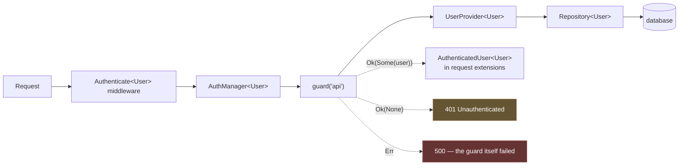

# Authentication

Authentication answers **who is this**. [Authorization](authorization.md)
answers **may they**. They are separate crates' worth of separate, and keeping
them separate is worth the discipline.

Four pieces: guards, user providers, a manager holding several guards, and an
`auth` middleware. The structural decision worth knowing first is that
**the manager is generic over your user model**.



## The user model

Implement `Authenticatable` on it. The framework only ever needs three facts,
which is what keeps guards independent of whatever else a user row holds:

```rust
impl Authenticatable for User {
    fn auth_identifier(&self) -> String {
        self.id.to_string()
    }

    fn auth_password_hash(&self) -> Option<&str> {
        Some(&self.password)
    }

    fn auth_username_column() -> &'static str { "email" }    // the default
    fn auth_token_column() -> &'static str { "api_token" }   // the default
}
```

`auth_password_hash` returns `Option` so an SSO-only or machine account — one
that cannot log in with a password at all — is representable rather than being
a row with an impossible hash in it.

## Guards

A guard identifies the user behind a request.

```rust
pub trait Guard<U: Authenticatable>: Send + Sync + 'static {
    fn name(&self) -> &str;
    fn user<'a>(&'a self, request: &'a Request) -> BoxFuture<'a, Result<Option<U>>>;
}
```

Note the return type: `Result<Option<U>>`, and the distinction is load-bearing.

> **A *failure* to determine who the user is (the database is down) is an
> `Err`. "Nobody is logged in" is `Ok(None)`.**

Conflating the two would turn an outage into a silent mass logout — every user
bounced to a login page that will also fail. The
[middleware](#the-middleware) maps them differently for exactly this reason.

### `TokenGuard`

```rust
TokenGuard::new("api", provider)
```

Reads `Authorization: Bearer …` and looks the token up through the provider's
`retrieve_by_token`. Stateless.

### `SessionGuard`

```rust
SessionGuard::new("web", provider, session_store).with_cookie_name("rainier_session")
```

Reads a session cookie, looks up the session, then the user. It also implements
`StatefulGuard`, which is the log-in/log-out half:

```rust
pub trait StatefulGuard<U>: Guard<U> {
    fn attempt(&self, credentials: &Credentials) -> …<Result<Option<String>>>;
    fn login(&self, user: &U) -> …<Result<String>>;
    fn logout(&self, request: &Request) -> …<Result<()>>;
}
```

`attempt` verifies credentials and, on success, returns the session id to hand
back to the client as a cookie.

### `GuardExt`

Every guard gets these, kept in a separate trait so `Guard` stays object-safe:

```rust
guard.check(&request).await?;        // bool — is anyone logged in
guard.guest(&request).await?;        // bool — the negation
guard.id(&request).await?;           // Option<String>
guard.authenticate(&request).await?; // U, or a 401
```

## The manager

```rust
let auth = AuthManager::<User>::new("api")
    .register(Arc::new(TokenGuard::new("api", Arc::clone(&provider))))
    .register(Arc::new(SessionGuard::new("web", provider, sessions)));

app.instance(Arc::new(auth));
```

```rust
auth.user(&request).await?;                  // via the default guard
auth.user_via("web", &request).await?;       // via a named one
auth.guard("api")?;
auth.default_guard()?;
auth.guard_names();
```

### Why generic

`AuthManager<U>` is parameterised on your user model rather than erasing it
behind `dyn Authenticatable`.

An application has **one** user model and wants its own type back. Erasing it
would force a downcast at every call site — `user.downcast_ref::<User>()` in
every controller — to get at the fields the application actually cares about,
and each of those downcasts would be a place to get it wrong.

The cost is that the framework cannot ship an `Auth`
[facade](facades.md#there-is-no-built-in-auth-facade), because a facade is a
concrete type. You declare it in one line:

```rust
rainier_framework::facade!(Auth => AuthManager<crate::app::models::User>);
```

## User providers

The provider is where the users come from:

```rust
pub trait UserProvider<U: Authenticatable>: Send + Sync + 'static {
    async fn retrieve_by_id(&self, id: &str) -> Result<Option<U>>;
    async fn retrieve_by_credentials(&self, credentials: &Credentials) -> Result<Option<U>>;
    async fn validate_credentials(&self, user: &U, credentials: &Credentials) -> Result<bool>;
    async fn retrieve_by_token(&self, token: &str) -> Result<Option<U>> { Ok(None) }
}
```

`retrieve_by_credentials` finds the user **without** checking the password;
`validate_credentials` checks it. Splitting them is what lets a guard find the
user, verify, and then decide what to do — and it is why a failed login can be
made to take the same time as a successful one.

`RepositoryUserProvider` is the usual one:

```rust
let users: Arc<dyn Repository<User>> = Arc::new(EntityRepository::new(db));
let provider = Arc::new(RepositoryUserProvider::new(users, Arc::new(Argon2Hasher::new())));
```

Implement the trait yourself for LDAP, an upstream API, or a users table that
is not a `Model`.

## Credentials

A map rather than a struct, because the identifying field varies (`email`,
`username`, `phone`) and an application may authenticate on more than one:

```rust
Credentials::password("ada@example.com", "correct-horse")

Credentials::new()
    .with("email", email)
    .with("tenant_id", tenant)
    .with("password", password)
```

`lookup_fields()` returns everything except the password — the columns to match
on.

## The middleware

```rust
router.get("/me", me).middleware(Authenticate::<User>::resolved());
router.get("/api/me", me).middleware(Authenticate::<User>::resolved_with_guard("api"));
```

In frameworks that attach middleware by string those would be `'auth'` and
`'auth:api'`. The differences are worth naming:

- **The user model is in the type.** `"auth"` cannot say which model it
  authenticates; `Authenticate::<User>` cannot avoid saying it.
- **`resolved` defers, it does not look up.** Routes are declared before the
  container is populated, so the `AuthManager<User>` cannot be handed over yet.
  The closure runs when the router compiles — after the providers, before the
  first request. A missing binding fails the boot naming the route. See
  [Middleware](middleware.md#middleware-that-needs-the-container).
- **`"api"` is still a string**, and correctly so: it names a guard registered
  on the manager at runtime, not a type. A wrong one is a `500` on the first
  request through that route, which is the next paragraph.

Wrap it up in a group function so the route file says what it means:

```rust
// src/app/http/kernel.rs
pub fn auth(guard: &str) -> MiddlewareStack {
    Authenticate::<User>::resolved_with_guard(guard)
}
```

On success it puts the user in the request's
[extensions](requests.md#extensions):

```rust
request.extension::<AuthenticatedUser<User>>().map(|u| u.get().clone())
```

Its three outcomes are worth reading as a table, because the third is the
non-obvious one:

| Guard returns | Response |
|---|---|
| `Ok(Some(user))` | proceed, user attached |
| `Ok(None)` | `401 Unauthenticated.` |
| `Err(e)` | **`500`**, logged |

A guard failure is a `500`, not a `401`: the user may well be authenticated,
and telling them they are not would be a lie that sends them to a login page
which will also fail.

### `RedirectIfAuthenticated`

The guest-only gate — bounces an already-logged-in user off `/login`:

```rust
router.get("/login", form).middleware(RedirectIfAuthenticated::new(auth, "/dashboard"));
```

## Logging in

A stateless API issues a token:

```rust
pub async fn login(Validated(input): Validated<LoginRequest>) -> Result<Response> {
    let users = resolve::<UserRepository>()?;
    let hasher = resolve::<Argon2Hasher>()?;

    // One message and one status for every failure mode, so the endpoint does
    // not reveal which addresses are registered.
    let invalid = || Error::unauthenticated("Those credentials do not match our records.");

    let mut user = users.by_email(&input.email).await?.ok_or_else(invalid)?;
    if !hasher.verify(&input.password, &user.password) {
        return Err(invalid());
    }

    let token = generate_session_id();
    user.api_token = Some(token.clone());
    users.update(&user).await?;

    Ok(Response::json(&json!({ "token": token })))
}
```

The single error for both cases is deliberate: "no such user" and "wrong
password" must be indistinguishable in the *response*, or the endpoint is an
account enumerator.

They are still distinguishable by **timing** — the unknown-address path returns
without hashing, and Argon2 is deliberately slow. If that matters for your
threat model, verify against a dummy hash before deciding:

```rust
let user = users.by_email(&input.email).await?;
let hash = user.as_ref().map(|u| u.password.as_str()).unwrap_or(DUMMY_HASH);
let valid = hasher.verify(&input.password, hash);   // always pays the cost

match (user, valid) {
    (Some(user), true) => …,
    _ => Err(invalid()),
}
```

A session app uses the stateful guard instead:

```rust
match session_guard.attempt(&credentials).await? {
    Some(session_id) => Ok(Response::no_content()
        .with_cookie(&Cookie::new("rainier_session", &session_id).secure(true))),
    None => Err(Error::unauthenticated("These credentials do not match our records.")),
}
```

## Sessions

```rust
pub trait SessionStore: Send + Sync + 'static { … }
```

`MemorySessionStore::new(Duration::from_secs(7200))` ships, and is right for
one process. For more than one, implement the trait over Redis or a database
table — a memory store means a user's session vanishes when they hit a
different instance.

`generate_session_id()` produces a fresh identifier.

## Token abilities

A token belongs to somebody, and it may be allowed to do **less** than they
are — which is the entire reason to issue one rather than hand over a
password. A CI job that only publishes releases should hold a token that can
only publish releases, so the leak that eventually happens leaks that.

```rust
router.post("/api/posts", store).middleware((
    Authenticate::<User>::resolved(),
    RequireAbility::any(["posts:write"]),
));
```

The abilities come from the provider, which reads whatever column holds them:

```rust
async fn retrieve_abilities_by_token(&self, token: &str) -> Result<Abilities> {
    Ok(self.tokens.by_hash(token).await?
        .map(|token| Abilities::parse(&token.abilities))
        .unwrap_or_else(Abilities::none))
}
```

| Held | Grants |
|---|---|
| `*` | everything |
| `posts:read` | exactly `posts:read` |
| `posts:*` | every ability beginning `posts:` |

The namespace wildcard is the one extension over Sanctum, and it earns its
place: without it, "this token manages posts" means listing every verb, and
the list goes stale the day somebody adds one.

Matching is **exact otherwise** — no case folding, no trimming. An ability is
an identifier the application chose, and being lenient means `Posts:Read`
silently granting `posts:read`.

`retrieve_abilities_by_token` defaults to [`Abilities::everything`], so nothing
changes for an application until it starts issuing narrower tokens.

### This is not the gate

They compose, and they answer different questions:

| | Asks | Denies because |
|---|---|---|
| [`Gate`](authorization.md) | may this **actor** do this at all? | of who they are |
| `Abilities` | was this **token** issued for it? | of what it was for |

An admin's read-only token must be refused a write, and no policy about admins
can express that — the policy is about the person, and the person is an admin.

Reading them in a handler:

```rust
use rainier_auth::AbilitiesRequestExt;

if request.token_can("posts:write") { … }
request.token_abilities();                  // Option<&Abilities>
```

`RequireAbility` must run **after** `Authenticate`, which is what puts the
abilities on the request. Before it there is nothing to read, and it refuses
everything and logs why: a guard that passes when it is misordered is not a
guard.

## Password confirmation

A session says somebody logged in as this account at some point. It does not
say the person at the keyboard *now* is them. Between those two facts sit an
unlocked laptop, a borrowed phone, a shared desk, and a session token lifted
from a machine somebody else has.

```rust
router.post("/account/password", change_password)
    .middleware(ConfirmPassword::within(Duration::from_secs(900)));
```

Anything that would let an attacker **keep** the account asks again: changing
the password, changing the address it recovers to, enrolling or removing a
second factor, issuing an API token.

The paired endpoint checks a submitted password and records the confirmation:

```rust
router.post("/account/confirm-password", |request: Req, Json(body): Json<Confirm>| async move {
    confirm_password::<User>(&request, &body.password, &hasher)?;
    Ok(Response::no_content())
});
```

`423 Locked`, not `403`, so a client can tell "prove it is you again" apart
from "you may never do this" — a browser application redirects to its
confirmation page, and an API client asks for the password. A **wrong**
password is `422`: it is a failed check of submitted input, and rendering it
as an authorization failure sends a browser to a login page it does not need.

`ConfirmPassword::mark_confirmed(&request)` is separate from the middleware on
purpose, so an application can confirm by some other proof — a passkey, a
second factor — and reuse the same gate. `ConfirmPassword::forget(&request)`
closes the window early.

Without a session it refuses and logs. This guard stands in front of the
account-takeover actions, so failing open on a misordered route is not an
option.

> **Not the `Confirmed` validation rule**, which asserts `password ==
> password_confirmation` inside one submitted form. Different feature,
> confusingly similar name.

## Challenges

The six-digit code somebody types.

```rust
let code = challenges.issue(user.id, "email-change").await?;
mail.send(&user, &EmailChangeCode { code }).await?;

// From the form:
challenges.consume(user.id, "email-change", &submitted).await?;
```

[Signed URLs](urls.md#signed-urls) cover the stateless half of this — a link
that proves the application sent it — and cannot cover this half, because a
code short enough to read over the phone is short enough to guess, so it needs
an attempt counter, and an attempt counter is state.

| | |
|---|---|
| **Single use** | a consumed challenge is gone, so a code seen in a notification or a screenshot cannot be replayed |
| **Attempt-limited** | after `max_attempts` wrong answers it is **destroyed**, not merely refused |
| **Purpose-bound** | a code emailed to confirm an address cannot remove a second factor |
| **Expiring** | the store drops it |
| **Constant-time** | six digits leak quickly one at a time |

Destroyed rather than locked, because a challenge that refuses further
attempts but stays in the store is a challenge somebody has to expire — and
the person holding it is better served by starting again.

Reissuing **replaces** any outstanding challenge, which is what "resend the
code" should do: two live codes for one purpose doubles a guesser's chances
and confuses the person holding them.

```rust
Challenges::new(cache)
    .lasting(Duration::from_secs(900))
    .max_attempts(5)
    .digits(6)
```

### There is no sweep command

Every hand-rolled version of this table came with a scheduled job to delete its
expired rows, and every one of those jobs is a thing to write, schedule,
monitor and eventually notice has been failing for a month.

A challenge here is a cache entry with a TTL. The store drops it, so there is
nothing accumulating. The right answer to "where is the purge job" is that the
design removed the need for one.

### Not TOTP

An authenticator app's code is derived from a shared secret and a clock, is
never issued and is never consumed. That is a library — `totp-rs` is a good
one — and not a framework concern.

## What is not here

**No password reset flow, no email verification, no OAuth.** Those are
application concerns built from these pieces — and 1.1.0 made the pieces the
right size: a reset is a [signed link](urls.md#signed-urls) or a
[challenge](#challenges), a verification is a signed link, and both used to
mean a token table with a sweep job. What is left is the part that differs per
application: the copy, the routes and the policy.

**No CSRF middleware.** The token-guard path does not need it, and a session
app's CSRF strategy depends on how it renders forms. `SameSite::Lax` is the
[cookie default](responses.md#cookies), which handles the common case.
