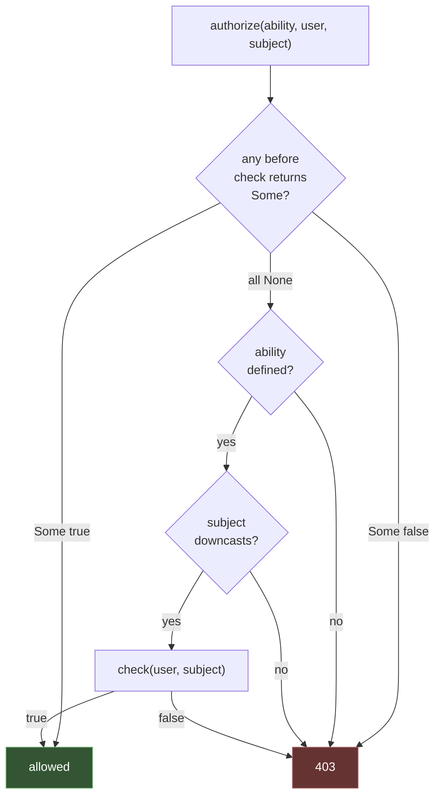

# Authorization

[Authentication](authentication.md) answers *who*. A **gate** answers *whether
they may*.

```rust
PostPolicy::gate().authorize("posts.publish", &author, Some(&post))?;   // 403 on denial
```

Other MVC frameworks split this into gates (a closure per ability) and
policies (a class per model). Rainier has one mechanism — a `Gate<A>` — and
"a policy" is the convention of building one per model.

## The actor does not have to be a person

`Gate<A>` is generic over **anything**. In a service with machine callers, the
actor often is not somebody with a password:

| The actor | Where it comes from |
|---|---|
| a user | a session or a bearer token |
| an API client | the client-credentials grant, where there is no user at all |
| a cloud principal | an assumed IAM role, an STS identity |
| a service account | a Kubernetes token, a signed internal request |

```rust
let scopes = Gate::<ApiClient>::new()
    .define_simple("posts.read", |client: &ApiClient| client.has_scope("posts:read"));

scopes.authorize("posts.read", &client, None::<&()>)?;
```

There is nothing to implement. [`Actor`] is a blanket alias over the bounds a
gate genuinely needs — `Send + Sync + 'static` — so every `Gate<User>` written
before 1.1.0 keeps working untouched.

Until then the bound was `U: Authenticatable`, which made two of those rows
unrepresentable: an API client has no password hash and no session, and
inventing one so it could be authorized is the shape that ends with a machine
identity able to log in. The bound bought the gate nothing — no check ever
called an `Authenticatable` method.

[`Actor`]: https://docs.rs/rainier-auth/latest/rainier_auth/gate/trait.Actor.html

## Defining abilities

```rust
use rainier_framework::auth::Gate;

pub struct PostPolicy;

impl PostPolicy {
    pub fn gate() -> Gate<User> {
        Gate::new()
            .before(|_user: &User, _ability: &str| None)
            .define("posts.update", |user: &User, post: Option<&Post>| {
                post.is_some_and(|post| post.belongs_to(user.id))
            })
            .define("posts.publish", |user: &User, post: Option<&Post>| {
                post.is_some_and(|post| post.belongs_to(user.id))
            })
            .define("posts.delete", |user: &User, post: Option<&Post>| {
                post.is_some_and(|post| post.belongs_to(user.id))
            })
            .define_simple("posts.create", |_user: &User| true)
    }
}
```

| Method | Signature |
|---|---|
| `define::<S, _>(ability, check)` | `Fn(&U, Option<&S>) -> bool` |
| `define_simple(ability, check)` | `Fn(&U) -> bool` — ignores the subject |
| `before(check)` | `Fn(&U, &str) -> Option<bool>` |

## Asking

```rust
gate.allows("posts.publish", &user, Some(&post));       // bool
gate.denies("posts.publish", &user, Some(&post));       // bool
gate.allows_any("posts.create", &user);                 // no subject
gate.authorize("posts.publish", &user, Some(&post))?;   // Result — 403 on denial

gate.has("posts.publish");
gate.abilities();
```

`authorize` is the one to use in a controller: it returns
`Err(Error::unauthorized(…))`, which renders as a `403`, so a single `?` is the
whole check.

```rust
pub async fn publish(request: Req) -> Result<Response> {
    let author = current_user(&request)?;
    let post = /* … */;

    // Authorisation is a policy, not an `if` buried in the controller.
    PostPolicy::gate().authorize("posts.publish", &author, Some(&post))?;

    …
}
```

## It fails closed

**An undefined ability is denied.**

```rust
gate.denies::<Post>("posts.teleport", &user, None);   // true
```

Defaulting to "allow" would mean a typo in an ability name silently opens a
hole — and it would be the kind of hole that no test catches, because the test
would use the same typo. Failing closed makes the typo visible the first time
someone tries the action.

The same rule covers a subject of the **wrong type**: that is a programming
error, not a permission, so the check denies and lets the caller notice.



## `before`

Runs before every ability. `Some(true)` grants regardless, `Some(false)`
denies, `None` defers:

```rust
Gate::new()
    .before(|user: &User, _ability: &str| user.is_admin.then_some(true))
    .define("posts.delete", |user: &User, post: Option<&Post>| { … })
```

That is "an admin may do anything", in **one place** instead of as the same
first clause in every check. Getting it right once beats getting it right
eleven times.

## Checks are synchronous

`define` takes a plain `Fn`, not an async one. Deliberately.

An authorisation decision that needs a database round-trip is a sign the
subject should have been loaded already — the controller has the record in hand
by the time it authorizes, and re-fetching it inside the check would double
every query on the page.

If a decision genuinely needs data the subject does not carry, load it in the
controller and pass a struct that has it:

```rust
struct PostWithTeam { post: Post, team_role: Role }

gate.authorize("posts.publish", &user, Some(&PostWithTeam { post, team_role }))?;
```

## Naming abilities

Dotted names scoped by model — `posts.publish`, `users.impersonate` — read
well in both the definition and the call, and make a gate greppable. The
framework does not parse them; any string works.

## Policies as a convention

There is no `Policy` trait and no auto-discovery. A "policy" is a struct with a
`gate()` constructor, one per model, in `app/policies/`:

```
src/app/policies/
  mod.rs
  post_policy.rs
  comment_policy.rs
```

`PostPolicy::gate()` is cheap to construct, so controllers call it per request.
Move it into a [container singleton](container.md#binding) if a policy ever
grows expensive to build.

Auto-discovery would need the framework to map a model type to a policy type by
name, which is reflection Rust does not have — and the explicit call is one
line, greppable, and impossible to get wrong silently.

## Testing a policy

A gate is a plain value, so its tests need no request, no container, and no
database:

```rust
#[test]
fn only_the_author_may_change_a_post() {
    let gate = PostPolicy::gate();
    let mine = Post::draft("Mine", "body", 1);

    assert!(gate.allows("posts.publish", &user(1), Some(&mine)));
    assert!(gate.denies("posts.publish", &user(2), Some(&mine)));
}

#[test]
fn an_undefined_ability_is_denied() {
    // Fails closed: a typo must not grant anything.
    assert!(PostPolicy::gate().denies::<Post>("posts.teleport", &user(1), None));
}

#[test]
fn a_denial_is_a_403() {
    let theirs = Post::draft("Theirs", "body", 99);
    let err = PostPolicy::gate().authorize("posts.publish", &user(1), Some(&theirs)).unwrap_err();

    assert_eq!(err.status(), 403);
}
```

That last one is worth having: it pins the status the whole application depends
on, in one place.

## Authorizing in a request contract

A [`FormRequest`](validation.md#request-contracts)'s `authorize` runs before
validation, which is where an ability check belongs when the whole endpoint is
gated:

```rust
#[async_trait]
impl FormRequest for StorePostRequest {
    fn rules() -> RuleSet { … }

    async fn authorize(request: &Request) -> bool {
        match request.extension::<AuthenticatedUser<User>>() {
            Some(user) => PostPolicy::gate().allows_any("posts.create", user.get()),
            None => false,
        }
    }
}
```

`false` produces a `403`, and validation never runs — so an unauthorised caller
cannot use validation messages to probe what the endpoint expects.

## Authorizing in middleware

For a whole group of routes, a middleware is cleaner than repeating the check:

```rust
pub fn can(ability: &str) -> MiddlewareStack {
    let ability = args.first().cloned().unwrap_or_default();
    Ok(Arc::new(RequireAbility::new(ability)) as Arc<_>)
});
```

```rust
router.get("/admin", dashboard).middleware((kernel::auth("web"), can("admin.access")));
```

Write `RequireAbility` as ordinary [middleware](middleware.md#writing-one) — it
reads `AuthenticatedUser<User>` from the extensions and consults a gate. Rainier
does not ship one, because the gate it should consult is yours.
