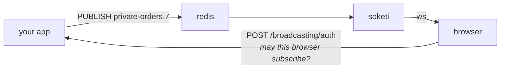

# Broadcasting

An event pushed to a browser, and the authorisation that decides who may
listen. Three parts: an event that names its channels, a driver that
publishes, and an endpoint that authorises subscriptions.

```rust
#[derive(Serialize)]
pub struct OrderShipped {
    pub order_id: u64,
    pub tracking: String,
}

impl Broadcastable for OrderShipped {
    fn broadcast_on(&self) -> Vec<Channel> {
        vec![Channel::private(format!("orders.{}", self.order_id))]
    }
}

Broadcast::instance().event(&OrderShipped { order_id: 7, tracking }).await?;
```

---

## This is not a WebSocket server

Broadcasting **publishes**. A separate process — soketi, or any
Pusher-protocol server — holds the sockets and relays.



That split is deliberate: it is what lets the thing holding ten thousand idle
connections be neither your web server nor your language. What Rainier
provides is the two halves an application owns: publishing, and authorising
subscriptions.

## Broadcast, event, notification

Three things that all mean "tell someone". Rainier has all three, and the
distinctions decide which one you want:

| | Reaches | Chosen by | Arrives |
|---|---|---|---|
| An [**event**](events.md) | listeners in this process | subscription, at boot | in-process, at once |
| A [**notification**](notifications.md) | one named recipient | `via()`, per recipient | email, SMS, a row |
| A **broadcast** | whoever is subscribed to a channel | the channel name | a WebSocket, now, or not at all |

A broadcast is the only one that is **best-effort and ephemeral**. Nobody may
be listening; a browser that reconnects a second later has missed it and
nothing will replay it. Pub/sub has no queue and no retry.

So: broadcast for "the page should update". For anything that must have
happened, use a notification or a job — and broadcast *as well* if a screen
should also move. The sample does exactly that: the author gets a database row
they will see on reload, and a broadcast that moves the bell without one.

---

## Channels

```rust
Channel::public("posts")            // anyone
Channel::private("orders.7")        // whoever the authoriser allows
Channel::presence("room.1")         // ditto, and members see each other
```

The kind becomes a prefix on the wire — `private-orders.7`,
`presence-room.1` — and the prefix is not decoration: it is how a
Pusher-protocol server knows to demand a signature before letting a socket
subscribe. **A channel that should be private and is not prefixed is a channel
anyone can read.**

The authoriser sees the **bare** name, so a pattern is `orders.{order}` and
never `private-orders.{order}`.

---

## Broadcastable

```rust
impl Broadcastable for OrderShipped {
    fn broadcast_on(&self) -> Vec<Channel> { … }         // required

    fn broadcast_as(&self) -> String { "order.shipped".into() }
    fn broadcast_with(&self) -> Result<Value> { … }
    fn broadcast_when(&self) -> bool { self.notify_customer }
}
```

**Nothing is discovered**: implementing this makes an event broadcast*able*,
and a listener still has to broadcast it.

```rust
events.listen(|event: Arc<PostPublished>| async move {
    Broadcast::instance().event(event.as_ref()).await
});
```

One type can be both an in-process event and a broadcast, which is usually what
you want: the fact is the same, and the listener list decides who cares.

### `broadcast_as` is permanent

It defaults to the type's short name, `OrderShipped`, which is the string a
JavaScript client listens for. Renaming the struct renames the event, and the
listener goes **quiet rather than erroring** — so pin it down with an override
once anything is listening.

### `broadcast_with` and what leaves the building

The payload defaults to the event serialised — every public field.
`Serialize` is a supertrait precisely so that `#[serde(skip)]` is
the tool for keeping a field in, the same one a response body uses.

Think about it every time. The default sends every field, and a default going
to a *public* channel is how a draft's body ends up in a browser. The sample
overrides it to send a slug and a title:

```rust
fn broadcast_with(&self) -> Result<Value> {
    Ok(json!({ "slug": self.post.slug, "title": self.post.title }))
}
```

A broadcast payload is a notification that something changed. The client
fetches what it needs, through a route you already authorise.

---

## Authorising subscriptions

`routes/channels.rs`:

```rust
pub fn channels() -> ChannelRegistry<User> {
    let mut channels = ChannelRegistry::new();

    channels.channel("orders.{order}", |user: &User, params: &ChannelParams| {
        let user_id = user.id;
        let order: u64 = match params.parse("order") {
            Ok(order) => order,
            Err(e) => return Box::pin(async move { Err(e) }),
        };

        Box::pin(async move { Ok(ChannelAccess::allowed_if(owns(user_id, order).await?)) })
    });

    channels
}
```

Generic over your user model, for the same reason
[the auth manager is](authentication.md#why-generic): an authoriser wants
*your* user, not a `dyn` it has to downcast first.

### It fails closed

**A channel with no matching pattern is denied.** Not "allowed because nobody
said otherwise" — a typo in a pattern would then publish a private channel to
anyone who guessed its name, and the failure would be silent in exactly the
direction that matters. The registry logs a warning when it denies for want of
a pattern, because that is nearly always the actual bug.

A pattern also matches segment-for-segment: `orders.{order}` does **not**
authorise `orders.7.invoices`.

### Presence channels

Return what the other members should see:

```rust
Ok(ChannelAccess::AllowedAs(json!({ "user_id": user.id, "name": user.name })))
```

Whatever goes in there is visible to **every other subscriber**. A display name
and an id, not a record.

### The endpoint

```rust
router
    .post("/broadcasting/auth", broadcasting::authorize::<User>)
    .name("broadcasting.auth")
    .middleware(kernel::auth("api"));
```

The auth endpoint is one handler you attach yourself — nothing registers it
implicitly. **Put it behind the guard** — it reads the authenticated user, and without one every
private channel answers `401`, which reads as a broken client rather than a
missing middleware.

A denied subscription is a **403**, not a 404: the client already knows the
channel name — it just sent it — so there is nothing left to conceal, and a
Pusher client shows "denied" for a 403 and hangs on a 404.

---

## Drivers

| Driver | Publishes to | Use |
|---|---|---|
| `LogBroadcaster` | the log | the default. Reaches no browser. |
| `MemoryBroadcaster` | a vector | tests — see [Testing](#testing) |
| `RedisBroadcaster` | Redis pub/sub | what soketi and its Pusher-protocol kin read |
| [`KafkaBroadcaster`](kafka.md#broadcasting) | a Kafka topic | when the same event has readers other than a browser |

The default is the log deliberately: an application that has not configured a
relay logs what it would have published rather than failing requests, and
nothing reaches a browser by accident.

```rust
Rainier::new(".").with_broadcasting(Broadcasting::new(Arc::new(
    RedisBroadcaster::connect(&connector).await?
        .with_prefix("app_")
        .with_pusher_auth(PusherAuth::new(key, secret)),
)))
```

`with_prefix` matters when two applications share a Redis, and getting it wrong
is silent: the publish succeeds and nobody is subscribed to what was published.

### Redis or Kafka

Redis pub/sub is **fire and forget**: a subscriber that is not connected at the
instant of the publish never learns it happened, and nothing records that it
did. For "the page should update", that is exactly the right trade and Redis is
the simpler thing to run.

[Kafka](kafka.md) keeps the message. Choose it when the event that moves the
browser is also one the business cares about — an order shipping, a payment
clearing — and the audit consumer, the analytics job and next quarter's service
should all be able to read it without anybody coordinating.

### Writing one

```rust
impl Broadcaster for AblyBroadcaster {
    fn name(&self) -> &'static str { "ably" }

    fn publish<'a>(&'a self, broadcast: &'a Broadcast) -> BoxFuture<'a, Result<()>> {
        Box::pin(async move { … })
    }
}
```

`Broadcast::wire_payload()` gives the `{ event, data, socket }` shape a relay
expects, if yours speaks the same one.

---

## The Pusher signature

Every Pusher-compatible server gates a private subscription the same way: the
browser asks your application, and you answer with an HMAC proving you agreed.
The server verifies it without asking you anything, because it has the same
secret.

```rust
PusherAuth::new(app_key, app_secret)
```

There is no HTTP in it — signing is the whole of the application's side, and
publishing goes out over Redis. Two details that are easy to get wrong and are
handled:

**The socket id is validated before it is signed.** It arrives in the request
body, and a client that can put a `:` in it can shift the boundary between the
socket and the channel inside the signed string.

**Presence data is serialised once** and both signed and returned, so the two
cannot disagree. Signing a different rendering than the one you send is the
classic way to make presence auth fail intermittently.

---

## `to_others`

The browser that caused a change has usually updated itself already, and
echoing the change back makes its own edit flicker.

```rust
let socket = broadcasting::socket_id(&request);   // the X-Socket-ID header
Broadcast::instance().event_except(&event, socket).await?;
```

`None` broadcasts to everyone, which is the right behaviour for a request that
did not come from a socket-aware client at all.

---

## Notifications over WebSocket

The framework's `BroadcastChannel` sends notifications to
`private-notifications.{type}.{id}`, so one subscription receives everything
sent to a recipient:

```rust
Notifier::new()
    .with(DatabaseChannel::new(db))
    .with(BroadcastChannel::new(broadcasting))
    .with(MailChannel::new(mailer))
```

Register the authoriser, or the channel publishes and no browser is ever
allowed to subscribe — which looks exactly like a broken relay:

```rust
authorize_notifications(&mut channels, "User", |user: &User| user.id.to_string());
```

Every recipient may listen to their own and nobody else's, and `Team.7` is not
`User.7` — comparing only the id would let a user read their team's
notifications.

---

## Testing

```rust
let broadcaster = Arc::new(MemoryBroadcaster::new());
app.instance(Broadcasting::new(broadcaster.clone()));

// …do the thing…

broadcaster.assert_broadcast("post.published", "posts");
broadcaster.assert_broadcast_times(1);
broadcaster.assert_nothing_broadcast();
```

Same rule as every other Rainier double: it implements the same port the real
thing does, and its assertions refuse to pass vacuously — a failure prints what
*was* published, because "nothing matched" is rarely the useful half.

Bind the same channel set in tests as in production. What should differ is the
driver underneath, not which channels a notification chooses.

---

## What is not here

**No WebSocket server here.** [See above](#this-is-not-a-websocket-server) —
though Rainier does have one: [WebSockets](websockets.md) holds sockets in your
own process, which is the right answer for a conversation and the wrong one for
fan-out across instances. That page has the table comparing them.

**No Pusher HTTP driver.** Publishing over Redis reaches soketi and every
relay that reads the same wire format, and the `Broadcaster` port is four
lines to implement against an HTTP client of your choosing. Adding one to the
workspace for one driver was the wrong trade.

**No queued publishing.** Publishing is one round trip to Redis. If yours is
slow enough to matter, broadcast from inside the [job](queues.md) that is
already queued.

**No client library.** Pusher-protocol JavaScript clients work as-is — the
channel names, the event names and the auth endpoint are all the ones they
expect.
