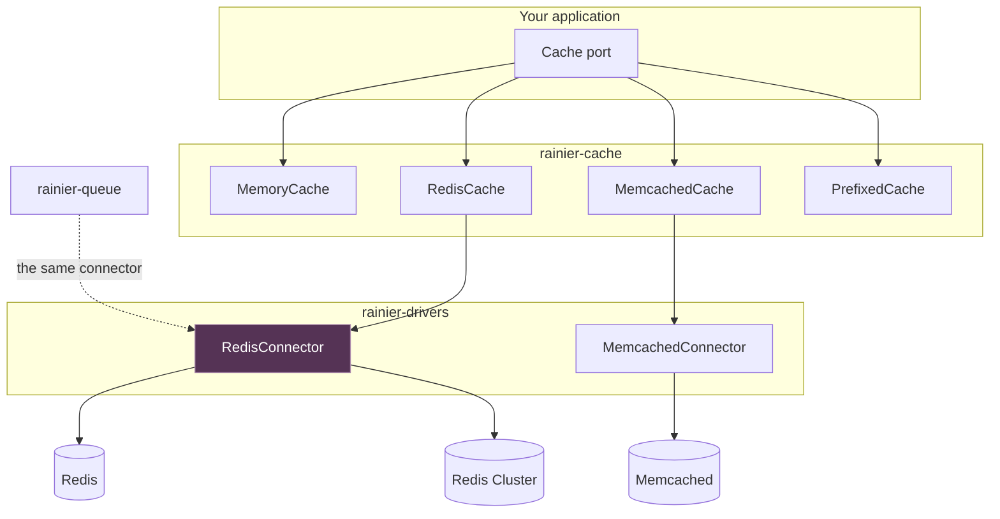

# Cache

A cache port with the shape and the drivers you would expect.

```rust
use rainier_framework::cache::{Cache, CacheExt};
use std::time::Duration;

cache.put_string("greeting", "hello", Some(Duration::from_secs(60))).await?;
cache.get_string("greeting").await?;              // Option<String>
cache.increment("hits", 1).await?;                // atomic, starts at zero
```

## A miss is not a failure

The rule the whole port is built around:

> `get` returns `Ok(None)` for an absent key, and `Err` **only** when the cache
> could not be reached.

Conflating the two is how a cache outage becomes an application outage — and a
cache is the one dependency an application should be able to lose. Driver errors
are `503`, so they land in the right bucket on a dashboard rather than looking
like bugs in the request that hit them.

## The API

```rust
cache.get("k").await?;                            // Option<Vec<u8>>
cache.put("k", b"v", Some(ttl)).await?;           // None ttl = no expiry
cache.forget("k").await?;                         // bool — was it there
cache.has("k").await?;
cache.flush().await?;                             // everything
cache.increment("hits", 1).await?;
cache.decrement("hits", 1).await?;

// Typed, from CacheExt
cache.get_json::<Post>("post").await?;
cache.put_json("post", &post, Some(ttl)).await?;
cache.get_string("name").await?;
cache.put_string("name", "Ada", None).await?;
cache.add("k", b"v", None).await?;                // only if absent

// The pattern nearly every cache use actually is
cache.remember("settings", Some(ttl), || async { load(&database).await }).await?;
cache.remember_forever("countries", || async { load_countries().await }).await?;
```

Bytes rather than strings, because the interesting things to cache — a
serialised session, a rendered page — are not all text, and forcing them through
UTF-8 would mean base64 on top of an already-encoded value.

An **unparseable** cached value reads as a miss rather than an error. A deploy
that changes a cached shape should make the caller recompute, not poison every
request until the key expires.

### `remember`

```rust
let settings: Settings = cache
    .remember("settings", Some(Duration::from_secs(300)), || async {
        load_settings(&database).await
    })
    .await?;
```

Two properties worth stating:

**A failure is never cached.** If the closure returns an error, the error is
returned and nothing is stored. Caching a failure for five minutes turns one
bad second into five bad minutes, and the request that would have succeeded
never gets to try.

**It is not a lock.** Ten simultaneous misses run the closure ten times and the
last write wins. That is the right trade for a cache: serialising them would
mean nine requests waiting on a tenth that might fail. When the computation is
expensive enough that a stampede matters, take a [lock](#atomic-locks) around
it explicitly.

`remember_forever` is the same thing with no expiry — for something that
changes only when the application says so, and which therefore needs a
`forget` somewhere or it is a leak with a nice name.

## Atomic locks

The cache is where Rainier puts distributed locks, because a lock is a key that
exactly one caller may create.

```rust
use rainier_framework::cache::LockManager;

let locks = app.resolve::<LockManager>()?;

let outcome = locks
    .lock("reports:nightly", Duration::from_secs(600))
    .run(async {
        build_the_report().await
    })
    .await?;

match outcome {
    Some(report) => { /* we ran it */ }
    None => { /* somebody else is */ }
}
```

`Rainier::boot` binds one over whatever cache the application uses, so it is
already there.

### What makes it a lock

Three things, and leaving out any one produces something that looks like a lock
and is not.

**An atomic acquire.** `Cache::add` is "store only if absent", decided by the
store. A `has` then a `put` lets two processes both see the key absent and both
write. It is a **required** method on the port with no default, precisely so a
new driver cannot inherit a broken one:

| Driver | How |
|---|---|
| memory | inside the same mutex as the map |
| Redis | `SET key value NX PX ttl` |
| Memcached | the `add` command, atomic by definition |
| DynamoDB | `PutItem` with a condition on the key not existing |

**An owner token.** Every acquire mints a random one and stores it as the value.

**A TTL.** The holder can die. A lock with no expiry, taken by a process that is
then killed, is a task that never runs again until somebody deletes a key by
hand.

### Why release compares the token

`Cache::forget_if`, not `forget`. The bug it avoids is invisible until it is an
incident:

```text
t=0    A acquires `nightly`, ttl 60s          A holds it
t=61   A is still stalled — GC, a slow query, a suspended VM
t=61   the key expires                        nobody holds it
t=62   B acquires `nightly`                   B holds it
t=63   A finishes and releases
         with `forget`     A deletes B's lock. C can acquire while B still
                           runs. Two copies, then three.
         with `forget_if`  A's token no longer matches. Nothing happens.
```

It cannot make A's overrun safe — B is already running — but it stops one
overrun becoming an unbounded number.

Redis needs a Lua script for this; Memcached has no conditional delete at all,
so it is `gets` for the CAS token then a `cas` that expires the item
immediately; DynamoDB uses a condition expression.

### The guarantee, stated honestly

A **lease**, not a mutex. If a holder overruns its TTL, another process takes
the lock and both run. No TTL-based lock prevents that, including Redlock.

- Set the TTL comfortably longer than the work takes.
- `guard.extend(ttl)` from long work, so the TTL tracks progress rather than a
  guess made at the start. It returns `false` if the lock already moved on —
  early enough to abandon the work rather than finish it alongside a second
  copy.
- Where two runs would be genuinely wrong, make the work idempotent or fence it
  with a token the downstream system checks.

### The API

```rust
let lock = locks.lock("import", Duration::from_secs(300));

lock.run(work).await?;                       // Option<T> — None if contended
lock.acquire().await?;                       // Option<LockGuard>
lock.wait_for(Duration::from_secs(10))       // block rather than give up
    .acquire().await?;
lock.is_held().await?;                       // for a status page, not a decision
lock.force_release().await?;                 // an operator's escape hatch

guard.release().await?;                      // false = it had already moved on
guard.extend(Duration::from_secs(300)).await?;
guard.keep();                                // abandon without releasing
```

**The guard does not release on drop.** `Drop` cannot await, and the
alternatives are a blocking call that deadlocks a current-thread runtime or a
spawn needing a handle that may be shutting down. Prefer `run`, which cannot
forget; a dropped guard holds its lock until the TTL, which is late rather than
forever.

`wait_for` polls. That is deliberate: a pub/sub channel per lock name is a lot
of moving parts to shave a hundred milliseconds off a path that is contended by
definition and rare by definition.

### In a memory cache it is not a shared lock

```rust
locks.is_shared();                    // false over a MemoryCache
```

The framework asserts this for you where it matters: a schedule declaring
`on_one_server` over a per-process lock is logged at boot and refused by
`schedule:run` in production. See
[Scheduling](scheduling.md#the-framework-checks-this-for-you).

`is_shared()` asks the store rather than guessing from its name — [`Cache`]
answers for itself, defaulting to `true` because almost every implementation is
a server somewhere, and `MemoryCache` overrides it. A store implemented outside
this workspace that has not overridden it can be taken at its word with
`LockManager::declared_shared()`; nothing verifies the claim, so declaring it
about a per-process store disables the one check that would have caught it.

[`Cache`]: https://docs.rs/rainier-cache/latest/rainier_cache/trait.Cache.html

### What uses them

| | |
|---|---|
| [`without_overlapping`](scheduling.md#without_overlapping) | one run of a scheduled task at a time |
| [`on_one_server`](scheduling.md#on_one_server) | one machine per occurrence |
| [`unique_id`](queues.md#unique-jobs) | one copy of a job pending at a time |

## Drivers

Selected by `CACHE_DRIVER`, which is a
[`CacheDriver`](configuration.md#settings-closed-sets-of-values) and not a
string — `CACHE_DRIVER=redys` fails the boot rather than caching in-process
until somebody notices.

| `CacheDriver` | Feature | Shared | Can lock | Notes |
|---|---|---|---|---|
| `Memory` | — | no | no | development, and anything genuinely per-process |
| `Redis` | `redis` | yes | yes | |
| `RedisCluster` | `redis-cluster` | yes, sharded | yes | |
| `Memcached` | `memcached` | yes | yes | get, set, counters; not much else |
| `DynamoDb` | `dynamodb` | yes | yes | TTL does the expiry; no server to run |
| `Kv` | `cloudflare-kv` | yes | **no** | [Workers KV](#cloudflare-workers-kv) — eventually consistent |

`is_shared()` is the question a production checklist is usually asking. A rate
limiter, a lock, or a cached authorisation decision needs it to be true; a
memoised computation does not.

### Shared and lock-capable are different questions

`Kv` is the row that makes the distinction necessary. Workers KV is visible to
every replica on earth — as shared as a store gets — and has **no
compare-and-set at all**. So two callers both "win" the `add` a lock is built
from, and both believe they hold it.

`supports_atomic_add()` is the second question, and
[`LockManager::is_shared`](#atomic-locks) requires both. That is what makes the
scheduler's boot check refuse a KV-backed lock rather than trusting an operator
to have read the driver's documentation.

```rust
let driver = config.setting(keys::CACHE_DRIVER)?;
if !driver.is_shared() {
    tracing::warn!("rate limits are per-process on the {driver} cache");
}
```

`driver.feature()` names the cargo feature each one needs, which is what lets
the "not built with that" error say which line to add to `Cargo.toml`.

```toml
rainier-framework = { git = "…", features = ["sea-orm-executor", "redis"] }
```

All off by default, so an application compiles only the clients it uses.



The **transports live in `rainier-drivers`**, not in the cache crate. Redis is
wanted by the queue too, and an application should configure it once — one
client, one set of connections, one place where a URL is parsed.

## Cloudflare Workers KV

```env
CACHE_DRIVER=kv
```

The edge key-value store, behind the `cloudflare-kv` feature. It compiles for
`wasm32`, which is the target it exists for.

**Read-heavy and eventually consistent.** Those two words are the design, not a
caveat: a write is visible at the edge that made it almost immediately and
everywhere else within roughly a minute.

| Not this | Because |
|---|---|
| [locks](#atomic-locks) | no compare-and-set, so two callers both win |
| `on_one_server` / `without_overlapping` | the same, one layer up |
| a credential rate limiter | a counter that propagates in a minute counts nothing useful in a minute |
| a sliding-expiry session | every read would rewrite, and rewriting is what KV is worst at |

What it is good at: a configuration blob, a feature-flag set, a rendered
fragment, a public key set — read constantly, written rarely, and harmless to
serve one version late.

Three things it does differently, all of them documented rather than hidden:

- **`add` is not atomic.** It is a read-then-write. Left in because `add` is
  also how a cache says "only if absent" for entirely benign things, and
  refusing those would make the driver unusable for what it *is* right for.
  `supports_atomic_add()` reports `false`, which is what stops it backing a
  lock.
- **`flush` reports that it cannot.** KV has no flush; a cache that said it
  cleared itself and did not would be worse than one that says no.
- **A TTL under 60 seconds is raised to it**, because that is Cloudflare's
  floor and a caller could not have known.

The transport is a trait — `KvTransport` — so the binding inside a Worker and
the REST API outside one are the same driver.

## Redis

```rust
use rainier_framework::cache::RedisCache;
use rainier_framework::drivers::RedisConnector;

// One server.
let cache = RedisCache::connect(RedisConnector::open("redis://127.0.0.1/")?).await?;

// A sharded cluster: every seed, and the client discovers the rest.
let cache = RedisCache::connect(RedisConnector::open_cluster([
    "redis://10.0.0.1:6379",
    "redis://10.0.0.2:6379",
    "redis://10.0.0.3:6379",
])?).await?;
```

Nothing downstream changes between those. Every command the cache issues touches
**exactly one key**, which is what makes it cluster-safe — a multi-key command
would need its keys in the same slot.

Give a cluster more than one seed, or a single dead node makes the whole cluster
unreachable.

Connect **once** and share the result. The connection multiplexes, so concurrent
commands share one socket per node; connecting per operation will exhaust the
server's connection limit under load.

### Atomic add, for locks

```rust
cache.add_atomic("lock", b"mine", Some(Duration::from_secs(5))).await?;
```

`SET NX`, so exactly one caller wins. **`CacheExt::add`'s default is not
atomic** — it is a `has` then a `put`, and two callers can both succeed. Do not
build a lock on it. `MemcachedCache::add_atomic` is the equivalent there.

## Memcached

```rust
use rainier_framework::cache::MemcachedCache;
use rainier_framework::drivers::MemcachedConnector;

let cache = MemcachedCache::new(MemcachedConnector::open("127.0.0.1:11211"));
```

Simpler than Redis and correspondingly more limited: keys capped at 250 bytes,
values at 1 MiB by default, **unsigned counters that saturate at zero**, and no
way to enumerate or delete by prefix.

Three behaviours Rainier surfaces rather than hides:

- A key with a space or control character is **refused before it is sent**. In
  the text protocol it would terminate the command and corrupt the connection,
  so the next borrower would read one key's value for another.
- A TTL over 30 days is **clamped**. Past that, Memcached reads the field as an
  absolute Unix timestamp, so an unclamped 40-day TTL means "expired in 1970".
- A sub-second TTL becomes **one second**, not zero — zero means "never expire",
  which is the opposite of what was asked.

The client is Rainier's own rather than a dependency: the obvious crate does not
compile on Windows, and six commands of a text protocol is cheaper to carry than
a portability problem.

## Rate-limit counters

The [throttle](middleware.md#throttlerequests) keeps its windows here, the same
way locks do:

```rust
let limits = CacheRateLimiter::new(Arc::clone(cache.store()));
```

Bound at boot as `RateLimits`, so `limits::shared(..)` on a route reaches it
and a deployment moves every limiter at once by changing `CACHE_DRIVER`.

It is a **port** rather than a direct dependency: `RateLimitStore` lives in
`rainier-middleware`, and this implements it. A throttle needs *a shared
counter*, not *the cache* — which lets a deployment put its limits in a
dedicated rate-limit service or a table with a unique index, and keeps
`rainier-middleware` depending on `rainier-http` and nothing else, which is
what lets it compile for a Worker.

Two keys per limiter: the counter, and when its window ends. The second exists
so `Retry-After` can say something true — the cache port cannot report a key's
remaining TTL, and telling somebody one second from the reset to come back in
a minute is a real cost paid by the person who mistyped their password.

The window is anchored to its **first** hit: `add` opens it, `increment`
counts, and neither extends it. A caller cannot hold the door open by
continuing to knock.

## Namespacing a shared cache

Two applications caching `user:1` on one Redis database read each other's
values, and the symptom is a user seeing another application's data.

```rust
use rainier_framework::cache::PrefixedCache;

let shared: Arc<dyn Cache> = Arc::new(redis);
let billing = PrefixedCache::new(Arc::clone(&shared), "billing");
let catalogue = PrefixedCache::new(shared, "catalogue");
```

**`flush` on a prefixed cache refuses** rather than delegating. No backend can
delete by prefix portably — Redis needs a `SCAN` loop, Memcached cannot do it at
all — and delegating would empty the whole server, including the other
application's keys and anybody's sessions. Which is exactly what wrapping it was
meant to prevent.

## What not to cache in memory

`MemoryCache` is per-process, so anything cached **for correctness** rather than
for speed is wrong in it:

| | In a memory cache |
|---|---|
| a rendered page | fine — just a slower miss elsewhere |
| a rate-limit counter | **broken** — the limit is `N × limit` across `N` instances |
| a lock | **not a lock** |
| a session | see [Sessions](sessions.md#drivers) |

## Configuring it

```env
CACHE_DRIVER=memory
CACHE_DRIVER=redis
CACHE_DRIVER=redis-cluster
CACHE_DRIVER=memcached

REDIS_URL=redis://127.0.0.1:6379/
MEMCACHED_URL=127.0.0.1:11211
```

A driver whose cargo feature is not enabled falls back to memory **with a
warning** rather than failing the boot. A cache is the one dependency an
application should be able to lose, and a missing feature is a build-time
mistake worth a loud line rather than an outage.

## Testing

```rust
use rainier_framework::cache::MemoryCache;

let cache = MemoryCache::new();
```

No server and no configuration. `MemoryCache` also has `purge()` and `len()` for
asserting on expiry, which the network drivers cannot offer.

The Redis and Memcached tests in the framework are `#[ignore]`d and need a live
server:

```sh
cargo test -p rainier-cache --features redis -- --ignored
```

The Memcached **protocol** is tested against a stub server rather than a live
one, including the case that matters — a value containing `CRLF`, which a
line-based reader would truncate.
