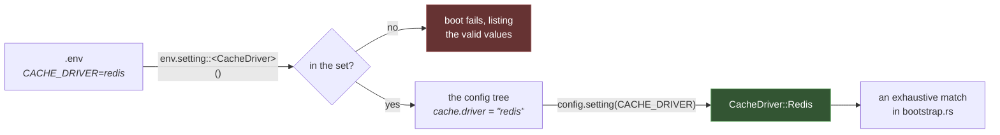

# Configuration

Two layers:

- **`.env`** — deployment values, one per environment, never committed
- **the config repository** — a dotted tree the application reads

```rust
Config::instance().get(keys::APP_NAME);
Config::instance().get_or(POSTS_PER_PAGE, 15);
Config::instance().setting(keys::CACHE_DRIVER)?;
```

Plus one thing a stringly-typed config API can never give you: **the keys and
the driver names are types**, not strings. `config("cache.drivers")` is a typo
a dynamic language cannot catch and Rust can, so it does.



## `.env`

```env
APP_NAME="Rainier Sample"
APP_ENV=local
APP_DEBUG=true
APP_URL=http://localhost:8000

SERVER_HOST=127.0.0.1
SERVER_PORT=8000

DATABASE_URL=sqlite::memory:
QUEUE_DRIVER=sync
MAIL_DRIVER=log
MAIL_FROM=hello@example.com

RUST_LOG=info
```

`Rainier::new(base_path)` reads `.env` from that path if it is there.

> **Real environment variables always win over the file.** A container
> orchestrator, a CI secret, or a `DATABASE_URL=… cargo run` beats a
> checked-out copy — which is what makes the same binary deployable everywhere.

`.env` is git-ignored; `.env.example` is committed and documents every key.

```rust
use rainier_framework::config::Env;

let env = Env::load_or_default(".env");     // missing file is fine
let env = Env::load(".env")?;               // missing file is an error
let env = Env::parse("APP_NAME=Test");      // from a string, for tests

env.string("APP_NAME", "Rainier");
env.int("SERVER_PORT", 8000);
env.bool("APP_DEBUG", false);
env.get("ANYTHING");                        // Option<String>
env.require("DATABASE_URL")?;               // Err if absent
```

`require` is worth using for anything with no safe default. Failing at boot
with "DATABASE_URL is not set" beats failing on the first query with a
connection error to `localhost`.

### Reading a driver

```rust
env.setting::<CacheDriver>("CACHE_DRIVER")?;      // default if unset, Err if unknown
env.setting_or("QUEUE_DRIVER", QueueDriver::Sync)?;   // a different default
```

Note that this does **not** follow `bool` and `int` in falling back:

```
Error: `CACHE_DRIVER`: `redys` is not a valid cache driver; expected one of
`memory`, `redis`, `redis-cluster`, `memcached`, `dynamodb`
```

A default is for a value nobody set. It is not for a value somebody set
*wrong* — substituting one there means the deployment that typed `redys` runs
on an in-process cache, and the first symptom is a rate limiter letting through
`N ×` its limit across `N` instances, weeks later. `bool` and `int` still fall
back because their whole range is obvious from the type and a bad one is
usually a stray quote; a driver name selects **code**, and running different
code than was asked for is not a recovery.

## The config repository

```rust
config.set("posts.per_page", 15)?;
config.set_default("posts.per_page", 15)?;      // only if unset; returns whether it set
config.merge("mail", json!({ "retries": 3 }))?; // deep-merge into a subtree
config.forget("posts.per_page");
```

Reading:

```rust
config.get::<u64>("posts.per_page");            // Option<T>
config.get_or("posts.per_page", 15u64);         // T
config.require::<String>("database.url")?;      // Result<T>
config.value("posts");                          // Option<Value> — a whole subtree
config.has("posts.per_page");
config.all();                                   // the whole tree

config.string("app.name");                      // typed shorthands
config.int("server.port");
config.bool("app.debug");
config.float("billing.rate");
```

Keys are **dotted paths** into a JSON tree, so a section is a subtree and
`config.value("mail")` gives you all of it.

`set` takes `&self` — the repository is interior-mutable and `Send + Sync`, so
it lives in the container and is read from every thread.

## Typed keys

Every call above has a magic string in it, and two of them have a magic string
on *both* sides. A `Key<T>` is a dotted path that knows what type lives there:

```rust
use rainier_framework::config::config_keys;

config_keys! {
    /// How many posts a listing shows.
    pub POSTS_PER_PAGE: u64 = "posts.per_page";
    /// The largest page a client may ask for.
    pub POSTS_MAX_PER_PAGE: u64 = "posts.max_per_page";
}
```

```rust
config.set(POSTS_PER_PAGE, 15)?;
let per_page = config.get(POSTS_PER_PAGE);      // Option<u64> — no turbofish
```

The type comes from the key, and the mistakes stop compiling:

```rust
config.set(POSTS_PER_PAGE, "fifteen")?;         // error: expected u64, found &str
let name: Option<String> = config.get(POSTS_PER_PAGE);   // error: not ConfigKey<String>
```

A `&str` still works everywhere — `ConfigKey<T>` is implemented for it for
*every* `T`, because a path built at runtime cannot be a `Key`. The typed form
is for the keys an application names in its own source, which is nearly all of
them.

### Where to declare them

In one module, next to the sections that write them. The sample project has
`src/config/keys.rs`, which re-exports the framework's:

```rust
use rainier_framework::config::config_keys;

config_keys! {
    pub POSTS_PER_PAGE: u64 = "posts.per_page";
}

// APP_NAME, CACHE_DRIVER, SESSION_LIFETIME, and the rest.
pub use rainier_framework::keys::*;
```

One import, both sets, and a name that collided would be a compile error in the
file where you can see both.

The framework's own are in [`rainier_framework::keys`] — that module *is* the
index of what the framework reads, one page to look at instead of a directory
of config files to leaf through.

[`rainier_framework::keys`]: https://github.com/safewords/rainier-framework/blob/main/crates/rainier-framework/src/keys.rs

## Settings: closed sets of values

A driver name is not a string. It is one of a handful of values the code knows
how to build, and every other string is a mistake.

```rust
use rainier_framework::support::setting_enum;

setting_enum! {
    /// Which search backend to query.
    pub enum SearchDriver: "search driver" {
        #[default]
        Database = "database",
        Meilisearch = "meilisearch",
    }
}
```

That one declaration gives you `Display`, `FromStr`, `Serialize`,
`Deserialize`, `Default`, and a parse error that lists the alternatives. The
wire spelling is written once and everything uses it, so a value written by
`config.set` reads back through `config.setting` with no second mapping to keep
in step.

```rust
config.set(SEARCH_DRIVER, SearchDriver::Meilisearch)?;
config.all();     // { "search": { "driver": "meilisearch" } }
```

### Reading one

```rust
config.setting(keys::CACHE_DRIVER)?;    // Result<CacheDriver>
```

| The key is… | `get` | `setting` |
|---|---|---|
| unset | `None` | the setting's `Default` |
| a valid spelling | `Some(driver)` | `Ok(driver)` |
| `"redys"` | `None` | **`Err`**, listing the options |
| an object | `None` | `Err`, saying it should be a string |

Use `setting` for anything that selects code. The difference is entirely in the
third row, and the third row is the one that costs you a weekend.

### The drivers Rainier ships

Each lives in the crate that owns the concept, and each carries the predicates
worth asking about it:

| Enum | Values | Ask it |
|---|---|---|
| [`CacheDriver`](cache.md) | `memory` `redis` `redis-cluster` `memcached` `dynamodb` | `is_shared()`, `feature()` |
| [`SessionDriver`](sessions.md) | `memory` `database` `cache` `cookie` | `is_revocable()`, `is_durable()`, `is_shared()` |
| [`QueueDriver`](queues.md) | `sync` `memory` `database` `sqs` | `is_deferred()`, `needs_a_worker()`, `survives_a_restart()` |
| [`MailDriver`](mail.md) | `log` `file` `memory` `smtp` | `delivers()`, `is_inspectable()` |
| `FilesystemDriver` | `local` `memory` `s3` | `is_shared()`, `is_durable()` |
| `AppEnv` | `production` `staging` `local` `testing` | `is_developing()`, `is_serving_users()` |

The predicates are the point. `driver.is_revocable()` is a question with one
answer; `driver == "cookie"` is the same question, spelled so that adding a
second non-revocable store silently gets it wrong.

Note what `SessionDriver` does **not** have: `redis`. Sessions in Redis are the
`cache` driver pointed at Redis — one store to configure, one pool to open. A
closed set makes that visible, where a free string would leave someone to
discover that `SESSION_DRIVER=redis` does nothing.

### Matching on one

```rust
let store: Arc<dyn SessionStore> = match env.setting::<SessionDriver>("SESSION_DRIVER")? {
    SessionDriver::Memory => Arc::new(MemorySessionStore::new(lifetime)),
    SessionDriver::Database => Arc::new(DatabaseSessionStore::new(db).with_lifetime(lifetime)),
    SessionDriver::Cache => Arc::new(CacheSessionStore::new(cache).with_lifetime(lifetime)),
    SessionDriver::Cookie => Arc::new(CookieSessionStore::new(crypt)),
};
```

No `_ =>` arm, and that is deliberate. Adding a store to the framework makes
this a compile error — which is exactly the list of places that need to learn
about it.

## Where it is set

```rust
// src/config/mod.rs — config/*.php
pub fn configure(config: &Config, env: &Env) -> Result<()> {
    app::configure(config, env)?;
    cache::configure(config, env)?;
    posts::configure(config, env)?;
    Ok(())
}
```

```rust
// src/config/app.rs — config/app.php
use crate::config::keys::{APP_LOCALE, APP_NAME};

pub fn configure(config: &Config, env: &Env) -> Result<()> {
    config.set(APP_NAME, env.string("APP_NAME", "Rainier Sample"))?;
    config.set(APP_LOCALE, env.string("APP_LOCALE", "en"))?;
    Ok(())
}
```

```rust
// src/config/cache.rs — config/cache.php
use crate::config::keys::{CACHE_DRIVER, CACHE_PREFIX, CACHE_REDIS_URL};

pub fn configure(config: &Config, env: &Env) -> Result<()> {
    config.set(CACHE_DRIVER, env.setting::<CacheDriver>("CACHE_DRIVER")?)?;
    config.set(CACHE_REDIS_URL, env.string("REDIS_URL", "redis://127.0.0.1:6379/"))?;

    // A literal: it namespaces our keys on a shared server, which is a
    // property of the application rather than of a deployment.
    config.set(CACHE_PREFIX, "rainier_sample".to_string())?;
    Ok(())
}
```

```rust
// src/config/posts.rs — an application's own section
use crate::config::keys::{POSTS_MAX_PER_PAGE, POSTS_PER_PAGE};

pub fn configure(config: &Config, env: &Env) -> Result<()> {
    config.set(POSTS_PER_PAGE, env.int("POSTS_PER_PAGE", 15) as u64)?;
    // Bounded, so a client cannot ask for every row in one request.
    config.set(POSTS_MAX_PER_PAGE, 100)?;
    Ok(())
}
```

```rust
Rainier::new(".").configure(|c| {
    config::configure(c, &Env::load_or_default(".env")).ok();
})
```

One function per concern. Every value
comes from the environment **with a fallback**, so a fresh clone runs with no
`.env` at all.

## What the framework sets for you

`Rainier::new` fills these in before your `configure` runs, so you only set
what is specific to your application — and override anything you want to
differ:

| Key | Type | From | Default |
|---|---|---|---|
| `keys::APP_NAME` | `String` | `APP_NAME` | `Rainier` |
| `keys::APP_ENV` | `AppEnv` | `APP_ENV` | `production` |
| `keys::APP_DEBUG` | `bool` | `APP_DEBUG` | `false` |
| `keys::APP_URL` | `String` | `APP_URL` | `http://localhost:8000` |
| `keys::APP_BASE_PATH` | `String` | the builder's argument | |
| `keys::APP_CIPHER` | `CryptScheme` | `APP_CIPHER` | `native` |
| `keys::SERVER_HOST` | `String` | `SERVER_HOST` | `127.0.0.1` |
| `keys::SERVER_PORT` | `u16` | `SERVER_PORT` | `8000` |
| `keys::SERVER_MAX_BODY_BYTES` | `u64` | `SERVER_MAX_BODY` | `2097152` (2 MiB) |
| `keys::SERVER_REQUEST_TIMEOUT_SECS` | `u64` | `SERVER_REQUEST_TIMEOUT` | `0` (off) |
| `keys::SERVER_COMPRESSION` | `bool` | `SERVER_COMPRESSION` | `false` |
| `keys::LOG_FORMAT` | `LogFormat` | `LOG_FORMAT` | `auto` |
| `keys::DATABASE_URL` | `String` | `DATABASE_URL` | `sqlite::memory:` |
| `keys::CACHE_DRIVER` | `CacheDriver` | `CACHE_DRIVER` | `memory` |
| `keys::CACHE_REDIS_URL` | `String` | `REDIS_URL` | `redis://127.0.0.1:6379/` |
| `keys::CACHE_MEMCACHED_URL` | `String` | `MEMCACHED_URL` | `127.0.0.1:11211` |
| `keys::CACHE_PREFIX` | `String` | — | |
| `keys::SESSION_DRIVER` | `SessionDriver` | `SESSION_DRIVER` | `memory` |
| `keys::SESSION_LIFETIME` | `i64` | `SESSION_LIFETIME` | `7200` |
| `keys::SESSION_COOKIE` | `String` | `SESSION_COOKIE` | `rainier_session` |
| `keys::SESSION_SECURE` | `bool` | `SESSION_SECURE` | `false` |
| `keys::QUEUE_DRIVER` | `QueueDriver` | `QUEUE_DRIVER` | `sync` |
| `keys::QUEUE_DEFAULT` | `String` | `QUEUE_DEFAULT` | `default` |
| `keys::KAFKA_BROKERS` | `String` | `KAFKA_BROKERS` | *(empty)* |
| `keys::KAFKA_GROUP` | `String` | `KAFKA_GROUP` | `rainier` |
| `keys::KAFKA_TOPIC_PREFIX` | `String` | `KAFKA_TOPIC_PREFIX` | *(empty)* |
| `keys::KAFKA_BROADCAST_TOPIC` | `String` | `KAFKA_BROADCAST_TOPIC` | `broadcasts` |
| `keys::KAFKA_TLS` | `bool` | `KAFKA_TLS` | `false` |
| `keys::KAFKA_USERNAME` | `String` | `KAFKA_USERNAME` | *(empty)* |
| `keys::KAFKA_PASSWORD` | `String` | `KAFKA_PASSWORD` | *(empty)* |
| `keys::KAFKA_SASL_MECHANISM` | `String` | `KAFKA_SASL_MECHANISM` | `plain` |
| `keys::MAIL_DRIVER` | `MailDriver` | `MAIL_DRIVER` | `log` |
| `keys::MAIL_FROM_ADDRESS` | `String` | `MAIL_FROM` | `hello@example.com` |
| `keys::MAIL_FROM_NAME` | `String` | `MAIL_FROM_NAME` | `Rainier` |

The three new in 1.0.1 are worth a word each:

- **`server.request_timeout_secs`** installs the
  [`Timeout`](middleware.md#timeout) middleware globally, answering `408` when
  a handler overruns. `0` is off, and it is off by default because the right
  ceiling is a fact about your application — a wrong one cancels work that was
  going to succeed.
- **`server.compression`** installs [`Compress`](middleware.md#compress). Off
  by default because the usual deployment has nginx or a CDN in front, and
  compressing twice is CPU spent to produce the same bytes.
- **`telemetry.log_format`** decides whether log lines are for a human or an
  aggregator. `auto` means JSON in production and staging — see
  [Observability](observability.md#logs).
- **`app.cipher`** is `native` or `php`, and chooses the **envelope**
  encrypted columns are written in. A closed set for the same reason a driver
  name is: writing the wrong one is not a preference that degrades, it is a
  column nothing can read. See
  [Encryption](encryption.md#reading-what-a-php-application-encrypted).

Note the defaults are the **safe** ones. `app.env` is `production` and
`app.debug` is `false`, so a misconfigured deployment fails closed rather than
[disclosing internal error messages](errors.md#what-the-client-is-told). Every
driver default needs no infrastructure and, in `MailDriver::Log`'s case, cannot
mail a real person — which is what a deployment that forgot to set one should
do.

## Settings that are not environment variables

Not every setting has an env var behind it, and it does not need one. `.env` is
for values that **differ per deployment**. Anything else is a literal in
`config.rs`.

```rust
fn server(config: &Config) -> Result<()> {
    // No env var: this is a property of your topology, not of a deployment,
    // and getting it wrong is a security bug rather than an inconvenience.
    config.set("server.trust_proxy", true)?;
    Ok(())
}
```

`server.trust_proxy` is the case that ships this way. It is read by
[`serve`](console.md#serve), it is `false` unless you set it, and no
environment variable sets it — see
[Deployment](deployment.md#behind-a-proxy) for why it should not be easy to
turn on by accident.

The same applies to your own settings. A rule that holds up:

| Value | Where |
|---|---|
| differs per environment (URLs, credentials, driver choice) | `.env`, read with `env.string(…)` |
| differs per deployment but has a safe default | `.env` with a fallback |
| the same everywhere in this application | a literal in `config.rs` |
| the same for every application | not configuration — a constant |

```rust
fn posts(config: &Config, env: &Env) -> Result<()> {
    // Tunable per environment.
    config.set("posts.per_page", env.int("POSTS_PER_PAGE", 15))?;

    // A property of the API contract. Same everywhere; no env var.
    config.set("posts.max_per_page", 100)?;
    Ok(())
}
```

Putting a literal in `config.rs` rather than inlining it at the use site still
buys you something: it is discoverable in one place, readable through
`Config::instance()` from anywhere, and overridable in a test with
`config.set(…)` without touching the environment.

### Overriding a framework default

Your `configure` runs **after** the framework has filled in its own defaults,
so setting a key again simply wins:

```rust
pub fn configure(config: &Config, env: &Env) -> Result<()> {
    // The framework read SERVER_MAX_BODY; this application accepts larger
    // uploads regardless of what the environment says.
    config.set(keys::SERVER_MAX_BODY_BYTES, 20 * 1024 * 1024)?;
    Ok(())
}
```

Use `set_default` instead when you want to fill a gap without overriding
something already set:

```rust
config.set_default(POSTS_PER_PAGE, 15)?;   // returns whether it set anything
```

## Reading it

Anywhere, through the [facade](facades.md):

```rust
let per_page = Config::instance().get_or(POSTS_PER_PAGE, 15);
```

Or from the container, which is what a service should do:

```rust
app.singleton(|c: &Container| {
    let config = c.resolve::<Config>()?;
    Ok(SearchClient::new(config.require(SEARCH_URL)?))
});
```

## Per-environment values

There is no `config/local/`. Branch on the environment where it matters:

```rust
let engine = if config.setting(keys::APP_ENV)?.is_developing() {
    TemplateEngine::new("resources/views").without_cache()
} else {
    TemplateEngine::new("resources/views")
};
```

`is_developing()` rather than `== AppEnv::Local`, because `staging` is the
value everybody forgets and a predicate has one place to get it right.

or, as the sample project does, on an explicit mode:

```rust
pub enum Mode { Running, Testing }

pub async fn boot(mode: Mode) -> Result<Arc<Application>> { … }
```

A parameter rather than a global, because a test wants captured mail and an
in-memory queue while a running app wants neither — and because reading
`APP_ENV` inside a test suite makes the suite depend on the developer's `.env`.

```rust
app.environment();
app.environment_is(&["local", "testing"]);
app.is_local();
app.is_testing();
app.is_production();
```

## Configuration is not a secret store

`.env` is fine for a development database URL. It is not fine for a production
credential — it lands on disk, in a backup, in a container image layer.

For anything that matters, read the real environment (which
[wins over the file](#env)) and let your platform inject it: Kubernetes
secrets, AWS Parameter Store, Vault, `systemd` `EnvironmentFile` with the right
mode. Rainier does not need to know the difference — `env.require("…")` reads
either.

## Testing configuration

`Env::parse` builds one from a string, so a test needs no file:

```rust
#[test]
fn the_environment_overrides_a_default() {
    let config = Config::new();
    configure(&config, &Env::parse("APP_NAME=Custom\nPOSTS_PER_PAGE=50")).unwrap();

    assert_eq!(config.get(keys::APP_NAME).as_deref(), Some("Custom"));
    assert_eq!(config.get(POSTS_PER_PAGE), Some(50));
}
```

Worth writing for any section with real defaults in it — it is the cheapest
test in the suite.

### The process environment wins, unless you say otherwise

`Env::get` consults the **real** environment before its own map. That is the
right rule in production — a variable set on the box beats a `.env` file
committed months ago — and it makes a test that sets `MAIL_DRIVER=log` in a map
still see whatever the machine exports.

```rust
let env = Env::parse("MAIL_DRIVER=log").isolated();     // nothing but this
let env = Env::from_map([("MAIL_DRIVER", "log")]);      // implies isolated
```

`from_map` implies isolation because a map is a complete statement of intent by
definition; `is_isolated()` answers which mode an `Env` is in. See
[Testing](testing.md#an-environment-a-test-can-state).

It no longer catches a misspelled key, though, and that is the improvement:
with typed keys a bad path does not compile, so the test is free to be about
behaviour. The one worth adding instead is that a bad driver is refused:

```rust
#[test]
fn a_driver_outside_its_set_stops_the_boot() {
    let err = configure(&Config::new(), &Env::parse("CACHE_DRIVER=redys")).unwrap_err();

    assert!(err.message().contains("CACHE_DRIVER"));
    assert!(err.message().contains("`memcached`"), "the message should list the options");
}
```
