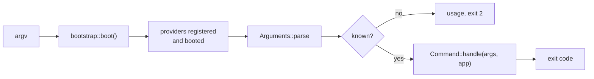

# Console

The console is the command-line half of the framework. Your `main.rs` is the
entry point, and it boots the same application an HTTP request would.

```rust
// src/main.rs
#[tokio::main]
async fn main() {
    let app = match bootstrap::boot(bootstrap::Mode::Running).await {
        Ok(app) => app,
        Err(e) => {
            eprintln!("the application failed to boot: {}", e.message());
            std::process::exit(1);
        }
    };

    let code = routes::console::commands().run_from_env(&app).await;
    std::process::exit(code);
}
```

```sh
cargo run -- list
cargo run -- serve --port=3000
cargo run -- route:list --json
cargo run -- app:seed --fresh
```

## The built-in commands

| Command | Does |
|---|---|
| `list` | every registered command |
| `route:list [--json]` | the route table, with resolved middleware |
| `serve [--host] [--port]` | start the HTTP server |
| `migrate [--pretend]` | run pending migrations |
| `migrate:rollback [--batches] [--pretend]` | undo the last batch |
| `queue:work [--queue] [--once] [--max-jobs] [--sleep]` | process jobs |
| `schedule:run` | run the tasks due this minute |
| `schedule:work [--once]` | the same, in a loop, for a container |
| `schedule:list` | what is scheduled and when it next runs |

`<command> --help` prints its usage.

```rust
use rainier_framework::console;

// A console with all four registered.
let console = console("rainier");
```

The argument is the **program name** the console prints in its usage — not a
crate name.

### `route:list`

```
METHOD    URI                        NAME               MIDDLEWARE
GET|HEAD  /                          home
POST      /login                     login              AddHeaders, ThrottleRequests
GET|HEAD  /api/posts                 api.posts.index    ThrottleRequests
```

The middleware column is what is **actually compiled into each route's
pipeline**, every group flattened — because the command reads the
same `CompiledRouter` the kernel serves. Global middleware is not in it:
`HandleCors`, `TrimStrings` and the rest wrap the router rather than living
inside it, so they run for every row and for requests that match no row at all. See
[Routing](routing.md#inspecting-the-table).

### `serve`

Host and port default to `server.host` and `server.port` in
[config](configuration.md), so the flags are an override rather than the usual
path.

### `migrate --pretend`

Lists what would run without running it. Worth making a habit before a deploy.

### `migrate:rollback`

Undoes the last batch — everything one `migrate` applied — in reverse order.
`--batches=N` takes back more than one. Refuses the whole range up front if any
step declared itself irreversible, and exits non-zero when it does, so a deploy
script stops rather than carrying on. See
[Migrations](migrations.md#batches).

### `queue:work`

See [Queues](queues.md#the-worker). Exits non-zero if any job failed, so a
supervisor notices.

## Writing a command

```rust
use rainier_framework::console_kernel::{Arguments, Command};
use rainier_framework::prelude::*;

pub struct SeedCommand;

#[async_trait]
impl Command for SeedCommand {
    fn name(&self) -> &str {
        "app:seed"
    }

    fn description(&self) -> &str {
        "Populate the database with demo data"
    }

    fn help(&self) -> Option<&str> {
        Some("Usage:\n  app:seed [--fresh]\n\nOptions:\n  --fresh  Delete existing rows first")
    }

    async fn handle(&self, args: &Arguments, app: &Application) -> Result<i32> {
        crate::database::seeders::run(app, args.flag("fresh")).await?;
        println!("Seeded.");
        Ok(0)
    }
}
```

Register it alongside the built-ins:

```rust
// src/routes/console.rs — routes/console.php
pub fn commands() -> Console {
    rainier_framework::console("app").register(SeedCommand)
}
```

`name()` is what the user types. The `verb:noun` convention (`app:seed`,
`route:list`) groups related commands in the listing.

## Arguments

```rust
args.command();                       // "app:seed"
args.positional();                    // &[String]
args.argument(0);                     // Option<&str>

args.option("queue");                 // --queue=high
args.option_or("queue", "default");
args.parsed_or("port", 8000u16);      // parsed, with a fallback
args.flag("fresh");                   // --fresh
args.wants_help();                    // --help or -h

args.options();
args.flags();
```

The parser handles `--key=value`, `--flag`, and positionals. There is no
`clap` dependency: the surface a framework console needs is small, and a
command with a genuinely complex interface can parse `args.positional()` with
whatever it likes.

## Talking to whoever is running it

`rainier_console::io` — a table, a question, a secret, a confirmation.

```rust
use rainier_framework::console_kernel::io;

io::table(
    &["ID", "Queue", "Failed at"],
    &failures.iter().map(|f| vec![f.id.clone(), f.queue.clone(), f.at.clone()]).collect::<Vec<_>>(),
);

let name = io::ask("What should the user be called?")?;
let queue = io::ask_with_default("Which queue?", "default")?;
let password = io::secret("Password:")?;

if io::confirm("Send the invitation now?", true)? {
    // …
}
```

```text
+--------+---------+---------------------+
| ID     | Queue   | Failed at           |
+--------+---------+---------------------+
| 01HXQ… | mail    | 2026-07-25 09:14:00 |
+--------+---------+---------------------+
```

Every non-trivial command ends up re-implementing these, and the hand-rolled
versions get the same three things wrong:

- **Column widths counted in bytes.** `"café"` is five bytes and four
  characters, so a byte-padded table goes crooked the first time a name has an
  accent in it — and stays crooked for the one row you were reading.
  `io::table` counts characters.
- **A prompt with nowhere to read from.** Under `cron`, in CI, behind a pipe,
  stdin is closed: `read_line` returns `Ok(0)` forever and a loop that re-asks
  spins until something kills it. Everything here returns an **error** at end
  of input.
- **A password echoed to the terminal**, into the scrollback and often into the
  CI log. `io::secret` turns echo off through the terminal's own API, and
  refuses rather than falling back to a visible read.

`io::table_to_string` returns the same thing as a `String`, for a test or for
writing it somewhere else. `io::is_interactive()` answers whether anyone is
actually watching — `false` under `cron`, in CI, and behind a pipe.

### Confirming something expensive

```rust
if !io::confirm_by_typing("This will drop every table.", "production")? {
    return Ok(exit::FAILURE);
}
```

GitHub's "type the repository name to delete it", for the operations where a
stray `y` is expensive. One attempt and no retry loop — someone who typed the
wrong thing gets to think about it.

It **refuses outright when stdin is not a terminal**. A destructive
confirmation that an empty pipe can satisfy is not a confirmation, so a command
that must also run unattended should take `--force` and check it before getting
here:

```rust
if !args.flag("force") && !io::confirm_by_typing(warning, "production")? {
    return Ok(exit::FAILURE);
}
```

## Exit codes

```rust
use rainier_framework::console_kernel::exit;

exit::SUCCESS   // 0
exit::FAILURE   // 1
exit::USAGE     // 2 — unknown command, or bad arguments
```

Returning `Err` from `handle` prints the message and exits `1`. Return
`Ok(code)` to choose.

Getting these right matters more than it looks: they are what a CI step, a
supervisor, or a `&&` in a deploy script reads.

## Running it

```rust
console.run_from_env(&app).await;                    // std::env::args()
console.run_argv(&app, ["app:seed", "--fresh"]).await;
console.run(&app, Arguments::parse(argv)).await;
```

The last two are what a test uses.

## Console commands run in a booted application



Same container, same providers, same config as a request — only there is no
request. Which means:

- `app.resolve::<T>()` works for anything a provider bound
- [facades](facades.md) work
- **anything reaching for HTTP state does not**, because there is none

That last point is the one to watch. A [job](queues.md) or
[mailable](mail.md) that reads the current request will work in a controller
test and fail in `queue:work` — pass what it needs into it instead.

## Testing a command

```rust
#[tokio::test]
async fn seeding_creates_the_demo_user() {
    let app = boot(Mode::Testing).await.unwrap();
    let console = Console::new("app").register(SeedCommand);

    let code = console.run_argv(&app, ["app:seed"]).await;

    assert_eq!(code, 0);
    let users = app.resolve::<UserRepository>().unwrap();
    assert!(users.by_email("ada@example.com").await.unwrap().is_some());
}
```

Assert on the **exit code and the effect**, not on stdout. The code is the
contract a script depends on; the wording of a `println!` is not.
