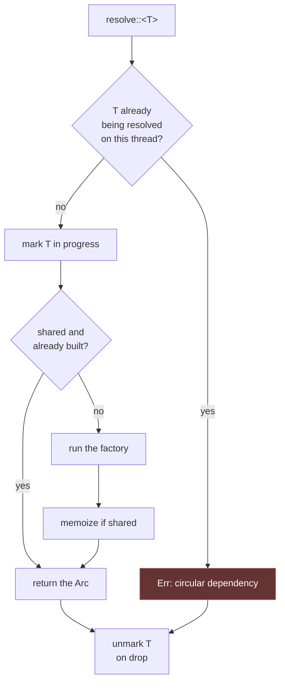

# Service Container

The container is a registry that knows how to build things, and how to hand
you the same one twice when that is what you want.

What matters is the key. A reflection-based container keys on a string or a
class name and resolves at runtime. Rust has no reflection, so **Rainier keys
on the type itself** — `TypeId`. That is faster, and it makes an unbound
service a compile-time-shaped error rather than a stringly-typed one.

```rust
use rainier_framework::prelude::*;

// Bind
app.instance(Config::new());
app.singleton(|c: &Container| Ok(PostService::new(c.resolve::<Database>()?)));

// Resolve
let service: Arc<PostService> = app.resolve::<PostService>()?;
```

## Binding

| Method | Lifetime |
|---|---|
| `instance(value)` | one value, given now |
| `instance_arc(arc)` | one value you already share |
| `singleton(factory)` | built once, on first resolve |
| `scoped(factory)` | like a singleton, until `flush_scoped()` |
| `bind(factory)` | rebuilt on **every** resolve |

```rust
// A value you have.
app.instance(Argon2Hasher::new());

// Built lazily, once, and shared. The usual choice.
app.singleton(|c: &Container| {
    let db = c.resolve::<Database>()?;
    Ok(EntityRepository::<Post>::new((*db).clone()))
});

// Rebuilt every time — for something that must not be shared.
app.bind(|_: &Container| Ok(RequestScopedThing::new()));
```

The factory receives `&Container`, so a binding can resolve its own
dependencies. That is constructor injection, done by hand — which in Rust is
the honest version, because there is nothing to reflect on.

### Binding a trait object

There is no `bind(Interface::class, Implementation::class)`, because a trait is
not a type you can key on. Bind the `Arc<dyn Trait>` instead:

```rust
let repository: Arc<dyn Repository<Post>> = Arc::new(EntityRepository::new(db));
app.instance(repository);

// …and resolve it as exactly that type:
let posts = app.resolve::<Arc<dyn Repository<Post>>>()?;
```

This is the idiom the [sample project's repository
provider](repositories.md#registering-repositories) uses. The double `Arc` is
real — `resolve` always returns `Arc<T>`, and here `T` is itself
`Arc<dyn Repository<Post>>` — but it costs one pointer hop and keeps the
container's signature uniform.

## Resolving

| Method | On failure |
|---|---|
| `resolve::<T>()` | `Err` naming the type |
| `try_resolve::<T>()` | `None` |
| `expect_resolve::<T>()` | panics, naming the type |
| `bound::<T>()` | `false` |

```rust
let db = app.resolve::<Database>()?;             // usual
let mailer = app.try_resolve::<Mailer>();        // optional feature
```

The error message names the type, which is the whole point of keying on it:

```
Error: nothing is bound for `app::services::PostService`
```

## The application

`Application` is `Foundation\Application`: a container plus the things a
running app needs around it. It `Deref`s to `Container`, so every method above
works directly on it.

```rust
let app = Application::new(".").with_environment("local");

app.instance(Config::new());
app.register(AppServiceProvider)?;
app.boot().await?;
```

### Environment

```rust
app.environment();                              // "local"
app.environment_is(&["local", "testing"]);      // true
app.is_local();                                 // true
app.is_testing();
app.is_production();
```

Set from `APP_ENV` by the [builder](lifecycle.md#the-builder).

### Paths

Where the application lives on disk:

```rust
app.base_path();                 // Path
app.path("src/routes");          // base + relative
app.config_path();               // base/config
app.storage_path();              // base/storage
app.resource_path();             // base/resources
app.database_path();             // base/database
```

### Lifecycle hooks

```rust
app.booting(|app| { /* before providers boot */ });
app.booted(|app| { /* after they all have */ });
app.terminating(|app| { /* on shutdown */ });

app.terminate();                 // runs the terminating hooks
app.is_booted();                 // has boot() completed
```

## Cycles do not deadlock

The interesting failure mode in any container is a dependency cycle. A naive
implementation takes the memoization lock, calls the factory, the factory
resolves the same type, and the whole thing deadlocks — a hang with no
diagnostic, which is the worst possible outcome.

Rainier tracks an in-progress resolution set per thread and checks it **before**
touching any lock:

```rust
app.singleton(|c: &Container| Ok(A(c.resolve::<B>()?)));
app.singleton(|c: &Container| Ok(B(c.resolve::<A>()?)));

app.resolve::<A>();
// Err: circular dependency while resolving `A`
```



The unmarking happens in a `Drop` guard, so a **panicking factory does not
poison later resolutions** either. Both properties have tests:
`dependency_cycles_error_instead_of_deadlocking` and
`a_panicking_factory_does_not_poison_later_resolutions`.

A singleton that resolves *itself* is caught by the same mechanism, rather than
self-deadlocking.

## Scoped bindings

`scoped` behaves like `singleton` until someone calls `flush_scoped()`, which
drops the memoized values but leaves the bindings and the true singletons
alone. That is the seam for per-request or per-job state in a long-running
process.

```rust
app.scoped(|_: &Container| Ok(RequestContext::new()));
// … later, at the end of the unit of work:
app.flush_scoped();
```

## Housekeeping

```rust
app.forget::<T>();      // remove the binding entirely
app.len();              // how many bindings
app.is_empty();
```

## Thread safety

`Container` is `Send + Sync` and every method takes `&self`, so an
`Arc<Application>` is shared across every worker thread with no wrapping. Bound
values must be `Send + Sync + 'static` — which is the compiler telling you
something true about a multi-threaded server, not a limitation of the
container.

## When not to use it

The container is the right home for **application-wide services**: the
database, repositories, the mailer, a client for some upstream API.

It is the wrong home for values that belong to one request. Those go in
[request extensions](requests.md#extensions) — typed, per-request, and gone
when the request is.

And a service that a piece of code needs should usually arrive as a
**constructor argument**, not be fetched from the container inside a method. A
struct that resolves its own dependencies hides them from its own signature,
which is the same objection as [facades](facades.md#the-cost) — for the same
reason.
