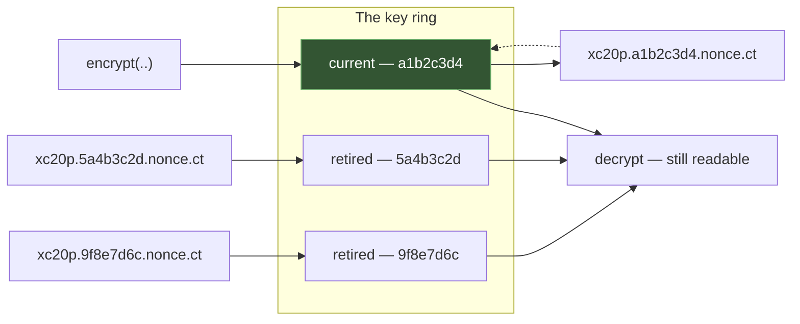

# Encryption

Encrypt what the client must not read, and sign what it may read but not
change — one `Crypt` for both halves.

```rust
use rainier_framework::prelude::*;

let sealed = Crypt::instance().encrypt("a card number")?;
assert_eq!(Crypt::instance().decrypt(&sealed)?, "a card number");
```

## Encrypt or sign?

The first question, and the one people get wrong.

| | Hidden | Tamper-evident | For |
|---|---|---|---|
| `encrypt` | yes | yes | anything the client must not read |
| `sign` | **no** | yes | anything the client may read but not change |

```rust
// The client must not see this.
let sealed = Crypt::instance().encrypt(&card_number)?;

// The client may see this; it must not be able to change the 42.
let signed = Crypt::instance().sign("unsubscribe-42")?;
// "unsubscribe-42.a1b2c3d4.k9x…"
```

Reach for **signing** when the value is not a secret. An unsubscribe link, a
reset token, a "remember this choice" cookie — encrypting those makes them
opaque in your own logs, to your own support staff, and to you, for no gain.

## The API

```rust
let crypt = app.resolve::<Encryption>()?;      // or Crypt::instance()

crypt.encrypt("plain")?;                       // String -> payload
crypt.decrypt(&payload)?;                      // payload -> String

crypt.encrypt_bytes(&bytes)?;                  // raw
crypt.decrypt_bytes(&payload)?;

crypt.encrypt_json(&value)?;                   // anything Serialize
crypt.decrypt_json::<T>(&payload)?;

crypt.sign("value")?;                          // value.keyid.tag
crypt.verify(&signed)?;                        // -> the value, or Err
crypt.is_valid(&signed);                       // -> bool
```

`Encryption` is a newtype over two ports, `Encrypter` and `Signer`, so
replacing either does not change a call site — the same shape as
[`Views`](views.md#rendering).

## Configuring it

```env
APP_KEY=base64:FhtFZdyUeiN5XAx1am30quaV9jUjm2pFvIzVBw9pdQg=
APP_PREVIOUS_KEYS=
```

```sh
cargo run -- key:generate
```

The `base64:` prefix is optional and accepted so a key generated for a PHP
application can be pasted straight in — which matters when the two are running
side by side during a migration.

**Without `APP_KEY`, a random key is minted per boot.** Everything works, and
every encrypted value from the last boot becomes unreadable. That is loud rather
than silent:

```
WARN APP_KEY is not set; generating a temporary key. Set one with
     `APP_KEY=base64:…` or nothing encrypted will survive a restart.
```

A malformed `APP_KEY` gets the same treatment plus an error, rather than a
decrypt failure three screens away from the cause.

## Key rotation

Rotation is designed in, not deferred. Every payload records **which key wrote
it**, and a `KeyRing` holds one current key plus any number of retired ones:

```env
APP_KEY=base64:<the new key>
APP_PREVIOUS_KEYS=base64:<the old key>,base64:<an older one>
```

That is the whole procedure: move the current key into `APP_PREVIOUS_KEYS`, put
a new one in `APP_KEY`, deploy. Anything already written still reads; anything
new uses the new key.



**Do not remove a retired key while payloads written with it still exist.** That
case has its own error, because it is an operator mistake rather than an attack
and the fix is to put the key back:

```
no key with id `9f8e7d6c` is on the ring; it is still needed to read
payloads written with it
```

Key ids are derived from the key material (a truncated hash), so they cannot be
configured inconsistently across deployments and cannot be forgotten when a key
is added.

## Ciphers

The default is **XChaCha20-Poly1305**, and it is the one to use. Its 192-bit
nonce is large enough that a **random nonce per message** has no meaningful
collision risk — so there is no counter to keep, no state to synchronise between
processes, and no way to catastrophically reuse one.

| Cipher | Id | Nonce | Notes |
|---|---|---|---|
| `XChaCha20Poly1305` | `xc20p` | 192-bit | **the default** |
| `ChaCha20Poly1305` | `c20p` | 96-bit | as used by TLS |
| `Aes256Gcm` | `a256gcm` | 96-bit | for interop, or hardware AES |
| `Aes128Gcm` | `a128gcm` | 96-bit | shorter key, same material |
| `Aes256GcmSiv` | `a256siv` | 96-bit | nonce-misuse **resistant** |

```rust
use rainier_framework::crypt::{Cipher, Encryption, KeyRing};

Encryption::from_keys_with(keys, Cipher::Aes256Gcm)
```

The 96-bit ciphers have a real birthday bound with random nonces — safe for a
few billion messages under one key, and a reason to prefer the X variant when
you are not constrained by a peer. AES-GCM's failure on a repeated nonce is also
harsher: it leaks the **authentication key**, not just a plaintext relationship.
`Aes256GcmSiv` is the one where a repeat reveals only that two plaintexts were
equal, which is worth choosing when nonces come from somewhere you do not fully
control.

**Switching cipher is a deploy, not a migration.** The payload names its own
algorithm, so a ring reads all five and writes with one:

```rust
let written = AeadEncrypter::new(keys.clone()).encrypt("before")?;

let now = AeadEncrypter::new(keys).with_cipher(Cipher::Aes256Gcm);
assert_eq!(now.decrypt(&written)?, "before");     // the old payload still reads
assert!(now.encrypt("after")?.starts_with("a256gcm."));
```

Each cipher's key is **derived** from the ring key by HKDF with the cipher's id
as `info`. That fits AES-128's shorter key, and more importantly gives every
algorithm a different key from the same material — so encrypting one value under
two ciphers does not reuse key bytes across primitives.

**HMAC-SHA256** for signing, compared in constant time. A byte-by-byte
comparison leaks how much of a forged tag was correct, which is enough to
construct the rest of it.

### The payload format

```
xc20p.a1b2c3d4.<nonce base64url>.<ciphertext base64url>
```

Algorithm, key id, nonce, ciphertext — URL-safe throughout, so a payload goes in
a query string or a cookie without further encoding.

The `xc20p.a1b2c3d4` header is the AEAD's **associated data**: authenticated but
not encrypted. So a payload cannot be relabelled with a different cipher or key
id and still open.

`v1` is accepted on read as an alias for `xc20p`, because that is what the first
release wrote.

### Failures are indistinguishable

```rust
crypt.decrypt("xc20p.abc.def.ghi")  // Err — 400
crypt.decrypt("nonsense")           // Err — 400, same message
crypt.decrypt(&tampered)            // Err — 400, same message
```

Every malformed-or-forged case reports the same thing. Distinguishing "the
padding was wrong" from "the tag was wrong" is how padding-oracle attacks start,
and a caller can do nothing useful with the difference.

The one exception is a **missing key**, which is a `500` with a specific
message, because that one is yours to fix.

### Equal plaintexts are not detectably equal

```rust
crypt.encrypt("same")? != crypt.encrypt("same")?
```

A fresh random nonce per message. Which means an encrypted column is safe to
store and **cannot be searched or compared for equality** — if you need to look
a value up, store a separate keyed hash of it to index on.

## Signing

```rust
let signed = crypt.sign("unsubscribe-42")?;   // "unsubscribe-42.a1b2c3d4.tag"
let value = crypt.verify(&signed)?;           // "unsubscribe-42"
```

The value stays readable, which is the whole point.

Two constraints:

- **The value must not contain a `.`** — the format is dot-separated and the
  value comes first. A structured value is refused rather than mangled, with a
  message telling you to encode it first.
- **The key id is folded into the tag**, so a signature cannot be replayed under
  a different key's label.

Retired keys verify what they signed, exactly as with encryption.

## JWTs and a JWKS document

Behind the `jwt` feature — an application that issues no tokens should not
compile an RSA implementation.

```rust
let jwt = Jwt::new(ring)
    .issued_by("https://id.example.com")
    .for_audience("api");

let token = jwt.sign(&claims)?;
let claims: Claims = jwt.verify(&token)?;

// GET /.well-known/jwks.json
Response::json(&jwt.jwks())
```

RS256 and ES256. Both asymmetric, and both what relying parties actually ask
for — OIDC expects RS256, which is why
[Ed25519](#public-key-cryptography) alone was not enough for an identity
provider.

It is not only for issuers. Anything that **verifies** a third-party token — a
Google ID token, an Apple one, a Kubernetes service-account token — needs the
same ring keyed by `kid` and the same rule about which keys are still
acceptable.

### Rotation is an overlap, not a switch

```rust
let ring = JwtKeyRing::new(JwtKey::rs256_from_pem("2026-07", &current)?)
    .with_previous(JwtKey::rs256_from_pem("2026-01", &previous)?);
```

The ring **signs with the newest key and verifies against every key it holds**.
Retiring one is two steps: stop signing with it, then — once every token it
signed has expired — remove it.

The JWKS lists **all** of them, which is what makes that work for somebody
else's verifier: a relying party that refreshes its copy keeps accepting tokens
across the change. Publishing only the signing key is the classic mistake, and
it invalidates every unexpired token the previous one issued.

### The algorithm comes from the key, never the token

A verifier that trusts the header's `alg` is the classic JWT vulnerability: a
forged header saying `none`, or saying `HS256` over a public key everybody has.
Here the `kid` selects a key and the **key** says which algorithm to verify
with. A token naming a key this service does not hold is refused without
spending CPU on it.

`HS256` is deliberately absent. A symmetric JWT cannot be verified by anyone
who cannot also *mint* one, which makes a published JWKS meaningless.

### Keys

```rust
JwtKey::rs256_from_pem("2026-07", &pem)?    // PKCS#8 or PKCS#1
JwtKey::es256_from_pem("2026-07", &pem)?
JwtKey::generate_rs256("2026-07", 2048)?    // tests, and a first boot
```

The `kid` travels in every token's header, so it has to be **stable across
restarts** — a random one per boot means every token issued before the last
deploy stops verifying. Generating a key at boot has the same problem, which
is why the generators say so.

### This is not an OAuth server

Sign, verify, rotate, publish. Grants, consent, PKCE and the endpoints around
them are an application's business — they are where the product is, and a
framework shipping them would be shipping opinions about a product.

## Reading what a PHP application encrypted

```env
APP_CIPHER=php
```

Not a preference. A ported database already holds columns that PHP wrote, and
they have to stay readable — so this reads and writes the exact wire format
PHP produced, against the same `APP_KEY`:

```text
base64( json( { "iv": base64(iv), "value": base64(ciphertext), "mac": hex(mac) } ) )
```

AES-256-CBC with PKCS#7, and an HMAC-SHA256 over the **base64 forms** of the IV
and the ciphertext concatenated — not over the raw bytes, which is the detail
every reimplementation gets wrong and then cannot explain. Both layers are
pinned in tests against an independent implementation rather than against
themselves.

The MAC is checked **before** decrypting, as the PHP implementation does. That
order is not a preference either: CBC without an authenticated MAC first is a
padding oracle,
and a padding oracle recovers plaintext without the key. Every failure returns
one indistinguishable error for the same reason.

### Use it to migrate, not to stay

Everything [the native envelope](#ciphers) has that this does not: a key id in
the payload, so rotation is possible without re-encrypting; an algorithm name,
so the cipher can change; AEAD, so there is one primitive to get right instead
of two composed in the correct order.

Rotation still works — every key on the ring is **tried**, because the PHP
payload names none — but that is a decrypt attempt per retired key rather than
a lookup, which is worth knowing before keeping ten of them.

The shape that works is the same one [legacy password
hashes](hashing.md#reading-hashes-this-application-did-not-write) use: read
with this, write with the native encrypter, and let the rows convert as they
are touched.

### Why it is not a `Cipher` variant

[`Cipher`](#ciphers) selects the AEAD *inside* Rainier's own envelope, which
names its algorithm, carries its key id and is URL-safe. The PHP format is a
different envelope with none of those properties. A variant would mean one
encrypter producing two incompatible payload shapes depending on a setting,
which is the ambiguity the self-describing envelope exists to remove.

`APP_CIPHER` is a closed set for the same reason a driver name is: writing the
wrong envelope is not a preference that degrades, it is a column nothing can
read.

## This is not password hashing


Passwords are **hashed, never encrypted**. That lives in
[`Hasher`](hashing.md) — one-way, salted, deliberately slow.

If you can get the value back out, it is the wrong tool for a password. The type
signature makes the mistake hard: `hash` returns a `String` you cannot recover
the input from, which is the point.

| | Reversible | Use for |
|---|---|---|
| [`Hasher`](hashing.md) | no | passwords |
| `encrypt` | yes | data you must read back |
| `sign` | n/a — nothing hidden | integrity of a visible value |

## Where to use it

**An encrypted column.** Encrypt in the constructor, decrypt in an accessor —
and remember the model must not derive `Serialize` if the plaintext would leak
through it.

```rust
impl Account {
    pub fn new(number: &str, crypt: &Encryption) -> Result<Self> {
        Ok(Self { number_sealed: crypt.encrypt(number)? })
    }

    pub fn number(&self, crypt: &Encryption) -> Result<String> {
        crypt.decrypt(&self.number_sealed)
    }
}
```

**A signed link.** No database row, no expiry table:

```rust
let token = Crypt::instance().sign(&format!("{}", user.id))?;
let url = Url::instance().absolute("unsubscribe", &[("token", &token)])?;
```

Note there is no expiry in that — a signature is valid forever unless you build
one in. Include a timestamp in the value and check it, or keep a revocation
list, if the link should stop working.

**Not sessions.** The [session](sessions.md) store keeps data server-side and
the cookie holds only an unguessable id, so there is nothing in the cookie to
encrypt.

## Public-key cryptography

Everything above is **symmetric**: the same key encrypts and decrypts, signs and
verifies. Sometimes that is exactly wrong — anyone who can verify can also
forge, and anyone who can decrypt can also encrypt.

| | Writer needs | Reader needs |
|---|---|---|
| `HmacSigner` | the shared key | **the shared key** |
| `Ed25519Signer` | the signing key | the **public** key |
| `AeadEncrypter` | the shared key | **the shared key** |
| `SealedBox` | the **public** key | the secret key |

### Ed25519 signatures

Same wire shape as the HMAC signer, so the two are interchangeable at a call
site. The difference is who can check one:

```rust
use rainier_framework::crypt::{Ed25519Signer, Signer, SigningKeyPair};

let keys = SigningKeyPair::generate();
let signer = Ed25519Signer::new(keys.clone());

let signed = signer.sign("licence-42")?;

// A service holding only the public key can verify, and cannot sign.
let checker = Ed25519Signer::verify_only(keys.public());
assert_eq!(checker.verify(&signed)?, "licence-42");
assert!(checker.sign("forged").is_err());
```

That is the shape for a licence key, a webhook you sign for someone else to
check, or a token one service issues and several verify — none of them needs
your secret.

Rotation is on the verifying side:

```rust
Ed25519Signer::new(current).trusting(previous.public())
```

### Sealed boxes

Anonymous public-key encryption — libsodium's `crypto_box_seal`. **Anyone** with
a public key can seal a message to it; **only** the holder can open it.

```rust
use rainier_framework::crypt::{BoxKeyPair, SealedBox};

let recipient = BoxKeyPair::generate();

// The sender needs only the public key.
let sealed = SealedBox::new().seal(&recipient.public(), b"a secret report")?;

assert_eq!(SealedBox::new().unseal(&recipient, &sealed)?, b"a secret report");
```

A throwaway keypair is generated per message and its secret dropped, so **the
sender cannot reopen it either**. And the sender is not authenticated: a sealed
box says nothing about who wrote it. Sign the plaintext as well if you need to
know.

Right for one-directional secrets — a client reporting to a server it cannot be
given a shared key for, an offline machine encrypting to a key held elsewhere, a
bug report containing a token.

### Key agreement

```rust
let alice = BoxKeyPair::generate();
let bob = BoxKeyPair::generate();

// Both sides compute the same key from their own secret and the other's public.
assert_eq!(alice.agree(&bob.public()).bytes(), bob.agree(&alice.public()).bytes());
```

The result is already run through HKDF, so it is usable with any `Cipher`.
Raw X25519 output is **not** uniformly random and must not be used as a key
directly — that is the classic mistake, and this API does not let you make it.

## Your own primitive

Implement `Encrypter` or `Signer` — it is two methods and one respectively:

```rust
pub struct KmsEncrypter { /* … */ }

impl Encrypter for KmsEncrypter {
    fn encrypt_bytes(&self, plain: &[u8]) -> Result<String> { … }
    fn decrypt_bytes(&self, payload: &str) -> Result<Vec<u8>> { … }
}
```

```rust
Rainier::new(".").with_encryption(Encryption::new(
    Arc::new(KmsEncrypter::new(client)),
    Arc::new(HmacSigner::new(keys)),
))
```

The typed helpers (`encrypt`, `decrypt`, `encrypt_json`) come from
`EncrypterExt`, a blanket-implemented extension trait, so you get them for free
and the port stays object-safe.

## Testing

```rust
use rainier_framework::crypt::{Encryption, Key, KeyRing};

let crypt = Encryption::from_keys(KeyRing::new(Key::generate()));
```

No configuration and no environment. A fresh key per test is usually what you
want — it also proves a test is not accidentally depending on a payload from
another one.

To test rotation, construct the ring explicitly:

```rust
let old = Key::generate();
let written = Encryption::from_keys(KeyRing::new(old.clone())).encrypt("before")?;

let rotated = Encryption::from_keys(KeyRing::new(Key::generate()).with_previous(old));
assert_eq!(rotated.decrypt(&written)?, "before");
```

## Operational notes

- **`Debug` is redacted.** `Key` prints its id and `<redacted>`; `Encryption`
  prints `Encryption(..)`. A key in a log line is a key that has to be rotated.
- **Keep keys out of config.** `APP_KEY` is read directly by the framework and
  never stored in the [config repository](configuration.md), so it cannot end up
  in a `config.all()` dump.
- **`.env` is not a secret store.** See
  [Configuration](configuration.md#configuration-is-not-a-secret-store).
