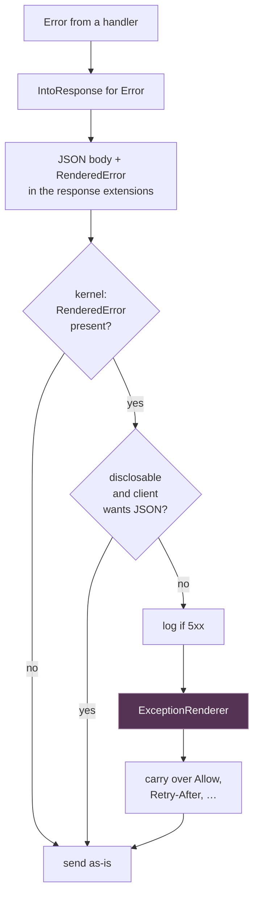

# Error Handling

Rainier has one error type. A handler returns `Result<T>`, uses `?` freely, and
the framework turns whatever comes out into the right status code.

Where an exception-based framework grows a hierarchy — an authentication
failure that renders as 401, a validation failure that renders as 422 —
Rainier has an enum, because Rust has no exception hierarchy to hang one on.

```rust
use rainier_framework::prelude::*;

pub async fn show(request: Req) -> Result<Response> {
    let slug = route_param(&request, "post")?;              // 400 if absent
    let post = posts.find_or_fail(slug).await?;             // 404 if no row
    PostPolicy::gate().authorize("posts.view", &user, Some(&post))?;   // 403
    Ok(Response::json(&post))
}
```

## `ErrorKind`

| Kind | Status | Raised by |
|---|---|---|
| `BadRequest` | 400 | malformed input, a missing route parameter |
| `Unauthenticated` | 401 | guards |
| `Unauthorized` | 403 | gates and policies, a failed `authorize()` |
| `NotFound` | 404 | no route, `find_or_fail` |
| `MethodNotAllowed` | 405 | the router |
| `Conflict` | 409 | you |
| `PayloadTooLarge` | 413 | the body limit |
| `Validation` | 422 | the validator |
| `TooManyRequests` | 429 | the throttle middleware |
| `Internal` | 500 | anything unhandled |
| `ServiceUnavailable` | 503 | maintenance, a dead dependency |
| `Status(u16)` | yours | anything else — `408` is spelled this way |

`service_unavailable` is the one people reach for least and should reach for
most: a health check that cannot see the database should answer `503`, not
`500`. A `500` says "this service is broken"; a `503` says "try again", which
is what a load balancer and a retrying client both need to hear.

## Constructing

```rust
Error::bad_request("The `since` parameter must be a date.")
Error::unauthenticated("Unauthenticated.")
Error::unauthorized("This action is unauthorized.")
Error::not_found("No Post matches the given key.")
Error::conflict("That slug is already taken.")
Error::request_timeout("The request did not finish within 30 seconds.")
Error::too_many_requests("Slow down.")
Error::service_unavailable("The search index is unreachable.")
Error::internal("could not reach the search index")
Error::validation(errors.to_json())

Error::new(ErrorKind::Status(418), "I'm a teapot")
```

And to enrich:

```rust
Error::internal("upload failed")
    .with_source(io_error)                    // the underlying cause
    .with_details(json!({ "field": "avatar" }))
    .with_kind(ErrorKind::BadRequest)
```

Read it back with `.kind()`, `.status()`, `.message()`, `.details()`,
`.source_error()`.

## Converting

`?` works on anything with a `From` impl. These ship:

| From | Becomes |
|---|---|
| `anyhow::Error` | `Internal` |
| `std::io::Error` | `Internal` (or `NotFound` for a missing file) |
| `serde_json::Error` | `Internal` |
| `ValidationErrors` | `Validation` |

For your own error types, implement `From<MyError> for Error` once and every
`?` in every handler starts working.

### Adding context

```rust
use rainier_framework::prelude::*;   // brings `Context`

let config = std::fs::read_to_string(path)
    .context("reading the search index configuration")?;

let user = maybe_user.context("the session referenced a user that no longer exists")?;
```

`Context` works on both `Result` and `Option`, like `anyhow`'s.

## What the client is told

This is the rule worth internalising:

> **A `4xx` message is always shown. A `5xx` message never is, unless debug
> mode is on.**

A `4xx` describes what the *client* did — "the title field is required", "no
Post matches the given key" — and is useless if hidden.

A `5xx` describes what *your server* did, and those messages routinely contain
a connection string, a file path, or a query. Outside debug the client gets
`"Server Error"` and the real message goes to the log:

```rust
tracing::error!(status = error.status, error = %error.message, "server error");
```

The mechanism is a `disclosable` flag on `RenderedError`, set from
`!kind.is_server_error()`. Debug mode (`APP_DEBUG=true`, which sets `app.debug`,
which the kernel reads) overrides it.



`RenderedError` lives in the response's **extensions**, so it never reaches the
client. It is what lets the kernel tell a JSON error body it produced from one a
handler deliberately returned — and therefore lets it offer a browser an HTML
page instead.

## The exception renderer

`DefaultExceptionRenderer` negotiates on content type:

- the client [expects JSON](requests.md#headers) → a JSON object with `message`
  and, if present, `errors`
- otherwise → a minimal HTML error page, with the message escaped

Replace it to render your own error pages:

```rust
pub struct MyRenderer;

impl ExceptionRenderer for MyRenderer {
    fn render(&self, request: &Request, error: &RenderedError, debug: bool) -> Response {
        if request.expects_json() {
            return Response::json(&json!({ "error": error.message })).with_status(…);
        }
        let html = View::instance()
            .render(&format!("errors.{}", error.status), &json!({ "message": error.message }))
            .unwrap_or_else(|_| fallback_page(error));
        Response::html(html).with_status(…)
    }
}
```

```rust
let kernel = Kernel::from_shared(router, global).with_renderer(Arc::new(MyRenderer));
```

It is a port because the right answer differs per application: an API returns
JSON, a monolith returns a styled page, and both want to decide for themselves
what a 500 discloses.

## Panics

A panic anywhere in a handler is caught and becomes a `500`. The detail is
logged; the client sees it only in debug mode. See
[the lifecycle](lifecycle.md#panics-do-not-take-down-the-process) for why the
catching is per-poll rather than around the closure.

Panics are a backstop, not a control-flow mechanism. Return `Err`.

## Debug mode

```env
APP_DEBUG=true
```

Turns on: 5xx messages to the client, and panic details in the response.

**Never in production.** The messages this reveals are exactly the ones an
attacker would like to read. The default is `false`, and the sample project's
`.env.example` says so.

## Errors outside HTTP

The same `Error` is used by [jobs](queues.md), [mailables](mail.md),
[migrations](migrations.md) and [console commands](console.md) — there is one
error type in the framework, not one per subsystem.

A job returning `Err` is released for another attempt. A command returning
`Err` prints the message and exits non-zero. A provider returning `Err` aborts
the boot. In none of those cases is there a client, so the disclosure rule does
not apply and the full message is shown.
