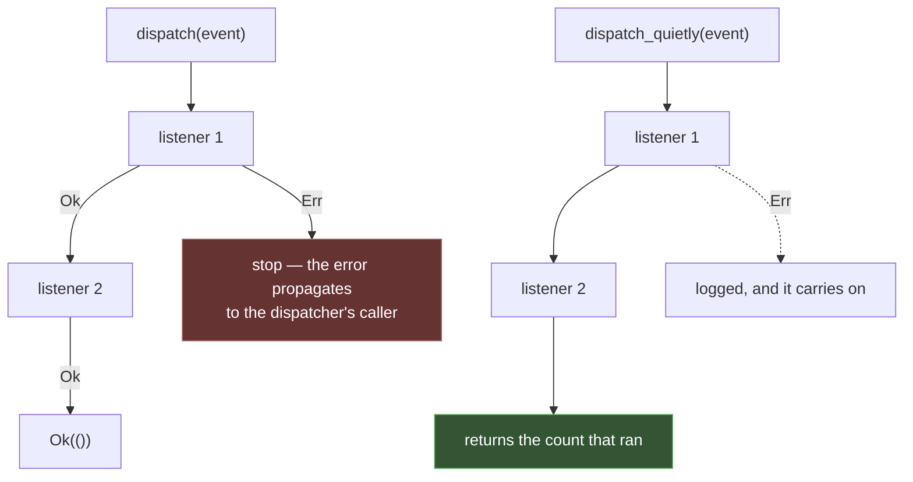

# Events

The dispatcher is Rainier's **hook bus** — the seam where something happens and
something else reacts without either knowing about the other.

```rust
// Raise
Event::instance().dispatch(PostPublished { post }).await?;

// React
events.listen(|event: Arc<PostPublished>| async move {
    Queue::instance().dispatch(NotifyAuthor { post_id: event.post.id }).await?;
    Ok(())
});
```

## Any type is an event

```rust
impl<T: Send + Sync + 'static> Event for T {}
```

No derive, no registration, no marker trait to implement. A struct is an event
because you dispatched it:

```rust
#[derive(Debug, Clone)]
pub struct PostPublished {
    pub post: Post,
}
```

Keeping events next to the model they concern is a convention worth following
— it puts the vocabulary of the domain in one file.

## Listening

```rust
// Async — the usual form.
events.listen(|event: Arc<PostPublished>| async move {
    tracing::info!(id = event.post.id, "published");
    Ok(())
});

// Synchronous, for something trivial.
events.listen_sync(|event: Arc<PostPublished>| {
    metrics::increment("posts.published");
    Ok(())
});

// Ordered — higher priority runs first.
events.listen_with_priority(listener, 100);

// Every event, whatever its type: its name and a type-erased payload.
events.listen_any(|name: &'static str, _event: Arc<dyn Any + Send + Sync>| async move {
    tracing::trace!(event = name, "dispatched");
    Ok(())
});
```

A wildcard listener can `Arc::downcast` the payload when it knows the type, but
most of them — logging, metrics, an audit trail — only need the name.

Listeners receive `Arc<E>`, so several can read the event without cloning it.
That is also **why a listener cannot mutate it** — see
[model hooks](models.md#what-a-hook-can-and-cannot-do) for the same argument in
full.

## Queued listeners

An ordinary listener runs **inside the dispatch**, which means inside the
request that dispatched it. A welcome email sent from a listener is 400ms of
SMTP the person who just signed up waits for, and an SMTP server having a bad
minute becomes a registration endpoint having a bad minute.

The answer is `listen_queued::<E, J>()` plus a `FromEvent` impl saying which
job the event becomes:

```rust
use rainier_framework::{DispatcherExt, FromEvent};

events.listen_queued::<UserRegistered, SendWelcomeEmail>();

impl FromEvent<UserRegistered> for SendWelcomeEmail {
    fn from_event(event: &UserRegistered) -> Self {
        Self { user_id: event.user_id }
    }
}
```

The dispatch now does one queue write and returns. The work happens in a
[worker](queues.md), with retries, backoff and a failed-jobs table — all of
which the inline version has none of.

| | Inline | Queued |
|---|---|---|
| Runs | in the request | in a worker |
| On failure | fails the dispatch | retried, then recorded |
| Sees | the event itself | what `FromEvent` copied out |
| Right for | a counter, a cache invalidation | mail, webhooks, anything over a network |

**The job is built at dispatch, not at handle.** `from_event` runs while the
event is still in hand, and what it copies out is serialised into the payload.
So take an id, not a model: by the time a worker picks the job up, minutes may
have passed and the row may have changed. Re-reading it is the point.

The `QueueManager` is resolved from the container when the event fires, not
when the listener is registered — listeners are registered while the
application is still being built. Dispatching therefore fails with a clear
error if no queue is bound, rather than silently doing nothing: a listener that
quietly stopped queueing is a feature that quietly stopped working.

`listen_queued_on::<E, J>(queue)` takes the queue explicitly, for a test or an
application that does not install the facades.

## Where listeners are registered

```rust
// src/app/providers/mod.rs
impl EventServiceProvider {
    pub fn register_listeners(events: &Dispatcher) {
        events.listen(|event: Arc<PostPublished>| async move {
            Queue::instance().dispatch(NotifyAuthor { post_id: event.post.id }).await?;
            Ok(())
        });
    }
}
```

```rust
Rainier::new(".").with_events(EventServiceProvider::register_listeners)
```

Through the **builder**, not a provider's `register`. The dispatcher is bound
into the container after listeners are added, so `with_events` runs at the
right moment.

### Subscribers

For a group of related listeners:

```rust
pub struct OrderSubscriber;

impl EventSubscriber for OrderSubscriber {
    fn subscribe(&self, events: &Dispatcher) {
        events.listen(|e: Arc<OrderPlaced>| async move { … });
        events.listen(|e: Arc<OrderShipped>| async move { … });
        events.listen(|e: Arc<OrderRefunded>| async move { … });
    }
}
```

```rust
events.subscribe(&OrderSubscriber);
```

One call registers every listener the subscriber declares — no string-keyed
map in the middle.

## Dispatching

```rust
events.dispatch(event).await?;              // Err from any listener propagates
events.dispatch_quietly(event).await;       // returns how many ran; errors logged
events.dispatch_as("legacy.name", event).await?;
```

The difference between the first two is the whole design question, and Rainier
gives you both because the right answer depends on the event:



Use `dispatch` when a listener failing should fail the operation — that is what
makes a [`Creating` hook](models.md#lifecycle-hooks) able to veto a write.

Use `dispatch_quietly` for notifications, where one broken listener should not
take down the request that raised the event.

## Introspection

```rust
events.has_listeners::<PostPublished>();
events.forget::<PostPublished>();
events.forget_all();
```

## Testing

```rust
let events = Dispatcher::fake();
app.instance(events);

// … exercise the code …

Event::instance().assert_dispatched::<PostPublished>();
Event::instance().assert_dispatched_times::<PostPublished>(1);
Event::instance().assert_not_dispatched::<PostDeleted>();

let dispatched: Vec<Arc<PostPublished>> = Event::instance().dispatched::<PostPublished>();
let names = Event::instance().dispatched_names();
```

The fake **records instead of calling listeners**. Every assertion panics if
you call it on a real dispatcher, rather than passing vacuously — a test that
asserts `assert_not_dispatched` against a live dispatcher would otherwise pass
for entirely the wrong reason.

`dispatched::<E>()` gives you the events themselves, so you can assert on their
contents:

```rust
let published = Event::instance().dispatched::<PostPublished>();
assert_eq!(published[0].post.title, "Hello");
```

## Events already in the framework

You can listen to these without raising them:

| Event | From |
|---|---|
| `Creating<M>`, `Created<M>` | [repository writes](models.md#lifecycle-hooks) |
| `Updating<M>`, `Updated<M>` | |
| `Deleting<M>`, `Deleted<M>` | |
| `MessageSending`, `MessageSent` | [the mailer](mail.md) |
| `JobProcessing`, `JobProcessed` | [the worker](queues.md#worker-events) |
| `JobReleased`, `JobFailed` | |

That is enough to build an audit log, a metrics feed, or a webhook fan-out
without touching the code that does the work.

## When to reach for an event

The question is whether the two sides should know about each other.

**Good:** a controller publishes a post; a listener queues a notification. The
controller does not care that notifications exist, and adding a second reaction
does not touch it.

> Reaching for a [notification](notifications.md) or a
> [broadcast](broadcasting.md) instead? Three different things that compose: an
> event is a **fact** with no recipient, a notification is a **message to a
> person**, and a broadcast is a **push to whoever is connected**. See
> [the table](broadcasting.md#broadcast-event-notification).

**Bad:** a controller dispatches `ChargeCard` and needs to know whether it
worked. That is a **function call**, and dressing it as an event only hides the
dependency and loses the return value.

A rule that holds up: if the raiser needs the outcome, call the thing. If it
genuinely does not, raise an event.
