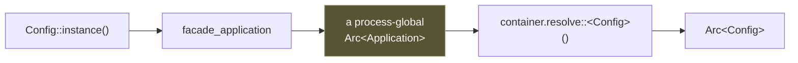

# Facades

A facade is a static proxy onto a container-resolved service — a global name
for something the container owns.

```rust
use rainier_framework::prelude::*;

let name = Config::instance().string("app.name");
Event::instance().dispatch(PostPublished { id }).await?;
Queue::instance().dispatch(NotifyAuthor { post_id }).await?;
let html = View::instance().render("home", &data)?;
```

PHP frameworks play this trick with `__callStatic` and a facade accessor.
Rust has no `__callStatic`, so `instance()` is explicit — `Config::instance().string(…)`
rather than `Config::string(…)`. Six extra characters, and in exchange the
indirection is visible at the call site rather than hidden in a base class.

## The ones that ship

| Facade | Resolves |
|---|---|
| `Config` | `rainier_config::Config` |
| `Event` | `rainier_events::Dispatcher` |
| `DB` | `rainier_database::Database` |
| `Queue` | `rainier_queue::QueueManager` |
| `Mail` | `rainier_mail::Mailer` |
| `Notify` | `rainier_notify::Notifier` |
| `View` | `Views` (a newtype over `Arc<dyn ViewEngine>`) |
| `Url` | `rainier_routing::UrlGenerator` |
| `Middleware` | `rainier_middleware::MiddlewareRegistry` |
| `Crypt` | `rainier_crypt::Encryption` |
| `Cache` | `rainier_cache::CacheManager` |
| `Storage` | `rainier_filesystem::Storage` |
| `Session` | `rainier_session::SessionManager` — the **store**, not a request's bag |

All are in the prelude.

There is deliberately no `Auth` facade: the auth manager is
[generic over your user model](authentication.md#why-generic), and a facade
resolves one concrete type. Declare your own in one line —
`facade!(Auth => AuthManager<User>)` — or resolve it from the container.

## How it works



Three moving parts:

1. A **process-global** `Arc<Application>`, installed by
   [`Rainier::boot`](lifecycle.md#what-boot-does-in-order).
2. The `Facade` trait, whose only job is to name an `Accessor` type.
3. `instance()`, a provided method that resolves the accessor from that global.

```rust
pub trait Facade {
    type Accessor: Send + Sync + 'static;

    fn instance() -> Arc<Self::Accessor> { /* resolve, or panic */ }
    fn try_instance() -> Option<Arc<Self::Accessor>> { /* resolve, or None */ }
}
```

Because every call goes through `resolve`, **rebinding the accessor changes
what every existing call site sees**. There is no separate `swap` mechanism,
because there does not need to be one:

```rust
// A test installs a fake by rebinding.
facade_application().instance(Mailer::fake(views));

// Every `Mail::instance()` in the application now returns the fake.
```

## Writing your own

One line:

```rust
use rainier_framework::facade;

facade!(
    /// The application's auth manager.
    Auth => rainier_framework::auth::AuthManager<crate::app::models::User>
);
```

Then `Auth::instance().user(&request).await?`.

The accessor must be bound in the container, or `instance()` panics with a
message naming the type. Bind it in a [service provider](providers.md).

### There is no built-in `Auth` facade

Deliberately. `AuthManager<U>` is generic over your user model, and a facade is
a concrete type — the framework cannot pick `U` for you. Declaring it takes the
one line above. See [Authentication: why generic](authentication.md#why-generic).

## `instance()` versus `try_instance()`

```rust
Config::instance()      // panics if unbound or no application installed
Config::try_instance()  // None instead
```

`instance()` panicking is correct for application code: a missing binding is a
wiring bug, and the panic names the type so you can fix it. Use `try_instance`
when the service genuinely might not be there — an optional integration, or a
library that works with or without the framework installed.

## Managing the global

```rust
set_facade_application(Arc::clone(&app));
try_facade_application();       // Option<Arc<Application>>
facade_application();           // panics if none
clear_facade_application();
```

The builder calls `set_facade_application` for you. `without_facades()` skips
it — which matters in tests, because **two applications in one process fight
over one global**. See [Testing](testing.md#facades-are-scoped-to-the-test).

## Scopes

Three places are consulted, nearest first:

| | Set by | Reaches |
|---|---|---|
| the **task** scope | `with_facade_application(app, future)` | that future, wherever tokio runs it |
| the **thread** scope | `scope_facade_application(app)` | everything on this thread |
| the **process** binding | `set_facade_application(app)` | everything else |

Nearest-first is what lets a test have its own application without the code
under test knowing anything about it.

### A thread scope reaches further than it looks

`block_on` drives a future on the **calling** thread, so the body of a
`#[tokio::test]` stays inside its scope across as many `.await`s as it likes —
even on a `multi_thread` runtime. "Multi-threaded runtime" is widely read as
"the body moves between threads", and it does not.

### Where it stops: `tokio::spawn`

A spawned task inherits neither scope and resolves through the process-wide
application, **silently**. That matters because it is where a served request
actually runs: one spawned task per connection.

```rust
// Carries whatever is in scope at the call site into the new task.
spawn_with_facades(async { … });

// Or scope a future explicitly — a task local, so it follows the future
// across worker threads.
with_facade_application(Arc::clone(&app), async { … }).await;
```

The server does this for you when it is told which application it is serving:

```rust
Server::from_arc(kernel).for_application(app)
```

`serve` wires that from the container. For a single-application process it is
the same object and nothing changes; it matters for a second server in one
process, and for a test that booted its own application and then started a
real listener to drive it.

A task local is **not** inherited by a task the future goes on to spawn —
nothing in tokio propagates them — so a spawn inside still needs
`spawn_with_facades`.

## The cost

The convenience is real and so is the price: **a facade hides a dependency that
a constructor argument would have made visible.**

```rust
// Honest: you can see what this needs, and a test can hand it a double.
struct PublishPost {
    posts: Arc<dyn Repository<Post>>,
    mailer: Arc<Mailer>,
}

// Convenient: the signature says nothing, and a test has to install globals.
async fn publish_post(id: u64) -> Result<()> {
    let post = DB::instance()./* … */;
    Mail::instance().send(&PostLive { post }).await?;
    Ok(())
}
```

Both are legitimate. The rule Rainier suggests:

> Reach for a facade in **application code and route closures**. Take the
> service as a **constructor argument** in anything you intend to unit-test.

A controller calling `Queue::instance().dispatch(job)` is fine — controllers
are tested through the [kernel](testing.md#feature-tests) anyway, where the
container is real. A domain service reaching for `DB::instance()` in the middle
of a calculation is the thing you will regret.

## Testing with facades

Because a facade resolves per call, a fake installed at any point takes effect
immediately:

```rust
let app = boot(Mode::Testing).await?;
set_facade_application(Arc::clone(&app));

app.instance(QueueManager::fake());

// exercise the code under test …

Queue::instance().assert_pushed::<NotifyAuthor>();
```

See [Testing](testing.md) for the fakes and the locking that keeps concurrent
tests from trampling the global.
