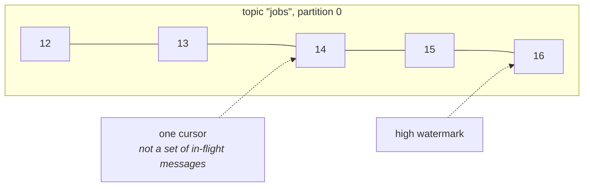
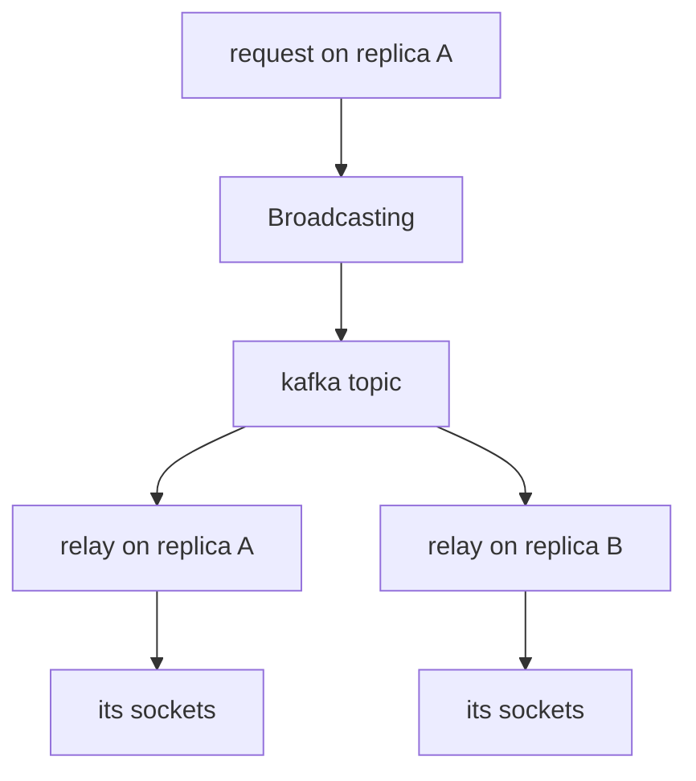

# Kafka

A partitioned log, wired into the three ports that can use one: broadcasting,
sockets, and the queue.

```env
KAFKA_BROKERS=kafka-1:9092,kafka-2:9092
KAFKA_GROUP=checkout
```

```rust
// Broadcasting over a topic instead of Redis pub/sub.
app.instance(Broadcasting::new(Arc::new(kafka::broadcaster(&config, Arc::clone(&client)))));

// ...and read back into this process's sockets, so a broadcast published on
// one replica reaches a browser connected to another.
relay::spawn(kafka::relay(&config, Arc::clone(&client)), SocketFanOut::new(rooms));
```

Enable it with the framework's `kafka` feature, or `kafka-tls` for a managed
cluster. The client is [pure Rust](#no-c-toolchain): nothing new to install and
no CMake.

## Kafka is a log, not a queue

Everything below follows from one fact, so it is worth stating plainly: **a
consumer does not remove what it reads.** A partition is an append-only file
and a reader is a cursor into it.



There is no "delete this one", no "make that one visible again", and no way to
acknowledge the third message while the second is still being worked on. What
you get in exchange: retention independent of consumption, ordering within a
partition, and throughput that comes from partition count rather than locking.

The valuable consequence is **many readers, uncoordinated**. The broadcast that
moved a browser is still on the topic for the analytics consumer, the audit
log, and the service somebody writes next quarter — none of which have to exist
yet, or be told about, or be deployed together. That is the actual reason a
team with Kafka wants their events on it.

## Broadcasting

```rust
Broadcasting::new(Arc::new(KafkaBroadcaster::new(client).on_topic("broadcasts")))
```

The same shape as [the Redis broadcaster](broadcasting.md#drivers), and the
same `{ event, data, socket }` body on the wire, so a relay that reads one
reads the other.

**Channels are keys, not topics.** Everything goes to one topic, keyed by
channel name. A topic per channel would be wrong twice over: Kafka topics are
cluster-level objects with partitions and replicas to provision, and
`private-orders.7` is not something anybody wants to provision. Keying by
channel gets the property that matters anyway — every message for a channel
lands on one partition, so a browser sees them in the order they happened.

### Why not just use Redis pub/sub

Redis pub/sub is **fire and forget**: a subscriber that is not connected at the
instant of the publish never learns it happened, and nothing records that it
did. That is the right trade for "make the list move" and the wrong one when
the same event is also an order shipping or a payment clearing.

If the only consumer is a browser, Redis is simpler and you should use it.

## Sockets across replicas

[WebSockets](websockets.md) says a `Rooms` registry lives in one process's
memory, so two replicas behind a load balancer have two sets of rooms. A relay
is how that stops being true:



```rust
relay::spawn(
    KafkaRelay::new(Arc::clone(&client), "broadcasts"),
    SocketFanOut::new(Arc::clone(&rooms))
        .naming_rooms(|channel| Some(channel.trim_start_matches("private-").to_string())),
);
```

Every replica publishes and every replica reads, including the one that
published. No second deployment: the relay runs inside the web process, next
to the sockets it feeds. [The feed scenario](scenarios.md#a-twitter-shaped-feed)
is this arrangement end to end.

### The relay has no cursor, deliberately

It reads from the **end** of the log and commits nothing, so it behaves like
pub/sub — every replica sees what is published while it is running, and a
replica that restarts does not replay yesterday's broadcasts to whoever happens
to be connected now.

That is right for pushing to a browser and wrong for anything that must not be
missed. If a message matters, it wants [a job](queues.md).

### `to_others` needs a socket identity

```rust
// on_connect — tell the browser what to send back in X-Socket-ID
socket.send_json(&json!({ "socket_id": socket.identity() }))?;
```

`SocketId` is a per-process counter, so **every replica has a socket `7`**.
Sending the bare number means "everyone except 7" silences an unrelated browser
on each of the other replicas. `identity()` pairs the counter with a
per-process id, and a relay that sees another replica's identity skips nobody —
which is the correct answer, not a fallback, because that socket is not here.

## Jobs

```env
QUEUE_DRIVER=kafka
```

**Read this section before choosing it.** The [database
driver](queues.md#databasequeue) is a better job queue and needs no new
infrastructure. Kafka is right when the jobs are already events on a topic, or
when per-key ordering matters more than concurrency.

| The port says | Kafka's answer | So the driver |
|---|---|---|
| reserve one job | a cursor | owns partitions with a **lock**, one job in flight each |
| acknowledge it | advance the cursor | commits `offset + 1` |
| release it for later | *nothing* | **re-produces** it, at the end of the topic |
| fail it | *nothing* | produces to `{topic}.failed` |
| how many are waiting | watermark − cursor | reports the lag |
| clear the queue | you cannot delete | skips to the end, and says how many |

**Concurrency is the partition count.** Two workers cannot share a partition —
a cursor is one number — so a topic with six partitions supports six concurrent
jobs and a seventh worker waits. That is Kafka's model, not a limitation of the
driver.

**A delayed job blocks its partition.** `release(job, 30s)` puts the job at the
end of the topic, and a worker that reaches a job which is not due stops reading
that partition until it is. In a queue the delayed job steps aside; in a log
there is nowhere to step aside to.

**A retry loses its place in the order.** It is a new record at the tail, which
is the standard Kafka retry-topic behaviour and worth knowing if you chose Kafka
*for* the ordering.

### Ownership and cursors live in the cache

This client does not join a consumer group, so partition ownership is a
[lock](cache.md#atomic-locks) and the cursor is a cache entry. Both need the
**shared, lock-capable** store you already run for
[`on_one_server`](scheduling.md#on_one_server), and the constructor refuses one
that is not:

```rust
KafkaQueue::new(client, locks)?     // Err on a process-local lock store
```

Because the silent version of that mistake is every worker owning every
partition and **every job running on every machine**.

The cost of this choice is that `kafka-consumer-groups.sh` cannot see the lag —
the cursors are Rainier's, not the broker's. [`size()`](queues.md) reports it
instead.

### Attempts are counted, because Kafka does not count them

Kafka redelivers from a cursor that never moved and says nothing about having
done so. Without a count of its own, a job that kills its worker is redelivered
forever and the partition never moves again — the poison pill that takes a
queue down at 3am and explains nothing.

So an attempt is **what the record carries plus how many times this offset has
been handed out**. The first half survives a retry (a new record at a new
offset); the second half counts a crash.

### The lease must outlive the job

```rust
KafkaQueue::new(client, locks)?.with_lease(Duration::from_secs(300))
```

The lease is what stops a second worker reading the partition. If it expires
while a job is still running, another worker takes the partition and runs from
a cursor that has not moved — so the job in flight runs twice. Same advice as
[SQS's visibility timeout](queues.md#drivers), same failure.

## Events onto a topic

```rust
kafka::publish_events::<OrderShipped>(&events, client, "orders", |e| e.order_id.to_string());
```

Every event of that type becomes a record: the event name in a header so a
consumer can route without parsing, the event itself as the body, keyed by
whatever identifies the subject — which is what puts everything about one order
on one partition, in order.

A failed publish is logged and swallowed. A listener returning `Err` stops the
listeners behind it, and "the analytics topic was unreachable" is not a reason
to abandon the rest of what an event set off. Where the publish must happen,
publish from [a job](queues.md) so it retries.

## Configuration

| | |
|---|---|
| `KAFKA_BROKERS` | comma-separated bootstrap brokers. A bare host gets `:9092` |
| `KAFKA_GROUP` | which set of cursors this deployment shares |
| `KAFKA_TOPIC_PREFIX` | prefixes every topic produced to or read from |
| `KAFKA_BROADCAST_TOPIC` | where broadcasts go — `broadcasts` |
| `KAFKA_TLS` | needs the `kafka-tls` feature |
| `KAFKA_USERNAME` / `KAFKA_PASSWORD` | SASL, when the cluster wants it |
| `KAFKA_SASL_MECHANISM` | `plain`, `scram-sha-256`, `scram-sha-512` |

The brokers listed are **bootstrap** brokers: the client asks one of them for
the cluster's metadata and then talks to whichever broker leads each partition.
One is enough to work and not enough to survive that broker being down, which
is why it is a list.

A misspelled mechanism stops the boot rather than defaulting to `PLAIN`, since
the default would send the password in the clear.

### Everything has a deadline

```rust
KafkaConnector::parse(&brokers).with_timeout(Duration::from_secs(10))
```

Ten seconds by default, and it is a **wall clock**. The underlying client's own
retry deadline counts accumulated sleep rather than elapsed time, which
measured out at 145 seconds to give up on a "10 second" timeout against a
machine with nothing listening. Inside a request that is not a slow failure, it
is a worker that never comes back.

A fetch gets its budget plus the long-poll wait it asked for, so an idle
consumer is not mistaken for a stuck one.

## Topics are not created for you

`create_topic` exists and the queue does not call it. Topic creation is where
partition counts and replication factors get decided, and a service that
creates its own topics on boot decides them by accident — one partition, one
replica, and the discovery of that during an incident.

Create them with your cluster's tooling, including `{topic}.failed` for the
queue's dead letters.

When `create_topic` is used — a development cluster, a test — it waits for the
cluster to *report* the topic before returning. The controller accepting it is
not the cluster knowing about it, and a produce in that window is told the
topic does not exist, so "created" would otherwise mean something a caller
cannot act on.

## No C toolchain

The wire client is [rskafka](https://docs.rs/rskafka), which is pure Rust. The
obvious alternative wraps `librdkafka` and needs a C compiler and CMake on
every machine that compiles the workspace — including the ones that will never
speak to Kafka. TLS is rustls and SASL is pure Rust, for the same reason.

What that costs is stated under [what is not here](#what-is-not-here).

## Testing

The parts that can be checked without a broker are: the record a broadcast or a
job becomes, the topic and cursor names, the partition a key belongs on, and
the attempt arithmetic. Those are unit tests.

Everything else is a claim about the log, so it is an integration test that
skips unless a broker answers:

```sh
docker run --rm -p 9092:9092 apache/kafka:3.9.0
KAFKA_BROKERS=localhost:9092 cargo test --features kafka
```

CI runs a broker and sets `KAFKA_REQUIRED=1`, which turns "no Kafka, so skip"
into a failure — a suite that silently skipped in CI would be a driver nobody
had ever run, reported as passing.

## What is not here

**No consumer group.** No `JoinGroup`, no heartbeat, no broker-side rebalancing
— so nothing Rainier reads is visible to `kafka-consumer-groups.sh`, and
partition ownership is a lock instead. A group-coordinating client is a
rebalance state machine, and carrying one that is subtly wrong is worse than
not carrying one.

**No transactions and no exactly-once.** Delivery is at-least-once, so a job
must be idempotent — which is [true of every driver
here](queues.md#retries), and truer of this one.

**No compression.** The compression codecs available to a pure-Rust build are
either C bindings or a partial implementation, and a producer that silently
wrote uncompressed records to a topic configured for `zstd` would be worse than
one that never offered it.

**No schema registry, no Avro, no Protobuf.** The body is bytes; what they mean
is an application's decision. A registry is a service with its own
configuration, cache and failure modes, and it belongs in a crate that is about
that.
