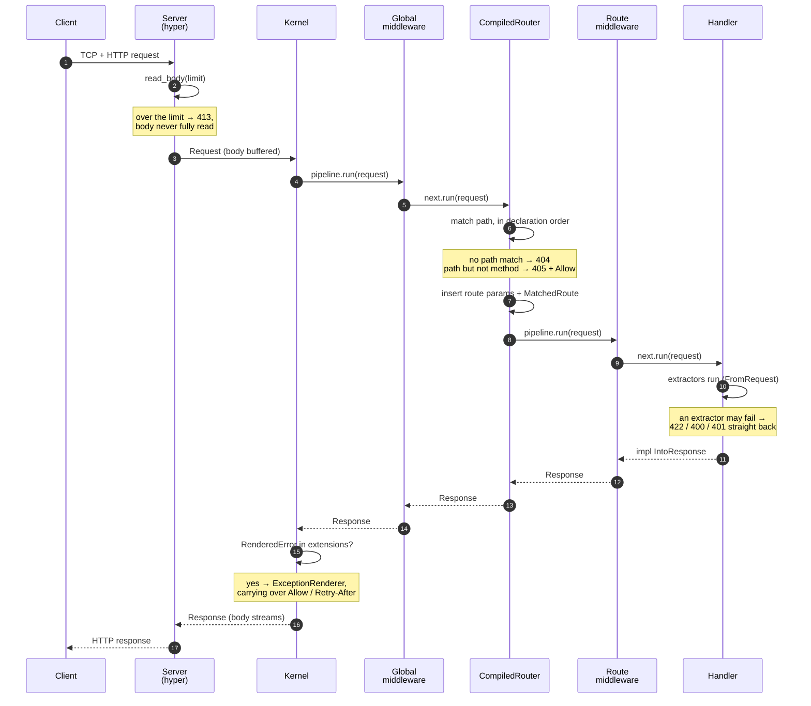
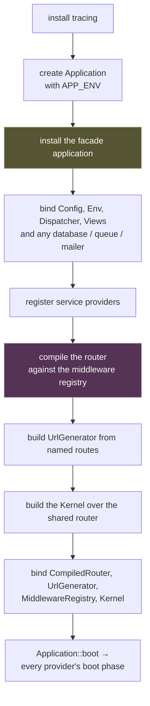
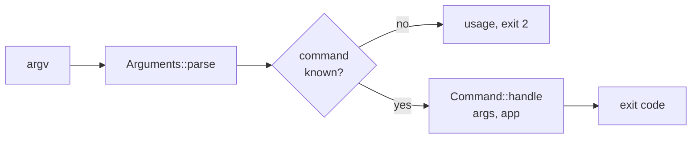

# The Request Lifecycle

A request's journey is the classic MVC spine: the server → the HTTP kernel →
global middleware → the router → route middleware → the controller → back out,
with a seam at every arrow.

Knowing where each seam is tells you where to put things — and, when something
goes wrong, where to look.

## The whole journey



## The bootstrap

Before any of that, the application is assembled once, in a function you
write using the [`Rainier`](#the-builder) builder:

```rust
// src/bootstrap.rs
pub async fn boot(mode: Mode) -> Result<Arc<Application>> {
    Rainier::new(".")
        .configure(|c| config::configure(c, &Env::load_or_default(".env")))
        .with_views(Arc::new(TemplateEngine::new("resources/views")))
        .with_database(database)
        .with_provider(AppServiceProvider { mode, database })
        .with_middleware(kernel::register)
        .with_events(EventServiceProvider::register_listeners)
        .with_routes(|router| {
            routes::web::routes(router);
            routes::api::routes(router);
        })
        .boot()
        .await
}
```

### The builder

`Rainier::new(base_path)` reads `.env` from that path if it exists and seeds
the config with framework defaults. Everything after it is a builder method:

| Method | What it does |
|---|---|
| `.configure(\|config\|)` | adjust configuration |
| `.with_events(\|dispatcher\|)` | register listeners |
| `.with_middleware(\|registry\|)` | register global middleware |
| `.with_routes(\|router\|)` | declare routes |
| `.with_views(engine)` | override the view engine |
| `.with_database(db)` | bind a `Database` you built |
| `.with_databases(dbs)` | declare the connections and let the framework open them |
| `.with_queue(manager)` | bind a `QueueManager` you built |
| `.with_queues(conns)` | declare the connections and let the framework build them |
| `.with_jobs(registry)` | declare the jobs a worker can run |
| `.with_mailer(mailer)` | bind a `Mailer` |
| `.with_provider(provider)` | register a service provider |
| `.without_facades()` | do not install the process-global facade app |
| `.without_tracing()` | do not install a tracing subscriber |
| `.boot().await` | build it, returning `Arc<Application>` |

### What `boot()` does, in order

The order matters, and it is the order it is for reasons you will eventually
run into:



**Facades are installed third, not last.** A provider's `boot`, and a
middleware built from the container while the router compiles, both legitimately
reach for a facade — and both happen inside this call. Installing the global
last would make them panic.

**The router compiles before providers boot but after they register.** That is
what lets a route's middleware resolve a service that a provider bound.

**Compiling at boot is deliberate.** A route naming middleware the registry
does not know, or two routes sharing a name, is a **boot failure** — not a
surprise on the first request that happens to hit it:

```
Error: route `GET /admin`: could not build the `Authenticate` middleware:
nothing is bound for `app::auth::AuthManager<app::models::User>`
```

**The router is compiled once and shared.** `CompiledRouter` is not `Clone` —
it owns each route's built pipeline — so the kernel and the container hold the
same `Arc`. That is why `route:list` describes what is actually being served
rather than a second compilation of it.

## The kernel

`rainier_server::Kernel` is everything between "a request exists" and "a
response exists", with the transport on one side and the router on the other.

It holds three things:

- a **pipeline** of global middleware terminating in the router
- an [`ExceptionRenderer`](errors.md#the-exception-renderer)
- a **debug** flag, from `app.debug`

```rust
let kernel = app.resolve::<Kernel>()?;
let response = kernel.handle_request(request).await;
```

`handle_request` is what the server calls. It is `handle` plus one more step:
if the response carries a `RenderedError` in its extensions, it is re-rendered
through the `ExceptionRenderer`. That split exists because re-rendering needs
the request, which the pipeline has already consumed.

### Panics do not take down the process

A panic anywhere in a handler is caught and becomes a `500`:

```rust
let outcome = std::panic::AssertUnwindSafe(self.pipeline.run(request));
match futures_catch_unwind(outcome).await { … }
```

Note `futures_catch_unwind` rather than `std::panic::catch_unwind`. The
standard one wraps a *closure*, so a panic after the first `.await` would
escape it. Rainier's wraps each **poll**, which is what makes the whole future
covered.

One request bringing down the process — or, worse, poisoning a shared lock and
taking every later request with it — is not an acceptable failure mode for a
web framework.

### Headers survive re-rendering

Re-rendering replaces the whole response, and some headers are part of the
error's *meaning* rather than its body. A `405` is required to carry `Allow`; a
throttled `429` is useless without `Retry-After`. `carry_over_headers` copies
everything the renderer did not set itself, minus `Content-Type` and
`Content-Length` — those belong to the new body.

## Where the body is read

The server reads the request body into memory, refusing anything over
`server.max_body_bytes` (2 MiB by default):

```rust
let bytes = read_body(incoming, limit).await?;
```

This is the single most visible departure from a streaming Rust framework, and
it is what makes `request.input("title")` synchronous — exactly as
`$request->input()` is in PHP. See
[Requests: why bodies are buffered](requests.md#why-bodies-are-buffered).

Responses are the other way round: `Body` is either bytes or a stream, so a
file download or an SSE endpoint does not have to fit in memory.

## Serving it

```rust
Server::from_arc(kernel)
    .with_options(
        ServerOptions::default()
            .bind_to("127.0.0.1", 8000)?
            .max_body_bytes(2 * 1024 * 1024)
            .trust_forwarded_for(false),
    )
    .run()
    .await?;
```

Or just `cargo run -- serve --port=3000`, which is the same thing with the
options read from config. See [Console](console.md).

`trust_forwarded_for` is off by default. Turn it on **only** behind a proxy you
control — otherwise any client can set `X-Forwarded-For` and forge its own IP,
which matters because that is what the [throttle
middleware](middleware.md#throttlerequests) keys on.

`run_until(shutdown)` takes a `watch::Receiver<bool>` for graceful shutdown.

## Outside HTTP

The console path skips all of this. `Console::run_from_env(&app)` parses argv,
finds the command, and calls it with the same booted `Application`:



Same container, same providers, same config — only no request. That is why a
job or a mailable must not reach for HTTP state: it may well be running in
`queue:work`. See [Console](console.md) and [Queues](queues.md).
