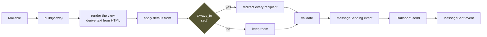

# Mail

A **mailable** is a value that knows what message it is. It says who the
message is from and to, and what the body is — and it does **no I/O**, which is
what makes the interesting part testable without a mail server.

```rust
use rainier_framework::prelude::*;

pub struct WelcomeEmail {
    pub name: String,
    pub email: String,
}

impl Mailable for WelcomeEmail {
    fn envelope(&self) -> Envelope {
        Envelope::new("Welcome!").to(self.email.clone())
    }

    fn content(&self) -> Result<Content> {
        Content::view("mail.welcome", json!({ "name": self.name }))
    }
}
```

```rust
Mail::instance().send(&WelcomeEmail { name, email }).await?;
```

## The envelope

```rust
Envelope::new("Your invoice")
    .from(Address::named("billing@example.com", "Acme Billing"))
    .to(Address::named("ada@example.com", "Ada Lovelace"))
    .cc("accounts@example.com")
    .bcc("archive@example.com")
    .reply_to("support@example.com")
```

`Address` converts from `&str` and `String`, so the short form is usually
enough. `Address::named(email, name)` produces `Name <email>` in the header.

`from` is optional — the mailer supplies a default:

```rust
Mailer::new(views, transport).with_default_from(Address::named("hello@example.com", "Rainier"))
```

which the [builder](lifecycle.md#the-builder) reads from `mail.from.address`
and `mail.from.name`.

## The content

```rust
// Rendered from a view
Content::view("mail.welcome", json!({ "name": name }))?

// …with a plain-text alternative from a second view
Content::view("mail.welcome", data)?.with_text_view("mail.welcome_text")

// Literal
Content::html("<p>Hello</p>")
Content::text("Hello")
```

Views live under `resources/views/mail/` and use the same
[template syntax](views.md) as pages.

**No text view is fine.** The mailer derives one from the HTML, so the message
is still readable in a text-only client. Supply one when the derived version
would be poor.

## Attachments

```rust
fn attachments(&self) -> Result<Vec<Attachment>> {
    Ok(vec![
        Attachment::from_path("storage/invoices/1.pdf")?,
        Attachment::from_bytes("report.csv", "text/csv", bytes),
    ])
}
```

## Headers

```rust
fn headers(&self) -> Vec<(String, String)> {
    vec![("X-Campaign".into(), "welcome".into())]
}
```

## Sending

```rust
let message = Mail::instance().send(&mailable).await?;   // build + deliver
let message = Mail::instance().prepare(&mailable)?;      // build only, no I/O
Mail::instance().deliver(message).await?;                // deliver a built one
```

`prepare` is the seam worth knowing about: it renders the views, applies the
default sender and the [`always_to` redirect](#always_to), and validates the
result — all synchronously, with no transport involved. A test that wants to
assert on the rendered body calls `prepare` and never touches a transport at
all.



## Transports

```rust
pub trait Transport: Send + Sync + 'static {
    fn name(&self) -> &str;
    fn send(&self, message: &Message) -> BoxFuture<'_, Result<()>>;
}
```

| Transport | Goes to | Cargo feature |
|---|---|---|
| `LogTransport` | the log | — |
| `FileTransport` | `.eml` files | — |
| `MemoryTransport` | memory, for tests | — |
| `SmtpTransport` | an SMTP server | `mail-smtp` |
| `SesTransport` | Amazon SES | `mail-ses` |
| `PostmarkTransport` | the Postmark API | `mail-postmark` |
| `MailgunTransport` | the Mailgun API | `mail-mailgun` |
| `SendGridTransport` | the SendGrid API | `mail-sendgrid` |
| `ResendTransport` | the Resend API | `mail-resend` |

The first three deliver nothing, and the default is the log — a deployment
that forgot to configure mail fails to send it rather than mailing real
people from a staging database. The senders are one cargo feature each,
because "we send through Postmark" is a single fact about a deployment and
the other providers' dependencies should cost it nothing.

**Every sender carries the same message.** The MIME document `render_eml`
produces travels whole over SMTP, SES and Mailgun; the JSON APIs are fed from
the same `Message` fields it renders. So the `.eml` you double-click in
development is what production delivers, whoever delivers it.

**`Bcc` stays blind by construction.** The rendered headers never contain
`Bcc`; blind recipients ride the SMTP envelope, the SES destination list, or
the API's own `Bcc` field — the split that *is* the mechanism of a blind
copy, decided in the framework rather than trusted to the server.

### Selecting one

`rainier_framework::mail::transport` is the exhaustive match over
`MAIL_DRIVER`, and `mail::mailer` is the whole provider:

```rust
// app/providers/app_provider.rs
let mailer = mail::mailer(&config, Arc::clone(views.engine()))
    .await?
    .with_events(container.resolve::<Dispatcher>()?);
```

Selecting a driver the build did not enable **fails the boot naming the
feature**, and a driver missing a setting it needs fails naming the variable
— because "mail is not working" should take one read of the boot log to
diagnose, not an afternoon.

### Configuration

```env
MAIL_DRIVER=smtp            # log | file | memory | smtp | ses | postmark | mailgun | sendgrid | resend
MAIL_FROM=hello@example.com
MAIL_FROM_NAME="My App"
MAIL_ALWAYS_TO=             # set in staging: every message goes here instead
MAIL_FILE_PATH=storage/mail # where the file driver writes

# smtp
MAIL_HOST=smtp.example.com
MAIL_PORT=0                 # 0 = whatever MAIL_ENCRYPTION's arrangement uses
MAIL_USERNAME=
MAIL_PASSWORD=
MAIL_ENCRYPTION=starttls    # starttls | tls | none
MAIL_TIMEOUT=30

# the API providers
MAIL_POSTMARK_TOKEN=
MAIL_MAILGUN_DOMAIN=
MAIL_MAILGUN_SECRET=
MAIL_MAILGUN_ENDPOINT=      # https://api.eu.mailgun.net for an EU domain
MAIL_SENDGRID_KEY=
MAIL_RESEND_KEY=
```

The `ses` driver has no variables of its own on purpose: region and
credentials come from the AWS default chain — `AWS_REGION`, a profile, IMDS —
exactly as the other AWS drivers resolve theirs.

`MAIL_ENCRYPTION=starttls` is a **required** upgrade, not an opportunistic
one: a server that will not upgrade is an error, never a plaintext session
that looks like a secure one. `none` exists for a capture container on
localhost and nothing else.

### Developing against a real SMTP server

```sh
docker run --rm -p 1025:1025 -p 8025:8025 axllent/mailpit
```

```env
MAIL_DRIVER=smtp
MAIL_HOST=localhost
MAIL_PORT=1025
MAIL_ENCRYPTION=none
```

[Mailpit](https://mailpit.axllent.org) accepts everything, delivers nothing,
and shows the result at `http://localhost:8025` — the file transport with a
web page. The framework's own SMTP tests run against exactly this, in CI and
locally, and skip when nothing is listening.

### The failure path

```rust
MemoryTransport::failing("connection refused")
```

is there for testing the path where sending fails, which is the one nobody
tests until it happens. The real senders distinguish the retryable failure
from the final one: a provider's `5xx` or `429` comes back as
service-unavailable — what a queued job's retry policy keys on — while a
`4xx` means this message or these credentials, which retrying will not fix.

## `always_to`

```rust
Mailer::new(views, transport).always_to(Address::new("dev@example.com"))
```

**Every** message goes to that address instead of its real recipients.

This is the difference between testing a flow against a copy of production data
and emailing all of those customers. Set it in staging and leave it set.

## Events

The mailer dispatches through the [event bus](events.md):

| Event | When |
|---|---|
| `MessageSending` | before the transport is called |
| `MessageSent` | after it succeeds |

```rust
Mailer::new(views, transport).with_events(events)
```

Useful for a send log, or a metric per campaign header.

## Testing

```rust
let mailer = Mailer::fake(views);
app.instance(mailer);

// … exercise the code …

Mail::instance().assert_sent_to("ada@example.com");
Mail::instance().assert_sent_times(1);
Mail::instance().assert_nothing_sent();

let sent: Vec<Message> = Mail::instance().sent();
let hers: Vec<Message> = Mail::instance().sent_to("ada@example.com");
```

Every assertion panics if you call it on a real mailer rather than passing
vacuously.

Because `build` does no I/O, a mailable's own test needs neither:

```rust
#[test]
fn the_welcome_email_greets_by_name() {
    let engine = MemoryEngine::new().with("mail.welcome", "Hi {{ name }}");
    let message = WelcomeEmail { name: "Ada".into(), email: "a@b.c".into() }
        .build(&engine)
        .unwrap();

    assert_eq!(message.envelope.subject, "Welcome!");
    assert!(message.html.unwrap().contains("Hi Ada"));
}
```

That is the payoff for keeping I/O out of `build`: the part with the logic in
it is a pure function.

## Rendering a message

```rust
use rainier_framework::mail::render_eml;

let raw = render_eml(&message);
```

The MIME document as it goes on the wire — for a snapshot test, or for
debugging what a client is choking on.

## What is not here

**No markdown mailables.** Write the HTML view. It is the thing that actually
ships, and a rendering layer between you and it makes the CSS harder, not
easier.
