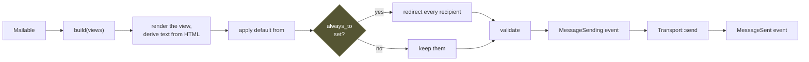

# Mail

A **mailable** is a value that knows what message it is. It says who the
message is from and to, and what the body is — and it does **no I/O**, which is
what makes the interesting part testable without a mail server.

```rust
use rainier_framework::prelude::*;

pub struct WelcomeEmail {
    pub name: String,
    pub email: String,
}

impl Mailable for WelcomeEmail {
    fn envelope(&self) -> Envelope {
        Envelope::new("Welcome!").to(self.email.clone())
    }

    fn content(&self) -> Result<Content> {
        Content::view("mail.welcome", json!({ "name": self.name }))
    }
}
```

```rust
Mail::instance().send(&WelcomeEmail { name, email }).await?;
```

## The envelope

```rust
Envelope::new("Your invoice")
    .from(Address::named("billing@example.com", "Acme Billing"))
    .to(Address::named("ada@example.com", "Ada Lovelace"))
    .cc("accounts@example.com")
    .bcc("archive@example.com")
    .reply_to("support@example.com")
```

`Address` converts from `&str` and `String`, so the short form is usually
enough. `Address::named(email, name)` produces `Name <email>` in the header.

`from` is optional — the mailer supplies a default:

```rust
Mailer::new(views, transport).with_default_from(Address::named("hello@example.com", "Rainier"))
```

which the [builder](lifecycle.md#the-builder) reads from `mail.from.address`
and `mail.from.name`.

## The content

```rust
// Rendered from a view
Content::view("mail.welcome", json!({ "name": name }))?

// …with a plain-text alternative from a second view
Content::view("mail.welcome", data)?.with_text_view("mail.welcome_text")

// Literal
Content::html("<p>Hello</p>")
Content::text("Hello")
```

Views live under `resources/views/mail/` and use the same
[template syntax](views.md) as pages.

**No text view is fine.** The mailer derives one from the HTML, so the message
is still readable in a text-only client. Supply one when the derived version
would be poor.

## Attachments

```rust
fn attachments(&self) -> Result<Vec<Attachment>> {
    Ok(vec![
        Attachment::from_path("storage/invoices/1.pdf")?,
        Attachment::from_bytes("report.csv", "text/csv", bytes),
    ])
}
```

## Headers

```rust
fn headers(&self) -> Vec<(String, String)> {
    vec![("X-Campaign".into(), "welcome".into())]
}
```

## Sending

```rust
let message = Mail::instance().send(&mailable).await?;   // build + deliver
let message = Mail::instance().prepare(&mailable)?;      // build only, no I/O
Mail::instance().deliver(message).await?;                // deliver a built one
```

`prepare` is the seam worth knowing about: it renders the views, applies the
default sender and the [`always_to` redirect](#always_to), and validates the
result — all synchronously, with no transport involved. A test that wants to
assert on the rendered body calls `prepare` and never touches a transport at
all.



## Transports

```rust
pub trait Transport: Send + Sync + 'static {
    fn send(&self, message: &Message) -> BoxFuture<'_, Result<()>>;
}
```

| Transport | Does |
|---|---|
| `LogTransport` | writes the message to the log |
| `FileTransport` | writes an `.eml` per message |
| `MemoryTransport` | keeps them in memory, for tests |

```env
MAIL_DRIVER=log
MAIL_DRIVER=file
```

```rust
FileTransport::new("storage/mail")?
```

`.eml` files open in any mail client, which makes "did the template render
correctly" a question you answer by double-clicking rather than by reading
escaped HTML in a log line.

Rainier ships no SMTP transport — implement `Transport` over `lettre`, SES,
Postmark, or whatever you send with. It is one method.

```rust
MemoryTransport::failing("connection refused")
```

is there for testing the path where sending fails, which is the one nobody
tests until it happens.

## `always_to`

```rust
Mailer::new(views, transport).always_to(Address::new("dev@example.com"))
```

**Every** message goes to that address instead of its real recipients.

This is the difference between testing a flow against a copy of production data
and emailing all of those customers. Set it in staging and leave it set.

## Events

The mailer dispatches through the [event bus](events.md):

| Event | When |
|---|---|
| `MessageSending` | before the transport is called |
| `MessageSent` | after it succeeds |

```rust
Mailer::new(views, transport).with_events(events)
```

Useful for a send log, or a metric per campaign header.

## Testing

```rust
let mailer = Mailer::fake(views);
app.instance(mailer);

// … exercise the code …

Mail::instance().assert_sent_to("ada@example.com");
Mail::instance().assert_sent_times(1);
Mail::instance().assert_nothing_sent();

let sent: Vec<Message> = Mail::instance().sent();
let hers: Vec<Message> = Mail::instance().sent_to("ada@example.com");
```

Every assertion panics if you call it on a real mailer rather than passing
vacuously.

Because `build` does no I/O, a mailable's own test needs neither:

```rust
#[test]
fn the_welcome_email_greets_by_name() {
    let engine = MemoryEngine::new().with("mail.welcome", "Hi {{ name }}");
    let message = WelcomeEmail { name: "Ada".into(), email: "a@b.c".into() }
        .build(&engine)
        .unwrap();

    assert_eq!(message.envelope.subject, "Welcome!");
    assert!(message.html.unwrap().contains("Hi Ada"));
}
```

That is the payoff for keeping I/O out of `build`: the part with the logic in
it is a pure function.

## Rendering a message

```rust
use rainier_framework::mail::render_eml;

let raw = render_eml(&message);
```

The MIME document as it goes on the wire — for a snapshot test, or for
debugging what a client is choking on.

## What is not here

**No markdown mailables.** Write the HTML view. It is the thing that actually
ships, and a rendering layer between you and it makes the CSS harder, not
easier.
