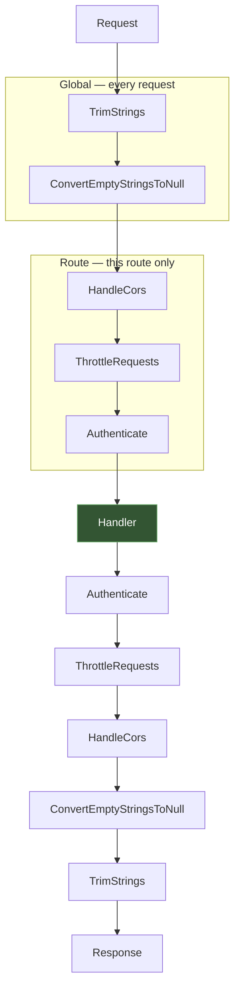
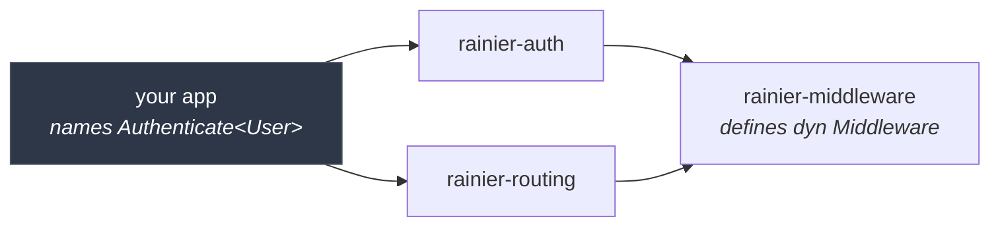

# Middleware

Middleware sits **around** the rest of the chain. It can inspect the request on
the way in, inspect or replace the response on the way out, wrap the whole call,
or decline to call `next` at all.

```rust
use rainier_framework::prelude::*;

pub struct RequireApiKey;

#[async_trait]
impl MiddlewareContract for RequireApiKey {
    async fn handle(&self, request: Request, next: Next) -> Response {
        match request.header("x-api-key") {
            Some("secret") => next.run(request).await,
            _ => Response::new(StatusCode::UNAUTHORIZED),
        }
    }

    fn name(&self) -> &'static str {
        "RequireApiKey"
    }
}
```

> The prelude imports the trait as `MiddlewareContract`, because `Middleware`
> is taken by the facade for the registry. Import
> `rainier_framework::middleware::Middleware` directly if you prefer the plain
> name.
>
> `name()` is a **label** — it is what `route:list` prints. Nothing looks
> middleware up by it, so two stages sharing one is untidy rather than broken.
> Leaving it out gives you the type's short name, which is usually right.

## The onion



Each stage sees the request going in and the response coming out. `name()` is
what `route:list` prints and what appears in `Pipeline::stage_names()`.

## Where middleware is declared

A name-based middleware kernel needs three maps: a global list, an alias →
class map, and named groups of aliases. Rainier has the first. The other two
exist only because a dynamic language cannot put a class in a route file and
have the router mean it.

```rust
// src/app/http/kernel.rs

/// Global — runs on every request, outermost first.
pub fn register(registry: &MiddlewareRegistry) {
    registry.global(RequestIdMiddleware::new());
    registry.global((TrimStrings::new(), ConvertEmptyStringsToNull));
}

/// A group — a function returning a stack, not a name in a map.
pub fn web() -> MiddlewareStack {
    groups::web().with(RequireApiKey)
}
```

```rust
Rainier::new(".").with_middleware(kernel::register)
```

| Rainier | The name-based equivalent |
|---|---|
| `registry.global(m)` | a global middleware array |
| `.middleware(m)` on a route | an alias registered in a kernel map, named at the route |
| `pub fn web() -> MiddlewareStack` | a named group in a config array |
| `ThrottleRequests::per_minute(60)` | parameters packed into a string, `'throttle:60,1'` |
| `.without_middleware::<T>()` | an opt-out by name |

## Why values and not names

```rust
router.get("/me", me).middleware(Authenticate::<User>::resolved_with_guard("api"));
```

The name-based version is `->middleware('auth:api')`, looked up at runtime.
That lookup map is the only thing standing between a typo and a route that
serves unguarded, and a dynamic language has no better option.

| | `.middleware("athu")` | `.middleware(Authenticate…)` |
|---|---|---|
| The typo | boots; the route is public | does not compile |
| Renaming the middleware | every route silently breaks | every route is a compile error, named |
| Deleting it | same | same |
| "What is in `web`?" | grep the kernel | go to definition |
| A group with a parameter | parse it back out of a string | `api(60)` |

### But doesn't the router now depend on everything?

No, and this was the original reason for the names — worth stating because it
sounds decisive and is not.

`Route::middleware` takes `impl IntoMiddlewareStack`, which bottoms out at
`dyn Middleware`. That trait lives in `rainier-middleware`, which
`rainier-routing` already depends on. The **application** names
`Authenticate<User>`, because the application is the crate that knows both the
guard and the user model.



The router never names a concrete middleware, so it never needs the crate that
defines one. Nothing about that required a string.

## Attaching it

Anything that is middleware, a tuple of middleware, or a stack:

```rust
// One.
router.get("/", home).middleware(AddHeaders::security_defaults());

// Several, in order.
router.post("/upload", upload)
    .middleware((RequireApiKey, ThrottleRequests::per_minute(5)));

// A group.
router.group(GroupAttributes::new().middleware(kernel::web()), |router| {
    router.get("/dashboard", dashboard);
});

// Chained, which is the same thing.
router.get("/admin", admin)
    .middleware(kernel::web())
    .middleware(RequireRole::Admin);
```

Group middleware runs **outside** a route's own, so a group's session wraps
whatever the route adds.

## Groups are functions

```rust
pub fn api(per_minute: u32) -> MiddlewareStack {
    MiddlewareStack::new()
        .with(HandleCors::any_origin())
        .with(ThrottleRequests::per_minute(per_minute))
}

pub fn api_authenticated() -> MiddlewareStack {
    api(60).with_stack(auth("api"))
}
```

Nesting is `with_stack`. There is no cycle check because a cycle is not
expressible: a function that calls itself into a value recurses forever, and
that is a mistake you cannot make by writing one line in a config array.

> **Extending beats replacing.** The classic config edit that overwrites a
> framework group wholesale — `['web'] = ['secure-headers']` — silently drops
> the session middleware and every page in the group loses its session, with
> nothing failing. Write your `web()` in terms of the framework's:
>
> ```rust
> pub fn web() -> MiddlewareStack {
>     rainier_framework::groups::web().with(RequestIdMiddleware::new())
> }
> ```

Rainier ships `groups::web()`, `groups::api()`, `groups::api_throttled(n)`,
`groups::session()`, `groups::normalise_input()` and
`groups::trust_local_proxies()`.

## Middleware that needs the container

Routes are declared before the container is populated, so an authentication
guard cannot be handed its `AuthManager` at declaration time. This is the one
thing the alias-and-factory indirection genuinely bought.

`resolved` buys it without a name:

```rust
MiddlewareStack::new()
    .resolved(|auth: Arc<AuthManager<User>>| Authenticate::new(auth))
```

The closure runs when the router **compiles** — after the providers, before the
first request. A missing binding is a boot failure naming the route, the
middleware and the service:

```
Error: route `GET /api/me`: could not build the `Authenticate` middleware:
nothing is bound for `app::auth::AuthManager<app::models::User>` — register it
in a service provider before resolving
```

The container arrives as an **argument**. That is the difference between a
builder a test can call and one that panics unless a process-wide slot happens
to be filled — the same reason the names went.

`deferred` is the general form, for middleware built from more than one service.

## Opting out

```rust
router.post("/webhooks/stripe", stripe)
    .without_middleware::<VerifyCsrfToken>();
```

By type, because that is the only identity a value has. It matches the
**concrete type**, so excluding `ThrottleRequests` drops every rate limiter the
group applied rather than one particular configuration of it. Where that is too
blunt, do not put it in the group.

## Controller middleware

A [resource controller](controllers.md#resource-controllers) can guard its own
actions:

```rust
impl ResourceController for PostController {
    async fn index(&self, request: Request) -> Response { … }
    async fn destroy(&self, request: Request) -> Response { … }

    fn middleware(&self) -> ControllerMiddleware {
        ControllerMiddleware::new()
            .except(
                [ResourceAction::Index, ResourceAction::Show],
                Authenticate::<User>::resolved(),
            )
            .only([ResourceAction::Destroy], RequireRole::Admin)
    }
}
```

| Method | Applies to |
|---|---|
| `always(m)` | every action |
| `only([actions], m)` | just those |
| `except([actions], m)` | everything else |

Prefer `except`. An action added next year arrives guarded, where an `only` list
leaves it public until someone remembers to add it.

Controller middleware runs **inside** the route's group and outside the action,
so a group's session still wraps the controller's authorisation check.

## The built-ins

| Middleware | Construct it | What it does |
|---|---|---|
| `TrimStrings` | `TrimStrings::new()` | trims whitespace from every string input |
| `ConvertEmptyStringsToNull` | `ConvertEmptyStringsToNull` | `""` becomes `null` |
| `AddHeaders` | `AddHeaders::security_defaults()` | adds fixed response headers |
| `HandleCors` | `HandleCors::any_origin()` | CORS, including preflight |
| `ThrottleRequests` | `ThrottleRequests::per_minute(60)` | rate limiting |
| `TrustProxies` | `groups::trust_local_proxies()` | believe `X-Forwarded-For`, from proxies you name |
| `StartSession` | `groups::session()` | load and persist the [session](sessions.md) |
| `Authenticate` | `Authenticate::<User>::resolved()` | see [Authentication](authentication.md) |
| `RedirectIfAuthenticated` | `RedirectIfAuthenticated::new(auth, "/")` | bounce a logged-in user off `/login` |
| `Timeout` | `Timeout::seconds(30)` | cancel a handler that overruns, answering `408` |
| `Compress` | `Compress::new()` | gzip a text response the client asked for |
| `MethodOverride` | `MethodOverride::new()` | let an HTML form spell `PUT`/`PATCH`/`DELETE` |

The two input normalisers are **global by default**; CORS, throttling and
authentication are opt-in per route, because applying them everywhere by
default is nearly always wrong. `Timeout` and `Compress` are global when
[configured on](configuration.md#what-the-framework-sets-for-you) and absent otherwise.

### `TrimStrings` and `ConvertEmptyStringsToNull`

These rewrite the parsed input, which is why `request.input(…)` sees the
normalised value and [validation](validation.md) does too. An empty form field
arriving as `""` and being treated as "present but empty" is a bug factory;
turning it into `null` makes `Rule::Required` behave the way you expect.

```rust
registry.global(TrimStrings::new().except(["password"]));
```

Exempt anything where leading or trailing whitespace is meaningful.

### `AddHeaders`

```rust
AddHeaders::security_defaults()
AddHeaders::new().with("x-frame-options", "DENY")
```

### `HandleCors`

```rust
HandleCors::any_origin()

HandleCors::default()
    .allow_origins(["https://app.example.com"])
    .allow_methods(["GET", "POST"])
    .allow_headers(["content-type", "authorization"])
    .expose_headers(["x-request-id"])
    .allow_credentials(true)
    .max_age(600)
```

Answers preflight `OPTIONS` itself rather than passing it through.
`any_origin()` plus `allow_credentials(true)` is a combination browsers reject,
and so does this.

### `ThrottleRequests`

```rust
ThrottleRequests::per_minute(60)
ThrottleRequests::per_hour(1000)
ThrottleRequests::new(10, Duration::from_secs(1))
```

A throttled request is a `429` with `Retry-After`, and that header survives
error re-rendering.

#### What it counts against

The default key is the bearer token if there is one and the client IP
otherwise — which is why [`TrustProxies`](#trustproxies) matters, because
without it configured correctly a client can forge the very thing the limiter
counts.

That default is the **wrong** key for a login form. There is no token yet, so
every attempt counts against an address, and:

- an attacker spraying one password across ten thousand accounts from a botnet
  never trips it;
- a whole office behind one NAT locks itself out.

Key on what was submitted instead, which limits attempts *per account* — the
thing actually being protected:

```rust
ThrottleRequests::per_minute(5)
    .named("login")
    .keyed_by(|request| request.input("email"))
```

Returning `None` from `keyed_by` means **do not count this request**: a login
with no email in it is a validation failure, and answering `429` would say
something untrue.

#### Name every limiter

Two limiters on one route with no names count the same request twice against
the same key, so a `5/min` and a `100/hour` become a `5/min` that also spends
the hourly allowance. A name namespaces the keys, and it is also what keeps
`/login` and `/password/reset` from sharing an allowance when both are keyed
by email.

#### Where the counters live

A bare `ThrottleRequests` counts **in its own process**. Behind a load
balancer that means five replicas each enforce "five a minute" separately, and
the effective limit is twenty-five.

For a page-view limiter that is a rounding error. For a credential limiter it
is the difference between a control and a decoration:

```rust
router.post("/login", login).middleware(limits::shared(
    ThrottleRequests::per_minute(5)
        .named("login")
        .keyed_by(|request| request.input("email")),
));
```

`limits::shared` counts in the store the bootstrap bound from `CACHE_DRIVER` —
the same place [locks](cache.md#atomic-locks) live, so a deployment decides
where its shared state is once. The bootstrap **warns at boot** when it finds
a throttled route counting per-process, naming the routes.

The counter itself is a [port](cache.md#rate-limit-counters), not the cache: a
deployment can put its limits in a dedicated service or a database table
without the middleware crate learning about either.

#### It fails open

If the counter is unreachable the request is **allowed**, and the failure is
logged. A Redis outage that turned every request into a `429` would be a much
larger incident than the one the limiter prevents, and it would take the login
page down with it.

#### Fixed windows

One integer and one expiry per key, rather than a timestamp per request — the
difference between a limiter that costs nothing and one that is its own
scaling problem. The trade is a boundary effect: a caller can spend a full
window's allowance either side of a reset.

### `TrustProxies`

```rust
router.get("/api/x", x)
    .middleware((TrustProxies::these(["10.0.0.0/8"]), ThrottleRequests::per_minute(60)));
```

| Construct | Trusts |
|---|---|
| `groups::trust_local_proxies()` | loopback and the private ranges — where a proxy usually is |
| `TrustProxies::these(["10.0.0.0/8"])` | exactly what you name |
| `TrustProxies::all()` | whoever connected |
| `TrustProxies::all().header("CF-Connecting-IP")` | …reading a different header |

**Order it before anything that reads the client IP** — the throttle, an audit
log. It rewrites `ClientIp`, and a middleware that already ran has seen the old
one.

`X-Forwarded-For` is *appended to* by every hop, so it reads
`client, proxy1, proxy2`. Rainier walks it from the **right**, skipping
addresses that are themselves trusted proxies; the first untrusted one is the
client.

Taking the leftmost entry instead — the obvious reading of "the original
client" — is what makes this spoofable. The left of the chain is whatever the
client sent, and a client can send anything:

```
X-Forwarded-For: 1.2.3.4, 203.0.113.9, 10.0.0.5
                 ^ forged  ^ real       ^ our proxy
```

Only entries your own proxies appended are worth believing, and those are on the
right.

`TrustProxies::all()` names no addresses, so it cannot recognise a hop to skip
and simply takes the rightmost entry — correct when a single proxy is the only
thing that can reach the port, and wrong if the port is open to the internet.

### `Timeout`

```rust
router.post("/import", import).middleware(Timeout::seconds(300));
```

A ceiling on how long a handler may take, answering `408` when it overruns.
Without one, a handler that never returns holds its connection, its task and
whatever it borrowed for as long as the process lives — and enough of those is
a service that has stopped answering *everything*, with nothing in the log
about the one endpoint that hung.

Configure it globally rather than per route with
`server.request_timeout_secs`; `0` turns it off, which is the default, because
the right ceiling is a fact about your application and a wrong one cancels work
that was going to succeed. When set, it goes **first** in the global stack — a
timeout that sits inside the throttle cannot cancel time spent in the throttle.

```env
SERVER_REQUEST_TIMEOUT=30
```

Two things it does not do, both worth knowing before relying on it:

**Cancelling is not undoing.** At the deadline the handler's future is dropped,
which stops the part that had not run yet. Work already handed to somebody else
keeps going: a query in flight was already sent and the row will be written, an
HTTP request already issued reaches the other service, a job already pushed
will be worked. This bounds *your* latency. A handler that must be
all-or-nothing needs a transaction, not a timeout.

**It can only interrupt at an `await`.** A handler that blocks the thread — a
long CPU loop, a synchronous file read, `std::thread::sleep` — never yields, so
the timer never fires and the runtime worker stays blocked. Move that work to
`spawn_blocking`; no middleware can save you from it.

It bounds the **handler**, not the response body, so a streaming or
server-sent-events route is unaffected: it returns its response immediately and
streams afterwards.

### `Compress`

```rust
registry.global(Compress::new());
```

Or `server.compression = true`. Off by default, because the usual deployment
has nginx or a CDN in front and compressing twice is CPU spent to produce the
same bytes — turn it on when Rainier is what clients talk to.

A JSON list of two hundred records is mostly repeated key names, and gzip takes
it to roughly a tenth. What it deliberately leaves alone:

| | Why |
|---|---|
| bodies under `min_size` (1 KiB) | the gzip header and trailer cost more than the saving |
| `image/*`, `video/*`, zip, woff2, PDF | already compressed; deflate makes them very slightly larger |
| **streaming bodies** | buffering an SSE response to compress it would hold every event until the stream ended |
| anything with a `content-encoding` | somebody has already decided |

`Vary: accept-encoding` goes on every response that *could* have been
compressed, whether or not it was. Without it a shared cache can hand a gzipped
body to a client that did not ask for one — which reads, at the far end, as a
corrupt response from an endpoint that works fine when tested directly.

```rust
Compress::new().min_size(4096).level(9)     // 0 none … 9 smallest, default 6
```

`gzip` and `deflate`, negotiated from `accept-encoding` with q-values honoured,
gzip winning a tie. Compression runs inline on the runtime thread: a few
hundred kilobytes is a millisecond or two, and a route returning megabytes
should raise `min_size` or not use this.

### `MethodOverride`

```rust
registry.global(MethodOverride::new());
```

```html
<form method="post" action="/posts/7">
  <input type="hidden" name="_method" value="DELETE">
</form>
```

A browser form can send `GET` and `POST` and nothing else. The hidden
`_method` field is the long-standing server-side convention for the rest, and
this converts it — which is what lets a server-rendered application have a
REST-shaped route table without a line of JavaScript.

Off by default and deliberately so. A JSON API has no use for it, and a rewrite
nobody needs is one that can surprise somebody: anything upstream that made a
decision **by method** — a WAF rule, an audit log, a proxy that only forwards
`POST` to this path — made it on the original.

It only ever upgrades a `POST`, and only to `PUT`, `PATCH` or `DELETE`. A `GET`
carrying `?_method=DELETE` is a link somebody crafted, and following it would
make every crawler a hazard. Anything else in the field is ignored rather than
refused: a `400` would be a stricter contract than the form ever agreed to.

`MethodOverride::new().trusting_the_header()` also honours
`X-HTTP-Method-Override`, for a client behind something that will not forward a
`PATCH`. Separate from the default because a header is easier to attach by
accident: an intermediary adding it to every request would rewrite every `POST`
in the application.

Order it **before the router**, which a global stage already is — the route has
otherwise been chosen for the old method.

## Writing one

```rust
use std::sync::atomic::{AtomicU64, Ordering};
use rainier_framework::middleware::{Middleware, Next};
use rainier_framework::prelude::*;

pub struct RequestId(pub String);

#[derive(Default)]
pub struct RequestIdMiddleware {
    counter: AtomicU64,
}

#[async_trait]
impl Middleware for RequestIdMiddleware {
    async fn handle(&self, mut request: Request, next: Next) -> Response {
        let id = request
            .header("x-request-id")
            .filter(|incoming| is_safe(incoming))
            .map(str::to_string)
            .unwrap_or_else(|| self.next_id());

        request.extensions_mut().insert(RequestId(id.clone()));
        next.run(request).await.with_header("x-request-id", &id)
    }

    fn name(&self) -> &'static str {
        "RequestId"
    }
}
```

Three things worth copying from this:

1. **It takes `&self`, not `self`.** Middleware is shared across every
   concurrent request, so state must be interior-mutable — `AtomicU64`,
   `Mutex`, `DashMap`. The compiler will tell you.
2. **It honours an incoming value.** A request that crossed a proxy keeps one
   id end to end, which is the entire point of having one.
3. **It validates before echoing.** An id echoed into a response header must
   not carry anything that could break out of it, and an unbounded one is a
   cheap way to bloat every log line.

Handlers read what it left behind through
[extensions](requests.md#extensions):

```rust
let id = request.extension::<RequestId>().map(|id| id.0.clone());
```

## Short-circuiting

Not calling `next` is how a guard rejects:

```rust
async fn handle(&self, request: Request, next: Next) -> Response {
    if !allowed(&request) {
        return Response::new(StatusCode::FORBIDDEN);
    }
    next.run(request).await
}
```

`next.remaining()` tells you how many stages are left, which is occasionally
useful in diagnostics.

## Using a pipeline directly

`Pipeline` is public, so middleware is testable without a router:

```rust
let response = Pipeline::new()
    .through(TrimStrings::new())
    .through_arc(Arc::clone(&generator) as Arc<dyn Middleware>)
    .then(|request: Request| async move { Response::text("ok") })
    .run(request)
    .await;
```

Use `through_arc` with a shared `Arc` when the middleware has state you want to
observe across requests — building a fresh one per request restarts its
counters, which is a mistake that produces a confusingly passing test.
