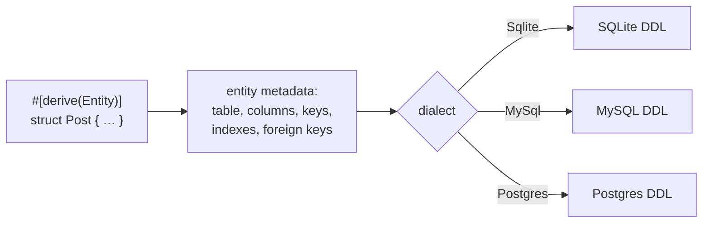
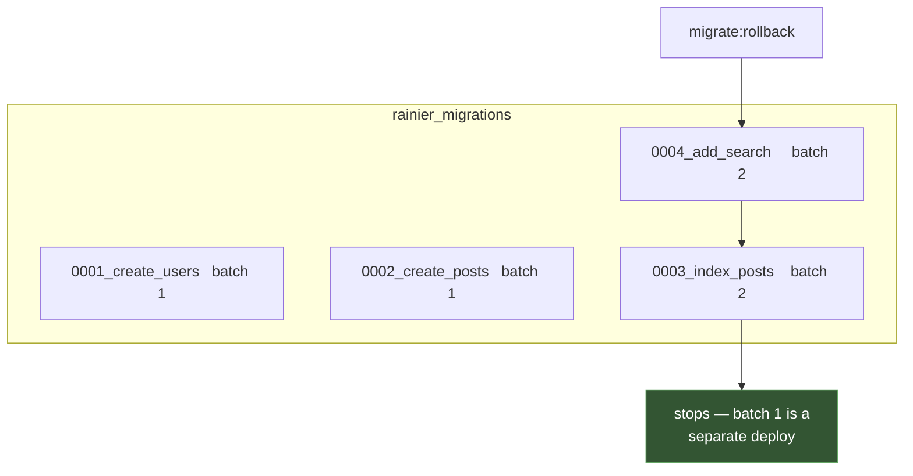

# Migrations

Migrations are ordered, named, and idempotent. Each runs at most once, tracked
in a `rainier_migrations` table, so `migrate` is safe to run on every boot.

Every migration declares two things: what it does, and how to undo it.

```rust
// src/database/migrations/mod.rs
use rainier_framework::database::Migrator;

pub fn all() -> Migrator {
    Migrator::new()
        .add(m0001_create_users::migration())
        .add(m0002_create_posts::migration())
        .add(m0003_index_posts_author::migration())
}
```

Rust does not autoload, so no directory scan discovers migrations: the order
lives in `all()` and each migration lives in its own module:

```text
src/database/migrations/
  mod.rs                        the ordered list
  m0001_create_users.rs         create_table, from the model's metadata
  m0002_create_posts.rs         …and a foreign key
  m0003_index_posts_author.rs   an index, from the builder
  m0004_add_post_search.rs      the exception: SQL that differs per engine
  m0005_normalise_emails.rs     a data migration that cannot be undone
  m0006_create_tags.rs          another table from a model
  m0007_create_post_tag.rs      a pivot: a table with no model
  m0008_posts_add_excerpt.rs    an alter, with a derived rollback
```

Each module exposes one `pub fn migration() -> Step`, so the name, the `up` and
the `down` sit together and the running order is one file you can read. The `m`
prefix is there because a Rust module cannot start with a digit.

For a small application the whole thing fits in one `migrations.rs` with
chained builder calls; the split earns its keep once a migration has a
`#[cfg(test)]` block of its own, which the interesting ones do.

```sh
cargo run -- migrate
cargo run -- migrate --pretend             # list what would run
cargo run -- migrate:rollback              # undo the last batch
cargo run -- migrate:rollback --pretend    # list what would be undone
```

## The contract

`Migration` is a trait with three methods and no defaults:

```rust
pub trait Migration: Send + Sync + 'static {
    fn name(&self) -> &str;
    fn up(&self, dialect: Dialect) -> Vec<String>;
    fn down(&self, dialect: Dialect) -> Down;
}
```

```rust
pub enum Down {
    Statements(Vec<String>),
    Irreversible(String),   // …and why
}
```

The builder methods (`create_table`, `raw`, `step`) produce a `Step`, which is
that trait implemented over a pair of closures. Implement the trait directly
when a migration deserves a name and a file of its own:

```rust
pub struct BackfillSlugs;

impl Migration for BackfillSlugs {
    fn name(&self) -> &str {
        "0004_backfill_slugs"
    }

    fn up(&self, _: Dialect) -> Vec<String> {
        vec!["UPDATE posts SET slug = lower(title) WHERE slug IS NULL".into()]
    }

    fn down(&self, _: Dialect) -> Down {
        Down::irreversible("the original NULLs are not recoverable")
    }
}
```

```rust
Migrator::new().add(BackfillSlugs)
```

### Why `down` is required

An optional `down` is a `down` that is usually missing — and by the time you
need one, the migration that lacks it is months old and nobody remembers what
it changed.

Requiring it costs one line, and forces the question at the only moment it is
easy to answer: while you are writing the `up` and the schema is in your head.

The escape hatch is **not** an empty vector. It is
`Down::irreversible(reason)`, because *"this cannot be undone"* and *"nobody
wrote a down step"* are different facts and only one of them is a bug:

| | An empty `down` | `Down::irreversible` |
|---|---|---|
| A rollback | succeeds, silently doing nothing | **refuses**, and prints the reason |
| Six months later | indistinguishable from an oversight | says which it was, and why |

```rust
.raw_irreversible(
    "0005_drop_legacy_column",
    vec!["ALTER TABLE users DROP COLUMN legacy_token".into()],
    "the column's contents are gone; restore from a backup",
)
```

List them before a deploy — this is exactly the set a rollback will refuse:

```rust
migrator.irreversible(db.dialect());     // ["0005_drop_legacy_column"]
```

`migrate` prints the same list when a run applies one, so you learn about it at
deploy time rather than at rollback time.

## Names are permanent

Migrations run **in the order listed** and never re-run. A name is the identity
of an applied migration, so **renaming one makes it run again**.

Treat an applied name as permanent. The numeric prefix is a convention that
makes the order visible in the file, not something the framework parses.

## DDL from the model

```rust
.create_table::<Post>("0002_create_posts")
```

`create_table` renders the DDL from the model's own
[`#[orm]` metadata](models.md#the-orm-attributes), for the connection's
dialect. **The schema cannot drift from the struct that defines it** — add a
column to the struct and the table it creates has that column.



Its `down` is the matching `DROP TABLE IF EXISTS`, which you get without
writing it. That is the honest inverse — and also why rolling back a
`create_table` in production destroys data. The operation is destructive, not
the implementation.

To see what it produces:

```rust
use rainier_framework::database::schema;

let ddl = schema::schema_ddl::<Post>(Dialect::Sqlite).join("\n");
assert!(ddl.contains("posts"));
assert!(ddl.contains("users"), "the foreign key should be declared");
```

That assertion in a test is worth writing: it catches a model change that
would have altered the schema.

`create_table` is the right tool when a model describes the table. For anything
else — a pivot, a join table, a table another system owns — and for **changing**
a table that already exists, reach for [the builder](#the-schema-builder): the
entity only describes the current shape, never the diff from the last one.

## The schema builder

For a table no model describes — a pivot, a join table, something another
system reads — describe it and let the builder render it:

```rust
Step::create("0007_create_post_tag", "post_tag", |table| {
    table.foreign_id("post_id").constrained_on("posts").cascade_on_delete();
    table.foreign_id("tag_id").constrained_on("tags").cascade_on_delete();

    table.primary(["post_id", "tag_id"]);
})
```

A schema builder. **There is no SQL in it**, and
that is the point: the three engines disagree about nearly every line of a
`CREATE TABLE`, and reconciling them is the job you are running a DBAL to
avoid.

| | SQLite | MySQL | Postgres |
|---|---|---|---|
| Auto-increment key | `INTEGER PRIMARY KEY AUTOINCREMENT` | `BIGINT AUTO_INCREMENT` | `bigserial` |
| Bytes | `blob` | `blob` | `bytea` |
| JSON | `text` | `json` | `jsonb` |
| Fixed-point | *(no such type — `real`)* | `decimal(p,s)` | `decimal(p,s)` |
| `CREATE INDEX IF NOT EXISTS` | yes | **rejected** | yes |
| Dropping an index | `DROP INDEX i` | `DROP INDEX i ON t` | `DROP INDEX i` |
| Renaming a table | `ALTER TABLE … RENAME TO` | `RENAME TABLE` | `ALTER TABLE … RENAME TO` |

Every row of that is a way a hand-written migration works on your laptop and
fails in CI.

### Columns

```rust
table.id();                              // big auto-increment `id`
table.big_increments("uid");
table.string("title");                   // VARCHAR(255)
table.string_len("excerpt", 500);
table.text("body");                      // unbounded — not indexable on MySQL
table.integer("hits");
table.big_integer("bytes");
table.unsigned_big_integer("size");
table.boolean("published");
table.double("ratio");
table.decimal("price", 8, 2);
table.timestamp("published_at");
table.date("born_on");
table.binary("thumbnail");
table.json("meta");

table.timestamps();                      // created_at + updated_at, nullable
table.soft_deletes();                    // deleted_at, nullable
```

Modifiers chain off any of them:

```rust
table.string("email").unique();
table.text("bio").nullable();
table.integer("logins").default(0);
table.string("slug").index();
```

**Columns are `NOT NULL` unless they say otherwise.** SQL's default is the
other way round, and it is the wrong way round: nullability should be a
decision somebody made rather than one they got by omission.

### Keys and indexes

```rust
table.primary(["post_id", "tag_id"]);        // composite
table.index(["published", "created_at"]);
table.unique(["team_id", "slug"]);

table.foreign_id("author_id").constrained_on("users").cascade_on_delete();
table.foreign_id("editor_id").nullable().constrained_on("users").null_on_delete();
```

`foreign_id` is an unsigned 64-bit column **and an index**, which is what you
almost always want — a foreign key you never query by is unusual.

Indexes are named `{table}_{columns}_{kind}`: `posts_author_id_index`,
`users_email_unique`. Predictable rather than clever, because a rollback has to
name the index it is dropping without being told. Override with
`.named("…")` where an existing schema disagrees.

### Altering a table

```rust
Step::table("0008_posts_add_excerpt", "posts", |table| {
    table.string_len("excerpt", 500).nullable();
    table.index(["author_id", "created_at"]);
})
```

A column added to a table that already holds rows must be `nullable()` or carry
a `default()` — the existing rows have no value for it otherwise, and every
engine refuses. The builder cannot know whether your table is empty, so it does
not guess.

Also available: `rename_column(from, to)`, `drop_column(name)`,
`drop_index(columns)`, `drop_unique(columns)`.

### The rollback is derived

This is the part worth the whole feature. `Step::table` computes its own `down`
from what changed:

| Change | Reversal |
|---|---|
| add a column | drop it |
| create an index | drop it |
| rename a column | rename it back |
| drop an index | create it again |

In reverse order, so an index over a column goes before the column does.

A hand-written `down` is the half of a migration that goes stale first: add a
second column six months later, forget the matching `DROP COLUMN`, and the
rollback silently leaves it behind. A derived one **cannot disagree with the
`up`**, because there is only one description.

Two changes genuinely cannot be undone, and say so rather than pretending:
`drop_column`, because the type and the data are gone; and `raw` with no
reverse, because nothing knows what it did. Both make the step
[irreversible](#why-down-is-required) with a reason naming the change, and the
rollback [refuses before it starts](#a-rollback-refuses-before-it-starts).

### Other whole-table operations

```rust
Step::drop_table("0009_drop_legacy", "legacy_imports")   // irreversible
Step::rename_table("0010_rename", "posts", "articles")   // reverses itself
```

`drop_table` is irreversible on purpose: nothing here knows the shape of what
it dropped, and a `down` that recreated an empty table would report success
having restored nothing.

## Raw SQL

The escape hatch, and it should feel like one. Before reaching for it, check
that [the builder](#the-schema-builder) cannot say what you mean — a migration
with SQL in it is a migration that stops being portable.

```rust
Step::raw(
    "0005_normalise_emails",
    vec!["UPDATE users SET email = LOWER(email)".into()],
    vec![],
)
```

Legitimate here: this is **data**, not schema. `UPDATE`, backfills and
one-off corrections have no schema builder to express them and are the same SQL
everywhere.

Several statements in one migration run in order — and so do the `down`
statements, so write those in the order they need to happen rather than as a
mirror of the `up`.

### A step per dialect

Sometimes the engines are not spelling one feature three ways; they have three
different features. Full-text search is the honest example — a GIN index over a
`tsvector`, an FTS5 **virtual table**, and a `FULLTEXT` index are not the same
object. There is nothing to translate to, so the migration answers per dialect:

```rust
Step::new(
    "0004_add_search",
    |dialect| match dialect {
        Dialect::Postgres => vec![
            "CREATE INDEX posts_search ON posts USING gin (to_tsvector('english', body))".into(),
        ],
        Dialect::Sqlite => vec![
            "CREATE VIRTUAL TABLE posts_fts USING fts5(title, body)".into(),
        ],
        Dialect::MySql => vec![
            "CREATE FULLTEXT INDEX posts_search ON posts (title, body)".into(),
        ],
    },
    |dialect| match dialect {
        Dialect::Postgres => Down::statements(["DROP INDEX posts_search".to_string()]),
        Dialect::Sqlite => Down::statements(["DROP TABLE posts_fts".to_string()]),
        Dialect::MySql => Down::statements(["DROP INDEX posts_search ON posts".to_string()]),
    },
)
```

Match **exhaustively**, without a `_` arm. A dialect added to the framework
should break this and make you decide, rather than silently leaving one backend
with no index until someone notices a slow query.

Returning an empty vector from `up` is a legal no-op for a backend that
genuinely needs nothing, and the matching `down` is `Down::statements([])` —
not `Down::irreversible`, which is a refusal rather than a nothing.

## Running them

Through the command:

```sh
cargo run -- migrate
cargo run -- migrate --pretend
```

Or in a [provider's `boot`](providers.md), which is what makes a fresh clone
work with no setup step:

```rust
boot_provider!(async |self, app| {
    let migrator = app.resolve::<Migrator>()?;
    let database = app.resolve::<Database>()?;
    let applied = migrator.run(&database).await?;
    if !applied.is_empty() {
        tracing::info!(?applied, "migrations applied");
    }
    Ok(())
});
```

`run` returns the names it applied — empty when everything was already done.

```rust
migrator.applied(&db).await?;    // what has run
migrator.pending(&db).await?;    // what has not
migrator.names();                // what exists
migrator.len();
migrator.is_empty();
```

## Batches

Everything one `migrate` applies shares a **batch number**, recorded next to
the name. A batch is the unit a rollback takes back off — it is "the last
deploy", not "the last migration".



```sh
cargo run -- migrate:rollback                # the last batch
cargo run -- migrate:rollback --batches=3    # the last three
```

Within a batch, steps are undone in **reverse** declaration order. That matters:
dropping the table a foreign key points at before dropping the key fails on
every backend that enforces them.

### A rollback refuses before it starts

Both of these are checked across the whole range *before* any statement runs:

- a step in range declared itself [irreversible](#why-down-is-required)
- a step in range is in the ledger but no longer in the migrator — usually
  because it was deleted from the code while still applied

Either one aborts the rollback with the name in the message and nothing
executed. A half-rolled-back batch leaves the schema in a state no migration
describes, which is harder to recover from than not having started.

```
Error: `0005_drop_legacy_column` cannot be rolled back: the column's contents
are gone; restore from a backup
```

`migrate:rollback` exits non-zero on that, so a deploy script that chains a
rollback stops rather than carrying on against a schema it did not change.

### Roll forward when you can

Rollback exists because sometimes you need it at three in the morning. It is
still usually the second-best answer.

Rolling **forward** — a new migration that undoes what the last one did — runs
through the same path everything else does, is tested by the same deploy, and
leaves a history that reads as what actually happened. A `down` written months
ago has been tested by nothing.

Use rollback in development, and in the narrow production case where the last
deploy is minutes old and you know exactly what it changed.

## Migrations for the queue and sessions

The [database queue](queues.md#databasequeue) needs two tables, and the
[database session store](sessions.md) one. They come as migrators you merge in:

```rust
use rainier_framework::queue::DatabaseQueue;
use rainier_framework::session::DatabaseSessionStore;

pub fn all() -> Migrator {
    Migrator::new()
        .create_table::<User>("0001_create_users")
        .create_table::<Post>("0002_create_posts")
        .merge(DatabaseQueue::migrations())
        .merge(DatabaseSessionStore::migrations())
}
```

`merge` appends another migrator's steps at the point you merge them in, `down`
steps and all. That is how a component owning tables contributes them to the
application's **one** migrator — which matters because `migrate` resolves a
single `Migrator` from the container and would have no way to find a second one.

## Rainier's migrator versus Rainier ORM's

Rainier ORM ships its own `Migrator`. Rainier has a separate one for a specific
reason: **Rainier ORM's boxes each step behind `dyn`, which erases auto traits, so
its `run` future cannot be `Send` on stable.**

The bound cannot simply be added — `CreateTable` implements `Migration<X>` for
*every* `X: Executor`, so it would have to promise a `Send` future for every
executor, which is unknowable generically without return-type notation (still
unstable).

`rainier_database::Migrator` renders both directions **synchronously** and
executes plain strings, so its future is `Send` and it can run inside a spawned
task — which is where a provider's `boot` runs. That is also why `up` and `down`
take a `Dialect` and return `Vec<String>` rather than taking a connection: a
migration cannot query the database to decide what to do, and does not need to.
See [the `Send` story](database.md#the-send-story).

## Testing them

Two assertions worth having, both cheap:

```rust
#[test]
fn every_migration_can_be_rolled_back() {
    // The day you need a rollback is not the day to discover a step opted out.
    assert!(all().irreversible(Dialect::Sqlite).is_empty());
}

#[tokio::test]
async fn the_schema_survives_a_round_trip() {
    let db = test_database().await;

    all().run(&db).await?;
    all().rollback(&db, 1).await?;
    all().run(&db).await?;      // fails if a `down` left something behind
}
```

The second is the one that catches a wrong `down`, because a `down` that
forgets an index makes the *next* `up` fail on the duplicate.

## Seeding

Seeders are ordinary code, not a framework concept:

```rust
// src/database/seeders.rs
pub async fn run(app: &Application, fresh: bool) -> Result<()> {
    let users = app.resolve::<UserRepository>()?;
    let posts = app.resolve::<PostRepository>()?;

    if fresh {
        posts.delete_matching(Criteria::new()).await?;
        users.delete_matching(Criteria::new()).await?;
    }

    let ada = users.create(User::new("ada@example.com", "Ada", &hasher)).await?;
    posts.create_unique(Post::draft("Hello", "…", ada.id)).await?;

    Ok(())
}
```

Driven by a [console command](console.md#writing-a-command):

```sh
cargo run -- app:seed --fresh
```

Note that a seeder usually wants a repository **without** a dispatcher, so it
does not fire [hooks](models.md#lifecycle-hooks) and queue a hundred welcome
emails.
