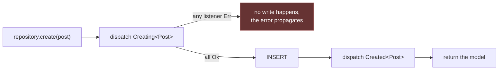

# Models

A model is a Rainier ORM [`Entity`] plus the two extra facts the framework needs:
a display name for error messages, and the column
[route-model binding](#route-keys) looks up by.

Declaring one is a single line, because everything else is derived.

```rust
use rainier_framework::prelude::*;
use chrono::{DateTime, Utc};
use serde::Serialize;

#[derive(Entity, Clone, Debug, PartialEq, Serialize)]
#[orm(table = "posts")]
#[orm(index = "published, created_at")]
pub struct Post {
    #[orm(pk, auto_increment)]
    pub id: u64,

    #[orm(unique)]
    pub slug: String,

    pub title: String,
    pub body: String,
    pub published: bool,

    #[orm(index, references = "users(id)", on_delete = "cascade")]
    pub author_id: u64,

    pub created_at: DateTime<Utc>,
}

impl Model for Post {
    /// Bind `/posts/{post}` by slug rather than by id, so URLs read well.
    fn route_key_name() -> &'static str {
        "slug"
    }
}
```

`Model` has no required methods. `impl Model for Post {}` is a complete
implementation.

## The `#[orm]` attributes

| Attribute | Effect |
|---|---|
| `#[orm(table = "posts")]` | the table name (defaults to the pluralised struct name) |
| `#[orm(pk)]` | the primary key (mark more than one field for a composite key) |
| `#[orm(pk, auto_increment)]` | database-assigned key |
| `#[orm(unique)]` | a unique index |
| `#[orm(index)]` | an index on this column |
| `#[orm(index = "a, b")]` | a composite index, on the struct |
| `#[orm(references = "users(id)")]` | a foreign key |
| `#[orm(on_delete = "cascade")]` | its delete behaviour |

This metadata is what [migrations](migrations.md) render DDL from, so **the
schema cannot drift from the struct that defines it**.

`Clone` is required by `Model` because lifecycle hooks receive the model by
value — a repository hands a copy to the event bus and keeps the original for
the write. The clone is skipped entirely when nothing is listening.

## Composite primary keys

Mark more than one field `#[orm(pk)]` and the key is all of them, in
**declaration order** — the order they appear in `PRIMARY KEY (a, b)`, so it
decides which prefix lookups the index can serve:

```rust
#[derive(Entity, Clone)]
#[orm(table = "memberships")]
struct Membership {
    #[orm(pk)]
    team_id: u64,
    #[orm(pk)]
    user_id: u64,
    role: String,
}
```

Reads and writes keyed on the pair take the values positionally, and **all** of
them:

```rust
let membership: Option<Membership> =
    repo::find_by_keys(&db, vec![team_id.into(), user_id.into()]).await?;

repo::update(&db, &membership).await?;                    // key read off the row
repo::delete_by_keys::<Membership, _>(&db, vec![team_id.into(), user_id.into()]).await?;
```

A list of the wrong length is an error rather than a narrower or wider query.
That is the whole point: a `WHERE` missing one part of the key still parses,
still runs, and still reports a plausible row count — it just matches every row
sharing the part that survived. An `UPDATE` written that way overwrites the
siblings and a `DELETE` removes them, with nothing in the result to say so.

The single-value APIs (`find_by_pk`, `delete_by_pk`, `cursor`, `Tracked::load`,
`first_or_create`) are bounded on `SingleKey`, which the derive emits only for a
one-column key, so aiming one at a composite entity is a **compile error** rather
than a partial-key match.

`Model` requires `SingleKey` too, so a composite-key table gets no
`Repository<M>` implementation: `Repository::find`/`delete` take one `Value` and
route binding names one column, neither of which a two-column key can answer.
Such tables are used through the ORM directly — the calls above, plus
`repo::query` and `Criteria`-driven statements.

`EntityRepository<E>` itself is still available, because the parts of it that do
not name a row by its key are bounded on `Entity` rather than `Model`:

```rust
let memberships = EntityRepository::<Membership>::new(db);

memberships.database();                        // the escape hatch
memberships.aggregate_rows(criteria).await?;   // projections and GROUP BY
```

`aggregate_rows` is the one that matters. An aggregate projects columns and
returns rows and never identifies a row by anything, so leaving it on the
`Model`-bound trait left a composite-key entity's only route to a `SUM` as raw
SQL — or loading every row and adding them up in process, which is the same
table scan moved somewhere it cannot be indexed. `Repository::aggregate`
delegates to it, so the two cannot drift apart.

An upsert on such a table conflicts on the composite key, which is exactly the
shape the [conflict target](repositories.md#the-conflict-target-must-be-a-column-the-insert-supplies)
rule wants: columns the insert actually supplies.

## Soft deletes

A soft-deleting table does not remove a row; it stamps a tombstone column and
leaves the row where it was. Every read then has to say `AND deleted_at IS NULL`
— and that is the part no design can rely on a human to get right. Forgetting it
raises nothing: the query runs, the rows decode, the page renders, with the
deleted rows on it. The failure is silent and it is always in the direction of
showing **too much**, which is the direction that matters for anything a soft
delete was used to hide.

So the predicate is not the caller's to write. Mark the column once:

```rust
#[derive(Entity, Clone)]
#[orm(table = "documents")]
struct Document {
    #[orm(pk, auto_increment)]
    id: u64,
    title: String,
    #[orm(soft_delete)]
    deleted_at: Option<chrono::DateTime<chrono::Utc>>,
}
```

`table.soft_deletes()` in a [migration](migrations.md#the-schema-builder) is the
matching DDL.

### The marker is declared, never inferred

Nothing looks for a column *called* `deleted_at`. Inferring the scope from a
column name would mean a table that happens to record a deletion date as
**domain data** — when a customer's account was closed, when a document was
retracted by its author — silently stops returning most of its rows, with the
only evidence being that some report got smaller. Worse, it would happen on the
upgrade that introduced the inference rather than on a change anybody wrote.

An explicit `#[orm(soft_delete)]` puts the behaviour change on one reviewable
line, in one table, at a moment a person chose. **An entity without the marker
builds exactly the SQL it did before this existed**, which is the property that
makes the feature safe to add to a running application.

Two declarations are compile errors rather than surprises:

| | Why |
|---|---|
| a `NOT NULL` tombstone | never `NULL`, so `deleted_at IS NULL` matches no row and **every** scoped read comes back empty, with no error to explain it |
| two `#[orm(soft_delete)]` columns | has no meaning, and a derive picking the first would be flipping a coin over what the whole table returns |

### Reading the deleted rows on purpose

This needs saying out loud, because it is the one hazard the feature introduces.
An admin trash view, a restore endpoint, a purge job and a support lookup all
mean to see tombstoned rows — and under an automatic scope every one of them
returns **nothing**, with nothing about the empty result saying the rows were
filtered rather than absent. That is just as silent as the bug the scope fixes,
pointing the other way.

```rust
repo::query::<Document>().with_trashed().all(&db).await?;   // live and trashed
repo::query::<Document>().only_trashed().all(&db).await?;   // the trash view
```

Both are bounded on `SoftDeletes`, so asking for the trashed rows of a table
with no tombstone column does not compile — the same trick `SingleKey` plays for
composite keys, and for the same reason: the alternative is a call that builds,
runs, and answers a question nobody asked.

### What it does not do

It scopes **reads**. It does not turn a delete into an update: `repo::delete_by_pk`
and `Query::delete` still remove the row, and writing the tombstone is the
application's — set the column and save. Two reasons, and the second is the real
one:

- A hard delete names its rows with a predicate the caller wrote. A tombstoned
  row that matches it is still a row of that table, and refusing to remove it
  would leave a purge unable to purge.
- A scoped `DELETE` fails **silently and without bound**. "Remove everything
  tombstoned more than thirty days ago" is `where_lt("deleted_at", cutoff)` and
  a delete — under a scope that hides tombstoned rows it matches nothing,
  forever, and the only symptom is a table that never stops growing.

Bulk writes are unscoped for the same reason, which is what makes
[`update_matching`](repositories.md#update-writes-every-column-and-that-is-usually-not-what-you-meant)
the way to tombstone or restore more than one row at a time.

### Exactly what is scoped

**Every read**, through either query layer:

| | |
|---|---|
| `repo::` and `Query` | `all`, `find_by_pk`, `find_by`, `cursor`, and the rest |
| keyed repository reads | `all`, `find`, `find_by`, `first_by` |
| **`Criteria` reads** | `matching`, `first_matching`, `count_matching`, `exists`, `paginate_matching`, `aggregate`, `count_grouped` |
| [relationship](relationships.md) loads | `has_many`, `has_one`, `belongs_to`, `belongs_to_many`, and counting without loading — they resolve through the far side's `matching` |

A `SELECT` and its `COUNT` are scoped by the same seam, so a paginator cannot
report a total its page does not contain.

**Writes are not scoped**, deliberately — see [above](#what-it-does-not-do).

One boundary is worth knowing, because it is the only place the scope stops:

> **A correlated subquery is not scoped for you.** `Subquery::count("comments")`
> names its table as a *string*, so there is no entity behind it to read a
> marker from — and scoping it with the outer query's entity would filter the
> inner table by the **wrong table's** column. A subquery over a soft-deleting
> table therefore counts tombstoned rows unless you say otherwise, which is one
> call on the subquery itself:
>
> ```rust
> Subquery::count("comments").correlate("document_id", "id").where_null("deleted_at")
> ```

A `Criteria` also cannot refuse `only_trashed()` on a model with no tombstone
column the way `Query` does at compile time, because it is built without knowing
which model it will run against. It renders as matching **nothing** rather than
everything: a table that cannot tombstone a row has no tombstoned rows, and the
other reading hands a trash view every live row in the table.

## Relationships are loaded, not navigated

A foreign key is a **flat column**, and the relationship over it is a value you
declare on the model:

```rust
impl Post {
    pub fn author() -> BelongsTo<Post, User> {
        BelongsTo::new().foreign_key("author_id")
    }
}
```

Loading takes the whole slice of parents and issues **one** query for all of
them:

```rust
let authors = Post::author().load(&posts, &*users).await?;
let name = &authors.one(&post).unwrap().name;
```

There is no lazy `post.author` that queries itself, because Rust has no `__get`
to hang one on — and the consequence is a good one: N+1 is not mitigated, it is
unrepresentable. `load` does not take a model, so there is no per-model load to
put in a loop.

Loading is `WHERE key IN (…)` against the other side's own repository, never a
`JOIN`, which is what keeps the two sides free to live in different backends.
For a real join, [`Criteria::join`](repositories.md#joins) is there.

See [Relationships](relationships.md) for all four kinds, `withCount`, and
many-to-many through a pivot.

## Route keys

```rust
impl Model for Post {
    fn route_key_name() -> &'static str { "slug" }
}
```

Defaults to the primary key. Override to bind by slug or UUID, and the
repository's lookup follows:

```rust
let post = posts.find_by_route_key(slug).await?;   // uses route_key_name()
```

See [Routing](routing.md#route-model-binding).

## Model names

```rust
Post::model_name();      // "Post"
```

Used in error messages — `find_or_fail` produces `"No Post matches the given
key."` — so a `404` says which model it was about.

## Lifecycle hooks

Every repository write dispatches events through the
[dispatcher](events.md). This is how the classic ORM lifecycle hooks —
creating, created, saved, deleted — are spelled here.

Each is a **distinct type**, so a listener registers for exactly the moment it
cares about rather than matching on a discriminant:

```rust
events.listen(|event: Arc<Created<Post>>| async move {
    tracing::info!(title = %event.model.title, "post created");
    Ok(())
});
```

| Event | When | Returning `Err` |
|---|---|---|
| `Creating<M>` | before an insert | **cancels it** |
| `Created<M>` | after a successful insert | surfaces to the caller |
| `Updating<M>` | before an update | **cancels it** |
| `Updated<M>` | after a successful update | surfaces to the caller |
| `Deleting<M>` | before a delete | **cancels it** |
| `Deleted<M>` | after a successful delete | surfaces to the caller |



A veto:

```rust
events.listen(|event: Arc<Creating<Post>>| async move {
    if contains_banned_words(&event.model.body) {
        return Err(Error::unauthorized("That post cannot be created."));
    }
    Ok(())
});
```

Hooks only fire on a repository configured with a dispatcher:

```rust
EntityRepository::<Post>::new(db).with_events(events)
```

### What a hook can and cannot do

**A `-ing` hook can veto but cannot mutate.** Listeners receive a shared `Arc`,
so there is no way to change the model on its way to the database.

That is deliberate. Several listeners mutating one row in registration order
would make the outcome depend on wiring — reorder two providers and the row
that gets written changes, with nothing in either listener to explain it.

Derive values in the model's own constructor, or in the repository, where there
is exactly one place to look:

```rust
impl Post {
    pub fn draft(title: impl Into<String>, body: impl Into<String>, author_id: u64) -> Self {
        let title = title.into();
        Self {
            id: 0,
            slug: str::slug(&title),      // derived here, not in a hook
            title,
            body: body.into(),
            published: false,
            author_id,
            created_at: Utc::now(),
        }
    }
}
```

**A `-ed` hook cannot roll back.** It runs after a successful write; returning
`Err` surfaces to the caller but the row is already there. Use it for things
that follow the write — raising a domain event, queueing a job — not for
things the write depends on.

## Domain events

A model's own events are just structs. Nothing derives them and nothing
registers them:

```rust
#[derive(Debug, Clone)]
pub struct PostPublished {
    pub post: Post,
}
```

```rust
Event::instance().dispatch(PostPublished { post: post.clone() }).await?;
```

Keeping them next to the model is a convention worth following — it puts the
vocabulary of the domain in one file. See [Events](events.md).

## Serialising

Derive `Serialize` and a model goes straight out as JSON:

```rust
Ok(Response::json(&post))
```

There is no `$hidden`. A model with a password hash in it **must not** be
serialised directly — define a separate view struct:

```rust
#[derive(Serialize)]
struct PublicUser { id: u64, name: String }

impl From<&User> for PublicUser { … }
```

The compiler cannot warn you about this one, so it is worth a habit: if a model
has a secret in it, it does not derive `Serialize`.

[`Entity`]: ../crates/rainier-orm
