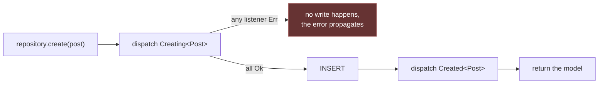

# Models

A model is a Rainier ORM [`Entity`] plus the two extra facts the framework needs:
a display name for error messages, and the column
[route-model binding](#route-keys) looks up by.

Declaring one is a single line, because everything else is derived.

```rust
use rainier_framework::prelude::*;
use chrono::{DateTime, Utc};
use serde::Serialize;

#[derive(Entity, Clone, Debug, PartialEq, Serialize)]
#[orm(table = "posts")]
#[orm(index = "published, created_at")]
pub struct Post {
    #[orm(pk, auto_increment)]
    pub id: u64,

    #[orm(unique)]
    pub slug: String,

    pub title: String,
    pub body: String,
    pub published: bool,

    #[orm(index, references = "users(id)", on_delete = "cascade")]
    pub author_id: u64,

    pub created_at: DateTime<Utc>,
}

impl Model for Post {
    /// Bind `/posts/{post}` by slug rather than by id, so URLs read well.
    fn route_key_name() -> &'static str {
        "slug"
    }
}
```

`Model` has no required methods. `impl Model for Post {}` is a complete
implementation.

## The `#[orm]` attributes

| Attribute | Effect |
|---|---|
| `#[orm(table = "posts")]` | the table name (defaults to the pluralised struct name) |
| `#[orm(pk)]` | the primary key |
| `#[orm(pk, auto_increment)]` | database-assigned key |
| `#[orm(unique)]` | a unique index |
| `#[orm(index)]` | an index on this column |
| `#[orm(index = "a, b")]` | a composite index, on the struct |
| `#[orm(references = "users(id)")]` | a foreign key |
| `#[orm(on_delete = "cascade")]` | its delete behaviour |

This metadata is what [migrations](migrations.md) render DDL from, so **the
schema cannot drift from the struct that defines it**.

`Clone` is required by `Model` because lifecycle hooks receive the model by
value — a repository hands a copy to the event bus and keeps the original for
the write. The clone is skipped entirely when nothing is listening.

## Relationships are loaded, not navigated

A foreign key is a **flat column**, and the relationship over it is a value you
declare on the model:

```rust
impl Post {
    pub fn author() -> BelongsTo<Post, User> {
        BelongsTo::new().foreign_key("author_id")
    }
}
```

Loading takes the whole slice of parents and issues **one** query for all of
them:

```rust
let authors = Post::author().load(&posts, &*users).await?;
let name = &authors.one(&post).unwrap().name;
```

There is no lazy `post.author` that queries itself, because Rust has no `__get`
to hang one on — and the consequence is a good one: N+1 is not mitigated, it is
unrepresentable. `load` does not take a model, so there is no per-model load to
put in a loop.

Loading is `WHERE key IN (…)` against the other side's own repository, never a
`JOIN`, which is what keeps the two sides free to live in different backends.
For a real join, [`Criteria::join`](repositories.md#joins) is there.

See [Relationships](relationships.md) for all four kinds, `withCount`, and
many-to-many through a pivot.

## Route keys

```rust
impl Model for Post {
    fn route_key_name() -> &'static str { "slug" }
}
```

Defaults to the primary key. Override to bind by slug or UUID, and the
repository's lookup follows:

```rust
let post = posts.find_by_route_key(slug).await?;   // uses route_key_name()
```

See [Routing](routing.md#route-model-binding).

## Model names

```rust
Post::model_name();      // "Post"
```

Used in error messages — `find_or_fail` produces `"No Post matches the given
key."` — so a `404` says which model it was about.

## Lifecycle hooks

Every repository write dispatches events through the
[dispatcher](events.md). This is how the classic ORM lifecycle hooks —
creating, created, saved, deleted — are spelled here.

Each is a **distinct type**, so a listener registers for exactly the moment it
cares about rather than matching on a discriminant:

```rust
events.listen(|event: Arc<Created<Post>>| async move {
    tracing::info!(title = %event.model.title, "post created");
    Ok(())
});
```

| Event | When | Returning `Err` |
|---|---|---|
| `Creating<M>` | before an insert | **cancels it** |
| `Created<M>` | after a successful insert | surfaces to the caller |
| `Updating<M>` | before an update | **cancels it** |
| `Updated<M>` | after a successful update | surfaces to the caller |
| `Deleting<M>` | before a delete | **cancels it** |
| `Deleted<M>` | after a successful delete | surfaces to the caller |



A veto:

```rust
events.listen(|event: Arc<Creating<Post>>| async move {
    if contains_banned_words(&event.model.body) {
        return Err(Error::unauthorized("That post cannot be created."));
    }
    Ok(())
});
```

Hooks only fire on a repository configured with a dispatcher:

```rust
EntityRepository::<Post>::new(db).with_events(events)
```

### What a hook can and cannot do

**A `-ing` hook can veto but cannot mutate.** Listeners receive a shared `Arc`,
so there is no way to change the model on its way to the database.

That is deliberate. Several listeners mutating one row in registration order
would make the outcome depend on wiring — reorder two providers and the row
that gets written changes, with nothing in either listener to explain it.

Derive values in the model's own constructor, or in the repository, where there
is exactly one place to look:

```rust
impl Post {
    pub fn draft(title: impl Into<String>, body: impl Into<String>, author_id: u64) -> Self {
        let title = title.into();
        Self {
            id: 0,
            slug: str::slug(&title),      // derived here, not in a hook
            title,
            body: body.into(),
            published: false,
            author_id,
            created_at: Utc::now(),
        }
    }
}
```

**A `-ed` hook cannot roll back.** It runs after a successful write; returning
`Err` surfaces to the caller but the row is already there. Use it for things
that follow the write — raising a domain event, queueing a job — not for
things the write depends on.

## Domain events

A model's own events are just structs. Nothing derives them and nothing
registers them:

```rust
#[derive(Debug, Clone)]
pub struct PostPublished {
    pub post: Post,
}
```

```rust
Event::instance().dispatch(PostPublished { post: post.clone() }).await?;
```

Keeping them next to the model is a convention worth following — it puts the
vocabulary of the domain in one file. See [Events](events.md).

## Serialising

Derive `Serialize` and a model goes straight out as JSON:

```rust
Ok(Response::json(&post))
```

There is no `$hidden`. A model with a password hash in it **must not** be
serialised directly — define a separate view struct:

```rust
#[derive(Serialize)]
struct PublicUser { id: u64, name: String }

impl From<&User> for PublicUser { … }
```

The compiler cannot warn you about this one, so it is worth a habit: if a model
has a secret in it, it does not derive `Serialize`.

[`Entity`]: ../crates/rainier-orm
