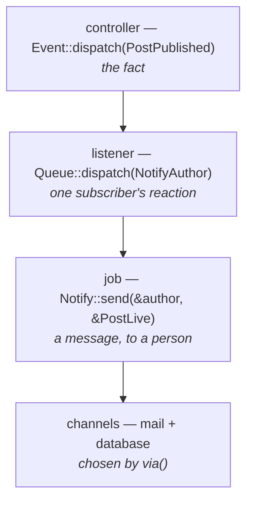

# Notifications

A notification is a **message to a recipient**, sent over whichever channels
suit that recipient. A `Notification`, a `Notifiable`, and channels, in
`rainier-notify`.

```rust
Notify::instance().send(&author, &PostLive { post }).await?;
```

One line, and depending on what `via()` says and what addresses the author has,
that is an email, a row in the notifications table, an SMS, or all three.

---

## Is this not just an event?

It is the question worth answering first, because the two overlap in the shape
of the code and not at all in what they mean.

| | [Event](events.md) | Notification |
|---|---|---|
| What it is | a **fact**: this happened | a **message**: someone should be told |
| Who receives it | whoever subscribed, at boot | one named recipient, per send |
| Who decides | the listener list, fixed for the process | `via()`, per recipient |
| Where it goes | in-process function calls | out of the process — email, SMS, a row |
| Payload | one struct, the same for every listener | three renderings, one per channel shape |
| Nobody listening | nothing happens, and that is fine | nothing was delivered, which is a bug |

The rule of thumb: **if you can describe it without naming a person, it is an
event.**

`PostPublished` is a fact about a post. The search index cares, the cache
cares, the author's mailbox cares — and the first two are not "recipients".
`PostLive` is a message to the author, and asking who it is for is the whole
point of it.

The two compose, and in a real application they usually do:



Each arrow is a place the next step can change without the previous one
knowing. The controller does not know an email goes out. The event does not
know a queue exists. The notification does not know the address.

> Sending inside the listener would work. Queueing first is better: a slow mail
> server should not slow the request that published the post, and a failure
> should be retried rather than logged and lost.

---

## Notifiable

The recipient side. An identity, and an address per channel.

```rust
impl Notifiable for User {
    fn notifiable_id(&self) -> String {
        self.id.to_string()
    }

    fn notifiable_type(&self) -> &'static str {
        "User"
    }

    fn route_for(&self, channel: &str) -> Option<String> {
        match channel {
            "mail" => Some(self.email.clone()),
            "sms" => self.phone.clone(),
            _ => None,
        }
    }
}
```

Three things about it:

**`None` skips the channel, it does not fail the send.** A user with no phone
number should still get the email. The [receipt](#the-receipt) records the skip.

**The id and type are stored.** They are how the database channel finds a
recipient's notifications later, so they have to mean the same thing across
restarts — a primary key, not a pointer.

**A notifiable is not a user.** An on-call rota, a Slack channel, a webhook
endpoint: anything with an identity and an address.

---

## Notification

The message side. What to say, and which channels to say it on.

```rust
pub struct PostLive {
    pub post: Post,
}

impl Notification<User> for PostLive {
    fn notification_name(&self) -> &'static str {
        "post.live"
    }

    fn via(&self, user: &User) -> Channels {
        let channels = Channels::new().with::<DatabaseChannel>();

        // The recipient's own preference decides — the other half of what
        // makes this a notification rather than an event.
        if user.wants_email {
            channels.with::<MailChannel>()
        } else {
            channels
        }
    }

    fn to_mail(&self, to: &User) -> Option<Box<dyn Mailable>> {
        Some(Box::new(PostLiveMail {
            name: to.name.clone(),
            title: self.post.title.clone(),
            slug: self.post.slug.clone(),
        }))
    }

    fn to_text(&self, _: &User) -> Option<String> {
        Some(format!("“{}” is now live.", self.post.title))
    }

    fn to_data(&self, _: &User) -> Option<Value> {
        Some(json!({ "post_id": self.post.id, "slug": self.post.slug }))
    }
}
```

`notification_name` is **permanent** once rows exist, like a job's `NAME`. The
database channel stores it; renaming the struct is free, renaming this strands
history.

### Three renderings, not one method per channel

The familiar design gives a notification one method per channel — `toMail`,
`toDatabase`, `toSlack` — dispatched dynamically by name. Rust has no dynamic
dispatch-by-name, and a trait naming every channel would close the set of
channels.

So Rainier closes the **representations** instead, and leaves the channels open.
There are three shapes a notification really takes:

| Rendering | Consumed by |
|---|---|
| `to_mail` — a full email | the mail channel |
| `to_text` — one short line | SMS, Slack, a webhook, the log |
| `to_data` — structured | the database channel, a broadcast |

A channel you write consumes whichever fits. Nothing in the trait changes for
it to exist. All three are rendered once per `send`, not once per channel.

### `to_mail` returns a mailable

Not a `Message`. A `Message` is already rendered, and a notification has no
view engine — so returning one would mean any notification wanting a template
had to assemble HTML by hand next to a [mailable](mail.md) that does it
properly. The channel has the mailer, so it renders.

`Message` itself implements `Mailable`, so the three-lines-of-text case needs
no separate type:

```rust
fn to_mail(&self, _: &User) -> Option<Box<dyn Mailable>> {
    let mut message = Message::new(Envelope::new("Your export is ready"));
    message.text = Some("Download it within 24 hours.".into());
    Some(Box::new(message))
}
```

**Leave the envelope's `to` empty.** The recipient supplies the address, via
`route_for`. A `to_mail` that hard-codes one has written a mailable, not a
notification — and the difference matters the day the same message needs to go
to a Slack channel instead.

---

## Channels are selected by type

```rust
Channels::new().with::<DatabaseChannel>().with::<MailChannel>()
```

By type, never by name — the same reason [middleware is](middleware.md#why-values-and-not-names).
A misspelled `"mial"` is a notification that silently goes nowhere; deleting a
channel should break every notification that used it, in the compiler.

Selecting the same channel twice sends once. Selecting none is a legitimate
answer: *this user has opted out of everything*.

### The channels that ship

| Channel | Wants | Notes |
|---|---|---|
| `LogChannel` | `to_text` | Delivers nothing. The safe default. |
| `BroadcastChannel` | `to_data`, falling back to `to_text` | A [WebSocket push](broadcasting.md#notifications-over-websocket). Ephemeral. |
| `MailChannel` | `to_mail` + a `"mail"` route | Renders through the mailer. |
| `DatabaseChannel` | `to_data`, falling back to `to_text` | The in-app bell menu. Needs no route. |
| `MemoryChannel` | anything | For tests — see [Testing](#testing). |

`DatabaseChannel` lives in `rainier-framework` rather than `rainier-notify`,
because `rainier-notify` depends on mail and support only. It is the one
channel that is never skipped for want of an address: it addresses by
`notifiable_id`, so a user with no email and no phone still has a notification
list.

### Writing one

```rust
pub struct SlackChannel {
    client: Arc<HttpClient>,
}

impl Channel for SlackChannel {
    fn name(&self) -> &'static str {
        "slack"     // what `route_for` is asked about
    }

    fn send<'a>(&'a self, delivery: &'a Delivery) -> BoxFuture<'a, Result<()>> {
        Box::pin(async move {
            let Some(text) = delivery.text() else {
                return Err(delivery.nothing_to_send("slack", "text"));
            };
            let Some(webhook) = &delivery.route else {
                return Err(delivery.no_route("slack"));
            };

            self.client.post(webhook).json(&json!({ "text": text })).send().await?;
            Ok(())
        })
    }
}
```

`Delivery` carries the three renderings, the recipient's id and type, and the
route for *this* channel. `nothing_to_send` and `no_route` produce the two
errors a channel actually has, phrased consistently.

---

## Registering the channels

The notifier holds the **configured** instances; the notification only names
types.

```rust
app.singleton(move |container: &Container| {
    Ok(Notifier::new()
        .with_arc(container.resolve::<DatabaseChannel>()?)
        .with(MailChannel::new(container.resolve::<Mailer>()?)))
});
```

Booting binds a notifier with `LogChannel` alone unless you supply one — or
pass yours to the builder:

```rust
Rainier::new(".").with_notifier(
    Notifier::new().with(MailChannel::new(mailer)).with(DatabaseChannel::new(database)),
)
```

The default is the log and not mail deliberately: a default that can reach a
real person is a default that reaches one from staging.

A notification selecting a channel that is not registered logs an error and
records `NotRegistered` on the receipt. It does not panic, and it does not stop
the other channels.

---

## The receipt

```rust
let receipt = Notify::instance().send(&author, &PostLive { post }).await?;

receipt.delivered();          // ["database", "mail"]
receipt.failures();           // channels that errored
receipt.delivered_anywhere(); // bool
receipt.into_result()?;       // Err only if *every* channel failed
```

Per channel, because per channel is what happens. One channel being down is
usually not a reason to fail the request that triggered the notification; every
channel being down probably is, and `into_result` is that shape.

`send_to_many` sends to a slice of recipients and returns a receipt each.

---

## The database channel

```rust
let stored = resolve::<DatabaseChannel>()?;

stored.unread("User", "7", 20).await?;        // the bell menu
stored.unread_count("User", "7").await?;      // the badge
stored.find_for("User", "7", &id).await?;     // scoped lookup — use this in a handler
stored.mark_read(&id).await?;
stored.mark_all_read("User", "7").await?;
stored.prune_read(Utc::now() - Duration::days(90)).await?;
```

Add its table to your migrator:

```rust
Migrator::new()
    .add(m0001_create_users::migration())
    .merge(DatabaseChannel::migrations())
```

`find_for` is scoped to the recipient on purpose. Ids are opaque strings, not
secrets, and reading the row and *then* comparing the owner in the handler is
the same query with one more place to forget the comparison.

A notifications table grows forever. `prune_read` is worth
[scheduling](scheduling.md).

---

## Testing

```rust
let channel = Arc::new(MemoryChannel::new());
let notifier = Notifier::new().with_arc(Arc::clone(&channel));

notifier.send(&user, &PostLive { post }).await?;

assert!(channel.sent_to("post.live", "7"));
assert_eq!(channel.sent()[0].text.as_deref(), Some("“Hello” is now live."));
```

Same rule as every other Rainier double: it implements the same port the real
thing does, so what you assert on is what production runs.

For a feature test, prefer asserting the *outcome* — a message in the
`MemoryTransport`, a row the `DatabaseChannel` wrote — over asserting that
`send` was called. The channel set should be the same in tests as in
production; what differs is the transport underneath.

---

## Directory

```text
src/app/notifications/
  mod.rs           the list, and the events-versus-notifications note
  post_live.rs     one notification per module
```

Nothing is discovered: a notification is a struct you construct and pass to
`send`, so there is nothing to register.

---

## What is not here

**No `Notification` queueing built in.** You queue the [job](queues.md) that
sends it, which is one more line and one less thing happening implicitly — and
the job is where the retry policy already lives.

**No per-user channel preferences table.** `via()` takes the recipient, so
reading a column and branching is your code, in one place, typed.
