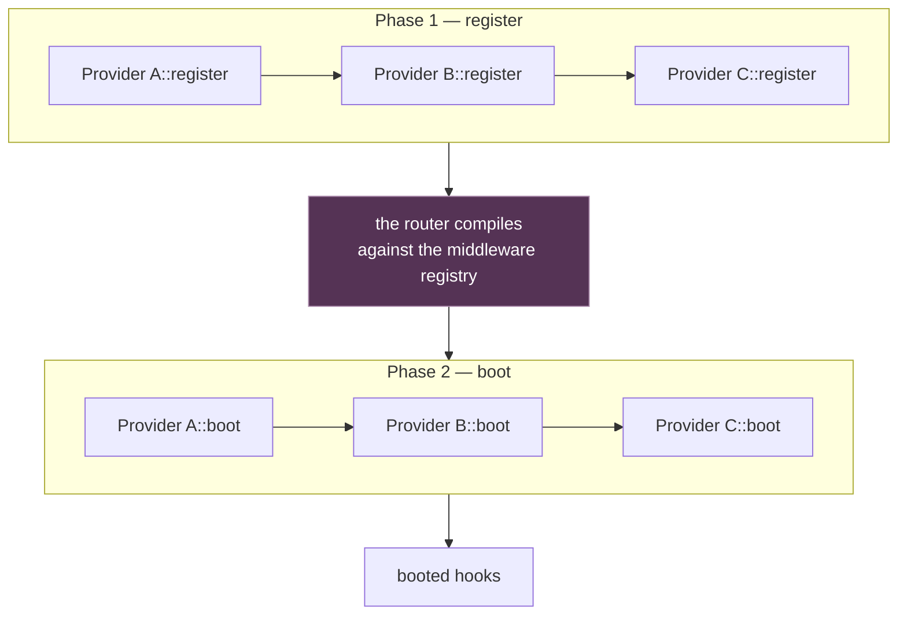

# Service Providers

Service providers are where an application says how it is wired: a `register`
phase that binds things, and a `boot` phase that uses them.

```rust
use rainier_framework::auth::Argon2Hasher;
use rainier_framework::container::boot_provider;
use rainier_framework::database::Migrator;
use rainier_framework::prelude::*;

pub struct AppServiceProvider {
    pub database: Database,
}

impl ServiceProvider for AppServiceProvider {
    fn name(&self) -> &'static str {
        "AppServiceProvider"
    }

    fn register(&self, app: &Application) -> Result<()> {
        app.instance(Argon2Hasher::new());
        app.singleton(|c: &Container| {
            Ok(EntityRepository::<Post>::new((*c.resolve::<Database>()?).clone()))
        });
        Ok(())
    }

    boot_provider!(async |self, app| {
        app.resolve::<Migrator>()?.run(&app.resolve::<Database>()?).await?;
        Ok(())
    });
}
```

Register it with the builder:

```rust
Rainier::new(".")
    .with_provider(AppServiceProvider { database })
    .with_provider(EventServiceProvider)
    .boot()
    .await?
```

## Why two phases

The rule is one line:

> **`register` may only bind. `boot` may resolve.**

Every provider's `register` runs before any provider's `boot`. That is what
makes registration order irrelevant — provider A's `boot` can resolve something
provider B registered, whether B was added first or last.



Resolving during `register` is the one thing that will bite you. It is not
forbidden — it will often even work — but it makes your provider depend on
having been registered *after* whoever binds what it wants. Move it to `boot`
and the ordering problem disappears.

Note where the router compiles: **after every `register`, before any `boot`**.
That is what lets a route's middleware resolve a service a provider bound. See
[the lifecycle](lifecycle.md#what-boot-does-in-order).

## The trait

```rust
pub trait ServiceProvider: Send + Sync + 'static {
    fn name(&self) -> &'static str { /* the type name */ }
    fn register(&self, app: &Application) -> Result<()> { Ok(()) }
    fn boot<'a>(&'a self, app: &'a Application) -> BoxFuture<'a, Result<()>> { /* no-op */ }
}
```

Both methods have defaults, so a provider that only registers writes only
`register`, and one that only boots writes only `boot`.

### Why `boot` is not `async fn`

`ServiceProvider` has to be object-safe — `Application` holds
`Vec<Arc<dyn ServiceProvider>>`. An `async fn` in a trait is not object-safe on
stable, so `boot` returns `BoxFuture` explicitly.

Writing that by hand is noisy, so there is a macro:

```rust
boot_provider!(async |self, app| {
    app.resolve::<Migrator>()?.run(&app.resolve::<Database>()?).await?;
    Ok(())
});
```

which expands to the `fn boot<'a>(&'a self, …) -> BoxFuture<'a, Result<()>>`
form. Use `#[async_trait]` instead if you prefer — it produces the same shape.

## A failing provider fails the boot

`register` and `boot` both return `Result`. An `Err` from either aborts
`Application::boot()` and the error names the provider:

```
Error: AppServiceProvider failed to boot: could not connect to `postgres://…`
```

That is the behaviour you want. A provider that cannot wire itself has left the
application in a state where *something* will fail later, further from the
cause.

## The providers a real application has

The sample project has two, which is a reasonable default:

### `AppServiceProvider`

Services and repositories:

```rust
fn register(&self, app: &Application) -> Result<()> {
    app.instance(Argon2Hasher::new());
    repositories::register(app, &self.database);

    let mut registry = JobRegistry::new();
    registry.register::<NotifyAuthor>();
    app.instance(Arc::new(registry));

    app.instance(match self.mode {
        Mode::Testing => Mailer::fake(views),
        Mode::Running => Mailer::new(views, Arc::new(LogTransport)),
    });

    Ok(())
}
```

### `EventServiceProvider`

Listeners, registered through the builder rather than as a provider, because
listeners are added to the `Dispatcher` *before* it is bound:

```rust
impl EventServiceProvider {
    pub fn register_listeners(events: &Dispatcher) {
        events.listen(|event: Arc<PostPublished>| async move {
            Queue::instance().dispatch(NotifyAuthor { post_id: event.id }).await?;
            Ok(())
        });
    }
}
```

```rust
Rainier::new(".").with_events(EventServiceProvider::register_listeners)
```

See [Events](events.md).

## Deferred providers

Some frameworks defer a provider so it is not constructed until something it
provides is asked for. Rainier has no such concept, and does not need one: a
`singleton` factory is **already** lazy. Registering a binding costs one
`TypeId` insert; the factory does not run until the first `resolve`.

If a provider does expensive work at register time, move that work into the
factory closure. That is the deferred provider, without a mechanism.

## Introspection

```rust
app.provider_names();       // ["AppServiceProvider", "EventServiceProvider"]
app.is_booted();            // has boot() completed
```

Useful in tests, and in a diagnostic command that prints what is wired.
