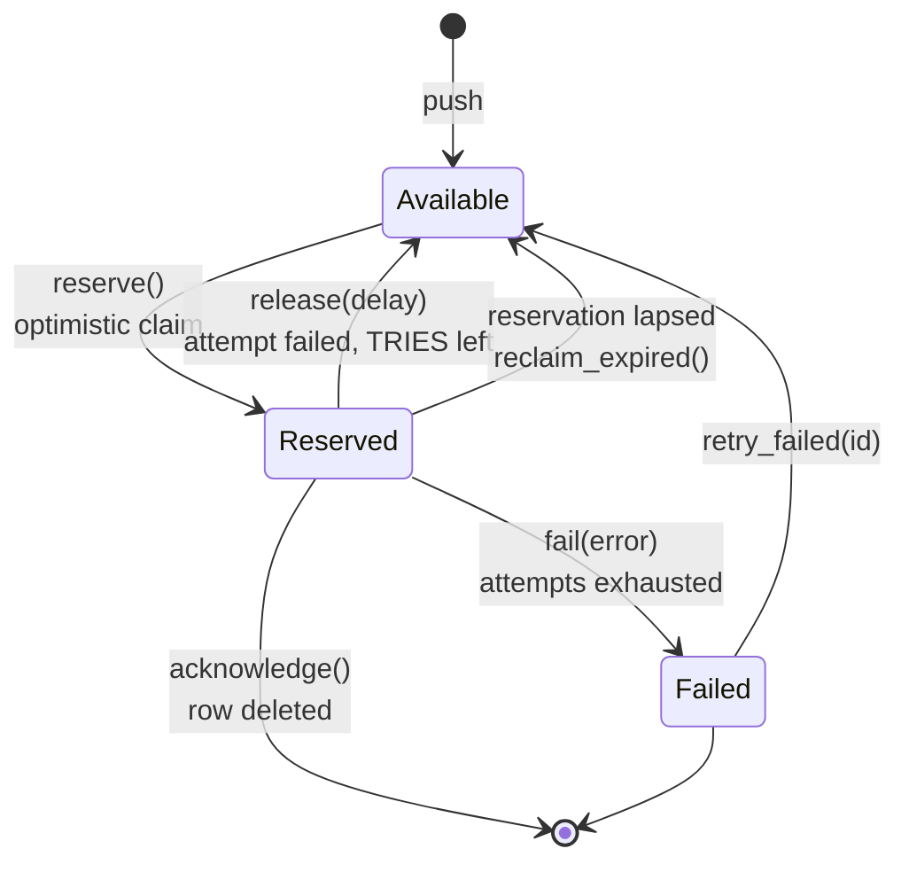

# Queues

Deferred work: a `Job` contract, a `Queue` port with three drivers, and a
`Worker` that runs them.

```rust
use rainier_framework::prelude::*;
use serde::{Deserialize, Serialize};

#[derive(Serialize, Deserialize)]
pub struct NotifyAuthor {
    pub post_id: u64,
}

#[async_trait]
impl Job for NotifyAuthor {
    const NAME: &'static str = "blog.notify-author";
    const QUEUE: &'static str = "mail";
    const TRIES: u32 = 5;

    async fn handle(&self, context: &JobContext) -> Result<()> {
        let posts = context.resolve::<PostRepository>()?;
        let mailer = context.resolve::<Mailer>()?;

        let post = posts.find_or_fail(self.post_id).await?;
        mailer.send(&PostLive { post }).await?;
        Ok(())
    }
}
```

```rust
Queue::instance().dispatch(NotifyAuthor { post_id }).await?;
```

## A job crosses a process boundary

**Everything about the design follows from that one fact.**

A job is written by a web request and read, later, by a worker that may be a
different process on a different machine. So:

- **A job is a serialisable payload plus a stable name**, not a closure. There
  is no `dispatch(move || …)`, because a closure cannot be written to a
  database and read back by another process.
- **The worker needs a `JobRegistry`** to turn the name back into code.
- **Dependencies cannot be captured.** A running job resolves them from the
  container through its `JobContext`.

```rust
const NAME: &'static str = "blog.notify-author";
```

That name goes **on the wire**. It must not change once jobs of this type exist
in a queue — renaming it strands every queued instance — and it must be unique
across the application. Prefixing by domain (`blog.`, `billing.`) is the habit
that keeps it so.

## Registering jobs

```rust
let mut registry = JobRegistry::new();
registry.register::<NotifyAuthor>();
registry.register::<SendInvoice>();

app.instance(Arc::new(registry));

// or, as a builder
let registry = JobRegistry::new().with::<NotifyAuthor>().with::<SendInvoice>();
```

A job the registry does not know cannot be run, so this is the one piece of
wiring you cannot skip.

When the framework builds the queue for you — `QUEUE_DRIVER`, or a `queues`
section — declare it on the builder instead, because a provider runs *after*
the queue is built:

```rust
Rainier::new(".").with_jobs(JobRegistry::new().with::<NotifyAuthor>())
```

A registry passed to a `QueueManager` you built yourself needs neither.

## Dispatching

```rust
Queue::instance().dispatch(job).await?;                            // its own QUEUE
Queue::instance().dispatch_on("high", job).await?;                 // a named queue
Queue::instance().dispatch_after(Duration::from_secs(60), job).await?;

Queue::instance()
    .pending(job)?
    .on_queue("high")
    .delay(Duration::from_secs(30))
    .tries(10)
    .send()
    .await?;
```

`dispatch` returns the queued job's id.

To run one **now**, in-process — which is what a console command usually wants:

```rust
manager.dispatch_now(job, container).await?;
```

## `JobContext`

The running job's handle on the world:

```rust
context.resolve::<Mailer>()?;      // from the container
context.container();
context.id();                      // this queued instance's id
context.queue();
context.attempt();                 // 1-based
context.max_attempts();
context.is_last_attempt();
```

`is_last_attempt` is the one worth knowing about — it lets a job behave
differently when it is about to be given up on:

```rust
if context.is_last_attempt() {
    alert_a_human(&self.post_id).await;
}
```

## Retries

Returning `Err` releases the job for another attempt, until `TRIES` is
exhausted and it is marked failed.

```rust
const TRIES: u32 = 5;

fn backoff(attempt: u32) -> Duration {
    Duration::from_secs(1u64 << attempt.min(6))    // 1s, 2s, 4s, … capped at 64s
}
```

The default backoff is **exponential**, because the usual reason a job fails is
a dependency that is briefly unavailable — and retrying at full speed makes
that worse, not better.

```rust
async fn failed(&self, context: &JobContext, error: &Error) {
    tracing::error!(post = self.post_id, %error, "notification gave up");
}
```

`failed` runs after the final attempt fails. For recording the failure
somewhere the application will notice.

## Unique jobs

A job declares what makes two of them "the same one", and dispatch drops a
duplicate rather than queueing it:

```rust
#[async_trait]
impl Job for RebuildSearchIndex {
    const NAME: &'static str = "search.rebuild";

    // One rebuild at a time, whoever asks for it.
    fn unique_id(&self) -> Option<String> {
        Some(String::new())
    }

    async fn handle(&self, _: &JobContext) -> Result<()> { … }
}

#[async_trait]
impl Job for SendInvoice {
    const NAME: &'static str = "billing.invoice";

    // One per invoice — two different invoices are two jobs.
    fn unique_id(&self) -> Option<String> {
        Some(self.invoice_id.to_string())
    }

    async fn handle(&self, _: &JobContext) -> Result<()> { … }
}
```

```rust
queue.dispatch(RebuildSearchIndex).await?;   // Some(id)
queue.dispatch(RebuildSearchIndex).await?;   // None — dropped
```

`dispatch` returns `Result<Option<String>>`; `None` means a duplicate was
dropped, which is the point rather than an error.

The lock key is `NAME` **and** the id, so invoice `"7"` and user `"7"` are not
the same lock.

### When the lock is released

On **success** and on **final failure** — but not when a job is released for a
retry. A retrying job is still pending, so a duplicate dispatched in the gap is
exactly what should be dropped; a permanently failed one must not block the
dispatch that fixes it.

`UNIQUE_FOR` (an hour by default) is only the net for a worker that dies
mid-job. Set it longer than the job takes.

```rust
const UNIQUE_FOR: Duration = Duration::from_secs(6 * 3600);
```

### What it does and does not deduplicate

It stops a **queue filling with copies**. It is not the mechanism that stops two
workers running one job — that is the queue's [reservation](#the-reservation-protocol),
and it is a different thing entirely.

> **It needs a shared cache**, like every other [atomic
> lock](cache.md#atomic-locks). Without a `LockManager` a unique job is
> dispatched anyway with a warning — quietly not deduplicating is a bug you find
> in production, and quietly deduplicating against a per-process cache is the
> same bug wearing a hat.

## Drivers

Selected by `QUEUE_DRIVER`, a
[`QueueDriver`](configuration.md#settings-closed-sets-of-values).

| `QueueDriver` | `is_deferred()` | `survives_a_restart()` | For |
|---|---|---|---|
| `Sync` | **no** — runs inline | n/a | development, and tests that want the side effect |
| `Memory` | yes | no | tests that want a job *queued* rather than run |
| `Database` | yes | yes | production, on the database you already have |
| `Redis` | yes | yes\* | fast, and \*can lose an accepted job — [read this](#redisqueue-and-what-it-costs); needs the `redis` feature |
| `Sqs` | yes | yes | production, managed; needs the `sqs` feature |
| `Kafka` | yes | yes | when the jobs are **already** events on a topic — [read this first](kafka.md#jobs); needs the `kafka` feature |

`needs_a_worker()` is the same question as `is_deferred()` asked from the other
end, and it is the one a deploy script wants: everything but `sync` needs a
`queue:work` process or nothing happens.

```env
QUEUE_DRIVER=sync
QUEUE_DRIVER=database
```

That declares **one** connection, named after its driver, and the framework
builds it at boot and binds the `QueueManager` over it. The settings the driver
needs come from the environment beside it — `REDIS_URL`, `SQS_QUEUE_URL`,
`KAFKA_BROKERS` and friends — and a driver whose settings are missing fails the
boot naming the variable rather than connecting to whatever a default would have
pointed at. Leave `QUEUE_DRIVER` unset and **no queue is built at all**.

### More than one connection

One `QUEUE_DRIVER` is one backend. Two — jobs on the database and a bulk lane on
SQS — are a **section**: a `default` naming one entry, and each entry naming its
own driver and settings.

```rust
use rainier_framework::queue::{ConnectionConfig, Connections, SqsConnection};

Rainier::new(".").with_queues(
    Connections::new("primary")
        .with("primary", ConnectionConfig::database())
        .with("bulk", SqsConnection::new(bulk_url).region("us-east-1")),
)
```

which writes it to the `queues` key, so it can come from the configuration tree
instead. Then `Queue::instance().pending(job)?.on_connection("bulk")` reaches
it, and a connection nobody declared is an error rather than the default —
because falling back would push the job to a backend nobody named and hand the
caller an id for it.

Each connection is built from **its own** declaration. There is no shared client
to inherit: the version of this that built them from one produced a second
connection with the right *name* pointed at the wrong store, accepting every job
pushed to it and running none of them.

### Never both

`QUEUE_DRIVER` and a `queues` section each name the default connection, so
setting both fails the boot rather than resolving by precedence. The reason is
the same as for [`DATABASE_URL` and a `databases` section](database.md#never-both),
only quieter: a dispatch to the connection that lost is still accepted, still
returns an id, and then waits in a store nothing drains. Nothing raises, nothing
retries, and there is no failed-job row — the job never failed. It was never run.

**`sync` runs jobs inline, so a failed job fails the request that dispatched
it.** That is fine in development and wrong in production — it is exactly the
coupling the queue exists to remove. Switch before you deploy; see
[Deployment](deployment.md).

### What a connection carries

Each entry names its own driver and that driver's own settings. Nothing is
shared between two connections, including two on the same server — sharing is
what makes one of them quietly inherit the other's settings.

| Driver | Its settings |
|---|---|
| `database` | `reservation` |
| `redis` | `url`, `prefix`, `reservation`, `connect_timeout_ms`, `response_timeout_ms`, `reconnect`, `reconnect_attempts`, `reconnect_max_backoff_ms` |
| `sqs` | `queue_url`, `region`, `endpoint`, `visibility_timeout`, `wait_time`, `key`/`secret` |
| `kafka` | `brokers`, `group`, `topic_prefix`, `lease` |

`reservation` is the one with teeth — it is the only setting here whose
*plausible* values include one that breaks the queue silently, so it gets a
check of its own (`Connections::check_reservations`) rather than a warning in
prose. A reservation shorter than the work takes means a second worker claims a
job the first is still running.

Three drivers need something no configuration file can hold: `sync` needs the
job registry and the container it resolves dependencies from, `database` needs
the application's `Database`, and `kafka` needs a shared lock store. Those
arrive through `QueueResources`. A driver that needs one and was not given it is
a boot failure naming the missing piece, not a connection that quietly becomes
something else.

#### What a `redis` connection waits for

The same three settings the [cache](cache.md#what-a-redis-store-waits-for-and-why-it-has-no-pool)
has, for the same reason — the connection multiplexes, so there is nothing to
pool and everything to time out:

```json
{
  "primary": {
    "driver": "redis",
    "url": "redis://localhost:6379/1",
    "connect_timeout_ms": 2000,
    "response_timeout_ms": 250,
    "reconnect": true
  }
}
```

`reconnect` is the one to reach for first: a socket a proxy dropped while the
queue was idle otherwise takes every push with it, permanently, until the
process restarts. All three are off unless declared.

Milliseconds here, unlike `reservation` and `lease` beside them, which are whole
seconds because they are periods a *job* waits. A command's budget is not: in
seconds the only values available are `0`, which would fail everything, and `1`,
already longer than a request can afford to spend pushing.

### Settings this framework cannot honour

A section written against another framework's queue config carries several more.
Every one is **refused by name**, with what to write instead, because the
alternative is the failure this whole section is built to avoid wearing a
different hat: a setting that is read, understood by the person who wrote it,
and then dropped.

An ignored setting is worse than a rejected one. A rejected `after_commit` is a
boot failure and a five-minute conversation. An accepted one is a configuration
file that states, in writing, that jobs wait for their transaction — while they
do not, and the person reading it has no reason to doubt it.

| Declaration | Why it cannot be honoured | Write instead |
|---|---|---|
| `retry_after` | the same setting under another name | `reservation` — or `visibility_timeout` on `sqs`, `lease` on `kafka` |
| `after_commit` | Rainier has **no transaction API** at all, so there is no commit to wait for | nothing; dispatch after the write returns |
| `block_for` | no driver here blocks; `reserve` returns immediately and the **worker** does the waiting | nothing; a worker's own `sleep` |
| `table` | the queue's tables are named on their entities at compile time, not per connection | nothing; run the driver's own migrations |
| `prefix`, `suffix` on `sqs` | they compose a queue *URL* out of parts, and an `sqs` connection is given the whole URL | `queue_url` |
| `connection` on `redis` | it would point at the cache's named stores — the queue sharing the cache's database index, which is the failure it existed to prevent | `url`, with its own index |
| `max_connections`, `min_connections`, `pool_size` | no driver here pools, and the Redis one **multiplexes** | `response_timeout_ms` and `reconnect` |

A declaration is refused on the same principle whenever accepting it would give
a working-looking connection storing jobs somewhere other than intended: no
`driver`, a `queue` on any connection (the queue is the job's to name, and one
here would be a decoy), a `url` on an `sqs` connection, `key` without `secret`,
`key` and `secret` with no `region`, an empty `brokers`, or a `default` naming a
connection nobody declared.

### `RedisQueue`, and what it costs

Redis is the reflex answer to "we need a queue". It is available here, and it
is worth being precise about what you are choosing, because the popular framing
has it backwards.

**Redis is a data-structure server, not a broker.** It holds strings, lists,
hashes, sets, sorted sets and streams in memory, and executes each command
atomically because it executes commands one at a time. Queue behaviour is a
*consequence* of that atomicity — two workers cannot take the same entry —
rather than something Redis was built to be. That is a real property and this
driver is built on it. It is not a broker's set of guarantees.

```rust
let queue = RedisQueue::connect(&connector).await?
    .with_prefix("myapp:queue:")
    .with_reservation(Duration::from_secs(90));

queue.check_eviction_policy().await;   // worth calling at boot; see below
```

```env
QUEUE_DRIVER=redis
```

#### Streams, not lists

`LPUSH`/`BRPOP` is the usual Redis queue and it **cannot** satisfy the
[reservation protocol](#the-reservation-protocol): `BRPOP` removes the job, so
a worker that dies has taken it with it. This driver uses **streams with
consumer groups** — a pending entry list, `XACK`, and `XAUTOCLAIM` to redeliver
what a dead consumer left — which is a genuine acknowledgement protocol.

Delays need a second structure, because a stream entry is available the moment
it is added: a delayed job waits in a sorted set scored by when it is due, and
a worker promotes the due ones with a Lua script before it reserves.

#### The four things streams do not fix

**An acknowledged write can still vanish.** Redis's default persistence is
periodic RDB snapshots; with the append-only file enabled, the default
`appendfsync everysec` leaves up to about a second of writes in the OS buffer.
So an enqueue that returned — a dispatch your request already told the user
succeeded — can be gone after a power loss. For a cache that is correct by
design, because losing an entry is free. A queue inverts that assumption.

**Replication is asynchronous.** A primary acknowledges before any replica has
the write. If it fails and a replica is promoted, writes it had already
confirmed are lost. `WAIT` blocks until *n* replicas confirm, which narrows the
window without closing it — it is not consensus.

**A backlog can be evicted.** With `maxmemory` set and a policy like
`allkeys-lru`, Redis drops keys to stay under the limit — including this
queue's stream, silently, exactly when it is deepest. Set
`maxmemory-policy noeviction`, which turns that into refused writes instead;
`check_eviction_policy()` reads the setting and warns if it is anything else.

**You cannot enqueue in your database transaction.** Insert an order and
dispatch its confirmation email, and with Redis those are two systems where
either can succeed alone. [`DatabaseQueue`](#databasequeue) makes them one
transaction, which is why it is the default recommendation and not a
compromise.

`QueueDriver::may_lose_an_accepted_job()` is `true` for `redis` and nothing
else, which is the distinction `survives_a_restart()` cannot make: a Redis job
outlives *your* process, and can still be gone.

#### So when

Right for work you can afford to lose — warming a cache, recomputing a
projection, analytics, anything you would happily run again. Wrong for work you
cannot: taking a payment, an email a user was told they would get, anything
whose absence nobody would notice until a customer complains.

The short version: Redis is designed around losing an item being **free**. A
queue is usually the place where it is not. Reach for it where its design and
your requirement agree — as a [cache](cache.md), a
[lock](cache.md#atomic-locks), a [broadcast](broadcasting.md) fan-out — and
weigh it more carefully here.

### `DatabaseQueue`

```rust
let queue = DatabaseQueue::new(db).with_reservation(Duration::from_secs(90));
```

Two tables, contributed to your migrator:

```rust
Migrator::new()
    .create_table::<User>("0001_create_users")
    .merge(DatabaseQueue::migrations())
```

## The reservation protocol

The `Queue` contract is **reserve, then acknowledge** — not "pop".

A worker that crashes mid-job must not lose it. A reserved job stays in the
store, invisible to other workers, until it is acknowledged, released, or its
reservation times out.



### The optimistic claim

Two workers polling the same table will both see the same candidate row. The
claim is what stops them both running it:

```rust
let candidates = self.jobs.matching(
    Criteria::new()
        .where_eq("queue", queue)
        .where_null("reserved_at")
        .where_lte("available_at", Utc::now())
        .order_by("available_at")          // oldest first — roughly FIFO
        .limit(self.max_claim_attempts as u64),
).await?;

for row in candidates {
    if self.claim(&row).await? {
        return Ok(Some(row.into_queued()?));
    }
}
```

`claim` is a conditional `UPDATE` — set `reserved_at` **where it is still
null**. The database decides the winner; the loser sees zero rows affected and
tries the next candidate. That is why several candidates are fetched rather
than one: under contention, the first is often already gone.

No `SELECT … FOR UPDATE`, no advisory locks, nothing dialect-specific. It works
the same on SQLite, MySQL and Postgres.

### Reclaiming

```rust
queue.reclaim_expired().await?;
```

Releases every job whose reservation has lapsed, so a job held by a worker that
died becomes available again. Run it periodically — a cron, or a startup step.

### Failed jobs

```rust
queue.failed_jobs(50).await?;
queue.retry_failed(&id).await?;
```

## The worker

```sh
cargo run -- queue:work
cargo run -- queue:work --queue=high,default --max-jobs=1000
cargo run -- queue:work --once
```

| Option | |
|---|---|
| `--queue=a,b` | comma-separated, **in priority order** |
| `--once` | process what is waiting, then stop |
| `--max-jobs=N` | stop after N — a worker that recycles |
| `--sleep=N` | seconds to wait when the queue is empty |

Queues are tried in the order given: the worker takes everything from `high`
before looking at `default`.

Programmatically:

```rust
let worker = Worker::new(queue, registry, container)
    .with_events(events)
    .with_options(
        WorkerOptions::default()
            .queues(["high", "default"])
            .sleep(Duration::from_secs(1))
            .max_jobs(1000)
            .timeout(Some(Duration::from_secs(60))),
    );

let stats = worker.run().await?;      // processed, released, failed, idles
```

`worker.stop()` asks it to finish the current job and exit — that is your
`SIGTERM` handler.

### Scoped bindings are flushed between jobs

```rust
self.container.flush_scoped();
```

A worker is a **long-running process**, which is the hazard a per-request
framework never has to think about. Between jobs the worker flushes the
container's [scoped bindings](container.md#scoped-bindings), so one job cannot
leak per-request-shaped state into the next.

### Timeouts

```rust
WorkerOptions::default().timeout(Some(Duration::from_secs(60)))
```

A job that overruns is cancelled and treated as a failure — released or failed
according to its attempts. Without one, a job that hangs takes the worker with
it.

## Worker events

Dispatched through the [event bus](events.md), so monitoring is a listener
rather than a fork of the worker:

| Event | When |
|---|---|
| `JobProcessing` | before each attempt |
| `JobProcessed` | after success |
| `JobReleased` | returned for another attempt |
| `JobFailed` | attempts exhausted |

```rust
events.listen(|e: Arc<JobFailed>| async move {
    metrics::increment("jobs.failed", &[("job", &e.job.name)]);
    Ok(())
});
```

## Testing

```rust
let queue = QueueManager::fake();
app.instance(queue);

// … exercise the code that dispatches …

Queue::instance().assert_pushed::<NotifyAuthor>();
Queue::instance().assert_pushed_times::<NotifyAuthor>(1);
Queue::instance().assert_pushed_on::<NotifyAuthor>("mail");
Queue::instance().assert_not_pushed::<SendInvoice>();

let pushed: Vec<QueuedJob> = Queue::instance().pushed::<NotifyAuthor>();
```

The fake **records instead of performing**, and every assertion panics if you
call it on a real manager rather than passing vacuously. See
[Testing](testing.md).

To test the job's own logic, call `handle` with a context — no queue involved:

```rust
let context = Arc::new(JobContext::new(container, "id".into(), "mail".into(), 1, 3));
NotifyAuthor { post_id: 1 }.handle(&context).await?;
```
