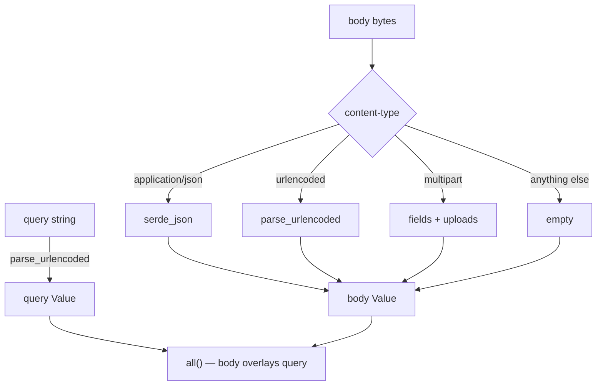

# Requests

`Request` is the whole of what arrived: method, URI, headers, a buffered body,
parsed input, cookies, uploads, route parameters, and a typed extension map.

Handlers usually take it as `Req` — an alias for `Arc<Request>`, because the
router shares one request across the extractors and the action.

```rust
pub async fn show(request: Req) -> Result<Response> {
    let slug = request.route_param("post").unwrap_or_default();
    let page: i64 = request.input("page").and_then(|p| p.parse().ok()).unwrap_or(1);
    …
}
```

## Input

This is `$request->input()`, and it works the same way — **merged query string
and body**, addressed by dotted path.

```rust
request.input("title")                    // Option<String>
request.input_or("page", "1")             // String, with a default
request.input_value("meta")               // Option<&Value>, uncoerced
request.has("title")                      // present, even if null or empty
request.filled("title")                   // present and not empty
request.all()                             // Value — query merged with body
```

Dotted paths reach into nested structures, and numeric segments index arrays:

```rust
request.input("user.address.city");
request.input("items.0.name");
```

### Where the values come from



Body wins on a collision — the value someone just submitted beats the one
riding in the URL.

`parse_urlencoded` understands PHP-style bracket syntax, so a form posting
`tags[]=a&tags[]=b` produces an array and `user[name]=Ada` produces an object:

```rust
// tags[]=rust&tags[]=web  →  { "tags": ["rust", "web"] }
// user[name]=Ada          →  { "user": { "name": "Ada" } }
```

### Typed input

```rust
let post: StorePost = request.json()?;        // from a JSON body
let login: Login = request.form()?;           // from a urlencoded body
let filters: Filters = request.query_as()?;   // from the query string
```

These deserialise with **string coercion**, so a urlencoded `page=2` fills a
`u32` field. Without that, every form field would have to be a `String` and
every handler would parse by hand.

For anything a client sends, prefer a
[request contract](validation.md#request-contracts) — it authorises, validates
and filters in one step.

### Rewriting input

The [`TrimStrings` and `ConvertEmptyStringsToNull`
middleware](middleware.md#trimstrings-and-convertemptystringstonull) work
through these:

```rust
request.transform_input(|value| normalise(value));
request.set_input(value);
request.merge_input(json!({ "author_id": id }));
request.input_was_rewritten();               // has anything touched it
```

`merge_input` is the idiomatic way for middleware to hand a handler something
it derived.

## Method, path and URI

```rust
request.method()              // &Method
request.is_method(&Method::POST)
request.uri()                 // &Uri
request.path()                // "/posts/hello"
request.query_string()        // "page=2&sort=new"
request.version()
```

## Headers

```rust
request.header("x-request-id")        // Option<&str>
request.headers()                     // &HeaderMap
request.headers_mut()
request.content_type()                // Option<String>
request.is_json()                     // the body is JSON
request.expects_json()                // the client wants JSON back
request.bearer_token()                // Option<&str>
```

`expects_json` is the one that decides whether an error comes back as JSON or
as an HTML page. It looks at `Accept` and at whether the request itself was
JSON — an API client that forgot its `Accept` header still gets JSON errors.

## Cookies

```rust
request.cookies()                     // &HashMap<String, String>
request.cookie("session")             // Option<&str>
```

Set them on the way out — see [Responses](responses.md#cookies).

## Uploads

```rust
request.file("avatar")                // Option<&UploadedFile>
request.files("photos")               // &[UploadedFile]  (multiple under one name)
request.has_file("avatar")
```

```rust
let file = request.file("avatar").ok_or_else(|| Error::bad_request("no file"))?;

file.client_file_name();              // Option<&str> — untrusted
file.content_type();                  // Option<&str> — also untrusted
file.size();                          // usize
file.extension();                     // Option<String>
file.bytes();                         // &Bytes
file.store("storage/avatars/1.png")?;
```

`client_file_name` and `content_type` are whatever the client claimed. Never
build a path from the first or trust the second — derive the extension from the
bytes if it matters, and generate your own name.

Uploads are parsed from `multipart/form-data` at the same time the non-file
fields become input, so `request.input("caption")` works on a multipart form.

## Route parameters

```rust
request.route_param("post")           // Option<&str>
request.route_params()                // &HashMap<String, String>
```

The router inserts these **before** the route's middleware runs, so an
authorisation middleware can read `{post}` as easily as the handler can.

## Extensions

A typed, per-request map — the seam for anything middleware wants to hand
downstream:

```rust
request.extensions_mut().insert(RequestId(id));
request.extension::<RequestId>();                    // Option<&T>
Request::builder().build().with_extension(value);    // builder form
```

This is where [`AuthenticatedUser<U>`](authentication.md#the-middleware) and
`MatchedRoute` live. Prefer it over the container for anything belonging to one
request — see [Container: when not to use it](container.md#when-not-to-use-it).

## Client IP

```rust
request.ip()                          // Option<IpAddr>
```

From the socket, or from `X-Forwarded-For` **only** when the server was
configured with `trust_forwarded_for(true)`. Off by default, because otherwise
any client can forge the value that [throttling](middleware.md#throttlerequests)
keys on.

## Building one in a test

```rust
let request = Request::builder()
    .method(Method::POST)
    .uri("/posts?draft=1")
    .header("authorization", "Bearer abc")
    .json(&json!({ "title": "Hello" }))
    .build();
```

| Builder method | |
|---|---|
| `.method(m)` | defaults to `GET` |
| `.uri(u)` | **remember this** — it defaults to `/` |
| `.header(name, value)` | |
| `.body(bytes)` | raw |
| `.json(&value)` | serialises and sets `content-type` |
| `.form(&[(k, v)])` | urlencodes and sets `content-type` |
| `.route_param(name, value)` | as if the router had matched |
| `.build()` | |

Forgetting `.uri()` is the most common cause of a test that 404s for reasons
that look mysterious.

## Why bodies are buffered

The body is read fully into memory before the request exists — capped by
`server.max_body_bytes`, 2 MiB by default.

This is a real trade and worth understanding, because it is the most visible
place Rainier differs from a streaming Rust framework.

**What it buys.** `request.input("title")` is *synchronous*, exactly as
`$request->input()` is in PHP. So is `has`, `filled`, `file`, every validation
rule, and every accessor middleware uses. A lazily-streamed body would push
`.await` into all of them — every rule, every accessor, every call site — and
that is a worse framework to write applications in.

**What it costs.** A request bigger than the limit is a `413`, and the limit
applies to file uploads too. Raise it for an endpoint that needs it:

```rust
ServerOptions::default().max_body_bytes(20 * 1024 * 1024)
```

For genuinely large uploads — multi-gigabyte files — buffering is the wrong
model and you want a dedicated endpoint that streams to storage. Rainier does
not pretend otherwise.

**Responses are the other way round.** `Body` is either bytes or a stream, so a
file download or an SSE endpoint does not have to fit in memory. Buffering is a
statement about *requests* only, where the size is bounded by a limit you set
and the ergonomic win is large.
