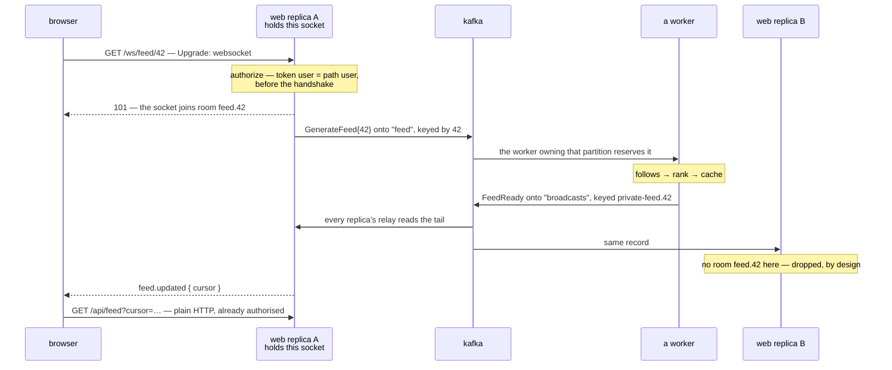

# Scenarios

The other pages each explain one technology. This page composes them: a
requirement you would recognise, the pieces that serve it, and the part a
reference page cannot give you — why *those* pieces, and not their neighbours.

The code here is the load-bearing highlights, not a tutorial. Every piece links
to the page that owns its detail.

---

## A Twitter-shaped feed

A browser shows a home timeline. Opening the app should produce a fresh feed;
updates should arrive without polling; and the expensive part — collecting what
a few hundred followed accounts have said and ranking it — must not run on the
machine holding the socket, or inside the request that asked for it.

The design in one sentence: **the browser holds a WebSocket that behaves like
a Kafka consumer, and everything behind the socket really is one.**



Three fleets, two topics. The web replicas hold sockets and stay I/O-bound;
the workers generate feeds and stay CPU-bound; Kafka is the only thing either
side addresses. Neither fleet knows the other's size, and they scale on
different axes — more idle sockets is more replicas, slower feeds is more
partitions and workers.

### The browser is a Kafka client with no Kafka in it

A feed *is* a keyed stream read from the tail, and the browser behaves exactly
like a consumer of one: it subscribes to a single key, receives records in the
order they were produced, and starts from now rather than from history. The
machinery makes each of those true:

- **one key** — everything for this user is keyed `private-feed.42`, and
  [channels are keys, not topics](kafka.md#broadcasting), so it all lands on
  one partition, in order.
- **from the tail** — [the relay has no
  cursor](kafka.md#the-relay-has-no-cursor-deliberately), so a socket hears
  what happens while it is open and a reconnecting browser is not replayed
  yesterday.
- **someone else holds the offset** — which is to say, no offset at all. If a
  message must not be missed, it is not a broadcast; it is
  [a job](queues.md), and here the feed itself is refetched over HTTP anyway.

What makes it a *fancy* client is what it cannot do: name a topic, choose an
offset, or read a key that is not its own. A real broker connection could do
all three — broker ACLs are per-topic, and every user's feed shares one topic —
so the browser must never hold one. The socket is the credentialed aperture
onto the log, one key wide.

### The socket: subscription is identity

```rust
// routes/ws.rs
WebSocketRoutes::new().add("/ws/feed/{user}", FeedSocket { rooms })
```

```rust
pub struct FeedSocket {
    rooms: Arc<Rooms>,
}

#[async_trait]
impl WebSocketHandler for FeedSocket {
    fn authorize(&self, request: &Request) -> bool {
        // The bearer token proves a user; the path names one.
        // Same user, or no socket is ever created.
        token_user(request).zip(path_user(request)).is_some_and(|(t, p)| t == p)
    }

    async fn on_connect(&self, socket: &Socket) -> Result<()> {
        let user: u64 = socket.parse_param("user")?;

        self.rooms.join(&format!("feed.{user}"), socket.clone());
        Queue::instance().dispatch(GenerateFeed { user_id: user }).await?;
        Ok(())
    }

    async fn on_message(&self, socket: &Socket, _message: Message) -> Result<()> {
        // The client has exactly one thing to say: "again".
        Queue::instance()
            .dispatch(GenerateFeed { user_id: socket.parse_param("user")? })
            .await?;
        Ok(())
    }

    async fn on_close(&self, socket: &Socket) {
        self.rooms.leave_all(socket.id());
    }
}
```

Two decisions worth naming. [`authorize`](websockets.md#authorising) runs
before the handshake, so an unauthenticated subscription is a `403` and no
socket ever exists. And the client never *asks* to subscribe — there is no
"subscribe" frame to validate, because the room the socket joins is derived
from who the handshake proved it was. In Kafka terms: the consumer does not
choose its subscription; its identity is the subscription.

Connecting *is* the feed request. `on_connect` dispatches a generation rather
than performing one, which is what keeps a thousand simultaneous connects a
thousand cheap queue writes instead of a thousand ranking runs on the socket
fleet.

### The request goes on the log

```rust
#[derive(Serialize, Deserialize)]
pub struct GenerateFeed {
    pub user_id: u64,
}

#[async_trait]
impl Job for GenerateFeed {
    const NAME: &'static str = "feed.generate";
    const QUEUE: &'static str = "feed";
    const TRIES: u32 = 3;

    // One pending generation per user — a browser hammering
    // "refresh" collapses to work that was already going to happen.
    fn unique_id(&self) -> Option<String> {
        Some(self.user_id.to_string())
    }

    async fn handle(&self, context: &JobContext) -> Result<()> {
        let follows = context.resolve::<FollowRepository>()?;
        let tweets = context.resolve::<TweetRepository>()?;
        let cache = context.resolve::<FeedCache>()?;

        let authors = follows.followed_by(self.user_id).await?;
        let page = rank(tweets.recent_by(&authors).await?);
        let cursor = cache.put(self.user_id, &page).await?;

        Broadcast::instance()
            .event(&FeedReady { user_id: self.user_id, cursor })
            .await
    }
}
```

```env
QUEUE_DRIVER=kafka
```

The [Kafka page is honest](kafka.md#jobs) that the database driver is usually
the better job queue, so choosing Kafka here needs a reason, and it has two.
Requests are **keyed by user**, so one user's refreshes land on one partition
and run in the order they were asked — two generations racing for the same
feed cannot finish out of order, because they were never concurrent. And the
request is **already an event**: the stream of "user 42 wanted a feed" is
exactly what a trending service or an ads pipeline wants to read, and
[a log has many readers, uncoordinated](kafka.md#kafka-is-a-log-not-a-queue) —
none of which need to exist yet.

The trade is stated on the same page: [concurrency is the partition
count](kafka.md#jobs). Provision the `feed` topic's partitions to the worker
fleet you intend to run, [with your cluster's tooling, not on
boot](kafka.md#topics-are-not-created-for-you).

The worker fleet is the same binary, running
[`queue:work`](queues.md#the-worker) on machines with no sockets to hold.

### The answer comes back as a broadcast

```rust
#[derive(Serialize)]
pub struct FeedReady {
    pub user_id: u64,
    pub cursor: String,
}

impl Broadcastable for FeedReady {
    fn broadcast_on(&self) -> Vec<Channel> {
        vec![Channel::private(format!("feed.{}", self.user_id))]
    }

    fn broadcast_as(&self) -> String {
        "feed.updated".into()
    }

    fn broadcast_with(&self) -> Result<Value> {
        Ok(json!({ "cursor": self.cursor }))    // a pointer, never the feed
    }
}
```

The worker that generated the feed does not know which replica holds the
user's socket, and must not: the balancer decided that, and will decide
differently after the next reconnect. So the worker addresses the *user*, not
the machine — it publishes to `private-feed.42` on the `broadcasts` topic and
is done.

Every web replica runs [the relay](kafka.md#sockets-across-replicas):

```rust
// bootstrap.rs — every web replica, no second deployment
app.instance(Broadcasting::new(Arc::new(kafka::broadcaster(&config, Arc::clone(&client)))));

relay::spawn(
    kafka::relay(&config, Arc::clone(&client)),
    SocketFanOut::new(Arc::clone(&rooms))
        .naming_rooms(|channel| Some(channel.trim_start_matches("private-").to_string())),
);
```

Each relay reads the tail and offers every record to its own rooms. The
replica holding room `feed.42` delivers; every other replica finds no such
room and drops the record. The dropping is not waste to engineer away — it
**is** the routing. Nothing anywhere maps users to machines, which is
precisely why no reconnect, deploy, or dead replica can make that map wrong.

### The payload is a pointer

The broadcast carries a cursor, not the feed, [as the broadcasting page
urges](broadcasting.md#broadcast_with-and-what-leaves-the-building) — the
client fetches `/api/feed?cursor=…` through a route that already authorises
it. That one choice buys three properties:

- **A missed broadcast costs nothing.** A broadcast is [best-effort and
  ephemeral](broadcasting.md#broadcast-event-notification); the HTTP endpoint
  stays the source of truth, and a browser that was offline reconnects,
  `on_connect` asks again, and a fresh feed arrives.
- **Nothing private rides an ephemeral pipe.** The frame says *that* the feed
  changed, never what is in it.
- **The socket stays small.** Ranked, hydrated feed pages are exactly the
  payload you do not want serialised into a broadcast topic and every
  replica's relay.

### When the nudge never comes

The reconnect story covers a socket that died. A socket that stayed up can
still miss an answer — a relay restarting in the instant the record went past
resumes at the tail, and the record is behind it. Two client-side moves cover
it, and neither asks anything new of the server:

- **Resend.** "Again" is safe to repeat: a resend that races the pending
  generation is [collapsed by `unique_id`](queues.md#unique-jobs) into work
  already underway, and a resend after a lost answer produces a fresh page.
  Either way the client converges. So silence is the cue — no `feed.updated`
  within a few seconds of asking, ask again. At-least-once on the pipe wants
  an at-least-once asker, and the server was built for the duplicates.

- **Track.** The cursor the client last rendered is its offset, kept where a
  Kafka client keeps one — on the consumer's side. Let `GET /api/feed` also
  answer *without* a cursor, with the newest generated page; the cache is
  already keyed by user, so "latest" is a lookup. The broadcast's cursor is
  then a saved round trip, never the only copy.

What the client cannot do is re-read the pipe. [The relay has no
cursor](kafka.md#the-relay-has-no-cursor-deliberately), so a dropped broadcast
is not waiting anywhere to be replayed into a socket — recovery is always
asking the question again, never seeking back into the answer. The durable
side of this design is HTTP and the cache; the socket is the side that is
allowed to lose things, which is exactly why losing one costs a resend and
nothing more.

### The right browser, and for how long

How a broadcast finds the right connection has a satisfying answer: **identity
enters this design in exactly one place, and every name in the pipeline is
derived from it.** The handshake proves a user, [before the socket
exists](websockets.md#authorising); after that it is server-side arithmetic on
the proof. The room is `feed.{user}` from the path `authorize` compared
against the token; the job carries the same id; the worker's channel is
`private-feed.{user_id}` from the job; the relay strips a prefix. Nothing in
the path accepts a claim it did not verify, because nothing after the
handshake lets the client claim anything.

That is also why the [subscription-authorising
machinery](broadcasting.md#authorising-subscriptions) — `channels.rs`, the
`/broadcasting/auth` endpoint, the Pusher signature — is absent from this
scenario. It exists to convince a *third party* holding your sockets that a
subscription is allowed. Here the process holding the socket is the process
that authenticated it, so there is nobody to convince: joining the room *is*
the grant. Swap the sockets out for soketi and that machinery is exactly what
comes back.

What stops user 7 listening to user 42's feed is, concretely, one comparison:

```rust
token_user(request).zip(path_user(request)).is_some_and(|(t, p)| t == p)
```

The `{user}` in `/ws/feed/{user}` is not the client choosing a feed; it is
the client repeating who it claims to be, and `authorize` holding it to the
claim — a mismatch is [a `403` and no socket ever
exists](websockets.md#authorising). Every other way in is prohibited by not
existing. There is no subscribe frame: after the `101` the client can say
"again" and hear nudges, and neither direction of the protocol can name
another user. And there is no broker within reach — the browser being [a
Kafka client with no Kafka in it](#the-browser-is-a-kafka-client-with-no-kafka-in-it)
is, from this angle, the security property rather than the architecture.

That single line is also the honest cost of doing without the registry. A
[`ChannelRegistry` fails closed](broadcasting.md#it-fails-closed): a channel
nobody wrote a pattern for is denied, so a forgotten authoriser denies rather
than discloses. A raw socket defaults the other way — `authorize` allows
everyone until overridden — and an override that validates the token but
forgets the path ("is this a user?" where it meant "is this *that* user?")
fails silently, in the direction that matters, for every feed at once. The
gate is one line; keep the test that pins it just as short — a token proving
7, a path naming 42, `authorize` answering `false`.

Two edges of the boundary worth naming:

- **"The right client" is plural.** A phone and a laptop, both proven to be
  user 42, are both in a `feed.42` room somewhere, and both hear the nudge.
  Broadcasting addresses the identity, not the device — which is what the
  second device wants.
- **The producing side trusts the topic.** Any process that may write to
  `broadcasts` may address any browser, so that edge is an infrastructure
  boundary — [SASL and broker ACLs](kafka.md#configuration), not application
  code.

**And for how long: a socket is authenticated once.** The handshake checked a
credential; the connection then outlives it. Nothing re-runs `authorize` when
the token expires or the session is revoked — a socket is not a request, and
no middleware sees its frames. Three things bound what a stale socket is
worth:

- **The content path re-authenticates every time.** The socket only ever
  carries [a pointer](#the-payload-is-a-pointer); redeeming it is
  `GET /api/feed`, behind [the guard](authentication.md), where a revoked
  session is a `401` on the next fetch. Revocation cuts the feed off at the
  next request; the lingering socket can hear *that* something changed, and
  nothing more.
- **The cursor is a name, not a key.** The cache lookup is scoped
  `(authenticated user, cursor)`, so a cursor that leaks — or lands on the
  wrong socket — redeems as nothing for anybody else. The fetch authorises;
  the pointer never does.
- **Closing is policy you write.** [Deliberately](websockets.md#what-is-not-here):
  validate the session where you already see frames — the top of
  `on_message`, answering `close_with("session expired")` — and apply your
  idle policy to sockets that say nothing, which the WebSockets page leaves
  as your decision because it is one.

### Why these pieces and not the others

| Decision | Why, here | When the other answer wins |
|---|---|---|
| Sockets [in the web process](websockets.md), not soketi | the browser talks back ("again"), and the relay lifts the one-process ceiling without a second deployment | you would rather hold no sockets at all: a Pusher-protocol client + Redis + [soketi](broadcasting.md#this-is-not-a-websocket-server), unchanged |
| [Kafka behind broadcasting](kafka.md#broadcasting), not Redis pub/sub | the feed events have readers beyond the browser, and per-channel keying gives per-user order | the browser is the only reader — [Redis is simpler, use it](kafka.md#why-not-just-use-redis-pubsub) |
| [Kafka behind the queue](kafka.md#jobs), not the database | requests keyed by user: ordered per user, readable by services that do not exist yet | you need a work queue and nothing else — [the database driver is better](queues.md#databasequeue) |
| Broadcast a cursor, not the feed | missed broadcasts are free, private data stays off the pipe | the payload is tiny, public and final — a like count can just ride along |

### What breaks, and what that costs

- **A web replica dies.** Its sockets drop; browsers reconnect through the
  balancer to any other replica, `authorize` runs again, `on_connect` asks
  again. Nothing replays and nothing needs to — that is [why the relay has no
  cursor](kafka.md#the-relay-has-no-cursor-deliberately).
- **A worker dies mid-generation.** Delivery is [at-least-once](kafka.md#what-is-not-here),
  so the job runs again — and generating the same feed twice is the harmless
  kind of twice: the browser is told twice and fetches the same page. Size
  [the lease to outlive a generation](kafka.md#the-lease-must-outlive-the-job).
- **Kafka is unreachable.** `on_connect`'s dispatch errors, which closes the
  socket — [bounded by a wall clock](kafka.md#everything-has-a-deadline), not
  by a retry loop. The HTTP feed route neither knows nor cares, so the product
  degrades to "refresh the page", which is where it started.

### The same pipes, one more consumer

Nothing above pushes a *new* tweet into open feeds — it answers whoever asks.
Making the timeline live is not a new design; it is one more reader on pipes
already laid. Publishing a tweet [puts an event on a
topic](kafka.md#events-onto-a-topic), keyed by author:

```rust
kafka::publish_events::<TweetPosted>(&events, client, "tweets", |e| e.author_id.to_string());
```

A consumer reads `tweets`, looks up who follows the author, and broadcasts
`feed.updated` for each follower — through the same broadcaster, the same
relay, the same rooms, with the socket handler unchanged. The analytics job
reads the same topic. So does whatever gets built next quarter, [without
anybody coordinating](kafka.md#kafka-is-a-log-not-a-queue) — which was the
reason to put the events on a log in the first place.
