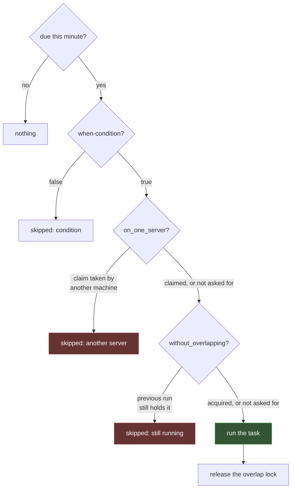

# Task Scheduling

One cron entry, and everything else in version control.

```cron
* * * * * cd /srv/app && ./app schedule:run >> /dev/null 2>&1
```

```rust
// src/routes/console.rs
use rainier_framework::scheduler::Schedule;
use rainier_framework::ScheduleExt;

pub fn schedule(schedule: &mut Schedule) {
    schedule
        .job(PruneSessions)
        .daily_at("03:00")
        .without_overlapping(Duration::from_secs(1800));

    schedule
        .call("warm-cache", |app| async move {
            app.resolve::<PostRepository>()?.published_page(1, 50, None).await?;
            Ok(())
        })
        .every_five_minutes();

    schedule
        .job(SendWeeklyDigest)
        .weekly_on(1, "09:00")
        .on_one_server();
}
```

```rust
Rainier::new(".").with_schedule(routes::console::schedule)
```

That is the whole point of a framework scheduler: adding a task is a commit, not
an ssh session and a `crontab -e` on each of three machines.

## The two guarantees

They sound similar and answer different questions.

| | Prevents | Lock held for | Keyed by |
|---|---|---|---|
| `without_overlapping(ttl)` | a run starting before the last finished | the whole run | the task name |
| `on_one_server()` | three machines running the same occurrence | that minute | the name **and** the minute |

They compose. A task that is slow *and* scheduled on every machine wants both.



The order is load-bearing. Claiming the minute *before* checking whether the
previous run is still going would have one machine claim it and then skip,
leaving the occurrence claimed by nobody who could have run it.

### `without_overlapping`

```rust
schedule
    .call("rebuild-index", rebuild)
    .hourly()
    .without_overlapping(Duration::from_secs(3600));
```

A rebuild that takes seventy minutes on an hourly schedule runs once, not twice,
and not five times by lunchtime.

The `ttl` is the safety net for a run that dies without releasing — a crash, an
OOM kill, a `kill -9`. Set it comfortably longer than the work takes:

- **too short** and a slow run gets a second copy anyway
- **too long** and a crashed run blocks the schedule until it expires

The lock is released whether the task succeeds or fails. One bad night must not
skip the next hour of runs.

### `on_one_server`

```rust
schedule.job(SendWeeklyDigest).weekly_on(1, "09:00").on_one_server();
```

Three machines run `schedule:run` every minute. At 09:00 on Monday all three
find the task due; one takes the claim and runs it, two find it taken and skip.

The claim is keyed by **the minute as well as the name**, and it is deliberately
not released when the run finishes. Both matter:

- Keyed by name alone, the first machine would win once and never release, and
  every later Monday would find it claimed. One machine would run it forever and
  the others never.
- Released at the end of the run, a machine whose clock is a second behind would
  find the minute unclaimed and run it again.

So it expires *with the occurrence*, sixty seconds after it was taken.

> **This needs a shared cache.** Three machines with three in-process caches are
> three machines each holding their own claim and each concluding they are the
> one — which is exactly the situation `on_one_server` exists to prevent.

## The framework checks this for you

A guarantee that is not a guarantee is worse than no guarantee, because the
code reads as though something is being enforced. So Rainier will not let it be
silent.

**At boot**, in every process and every environment, a schedule with tasks
declaring `without_overlapping` or `on_one_server` over an unshared lock says
so — at `warn` normally, and at `error` in production:

```text
ERROR 3 scheduled task(s) declare `without_overlapping` or `on_one_server`, but the
      lock is in-process — every machine will take its own, get it, and run.
      Tasks: sessions:prune, queue:reclaim, mail:weekly-digest.
      `schedule:run` will refuse to start. To fix: set CACHE_DRIVER to a shared
      store (redis, redis-cluster, memcached, dynamodb) and hand the built store
      to `Rainier::with_cache`.
```

**In `schedule:run` and `schedule:work`**, production refuses outright and exits
non-zero; everywhere else it warns and carries on, because a developer running
one process is not wrong to use the memory cache.

The refusal is in the scheduler rather than in `boot` on purpose: a web
container that never runs a scheduled task refusing to serve HTTP over a
scheduling concern would be a much larger outage than the one being prevented.

Asserting it yourself, if you want the check somewhere else:

```rust
use rainier_framework::scheduling::assert_locks_are_shared;

assert_locks_are_shared(&app)?;             // Err in production
```

```rust
let schedule = app.resolve::<Schedule>()?;

schedule.tasks_needing_shared_locks();      // Vec<String> — the task names
task.needs_shared_locks();                  // one task
app.resolve::<LockManager>()?.is_shared();  // the other half
```

`LockManager::is_shared()` asks the store itself rather than guessing from its
name. A cache implemented outside the workspace that has not overridden
[`Cache::is_shared`] can say so with `LockManager::declared_shared()` — nothing
verifies the claim, so declaring it about a per-process store disables the one
check that would have caught it.

[`Cache::is_shared`]: https://docs.rs/rainier-cache/latest/rainier_cache/trait.Cache.html#method.is_shared

## What a lock does not promise

Both guarantees are [atomic locks](cache.md#atomic-locks), and a TTL-based lock
is a **lease**, not a mutex. If a holder overruns its TTL, another process takes
the lock and both run. No lock built on a TTL prevents that — including Redlock.

Where two runs would be genuinely wrong rather than merely wasteful:

- make the work idempotent, or
- fence it with a token the *downstream* system checks, or
- do not rely on a lock for it.

The lock is a coordination hint. It is very good at stopping a queue filling up
with duplicate work, and it is not a distributed transaction.

## Scheduling things

### A queued job

```rust
schedule.job(PruneSessions).daily_at("03:00");
```

**Dispatches** rather than runs. A scheduled task that takes ten minutes is ten
minutes the scheduler is not looking at anything else, and a worker is the thing
built for long work.

Its lock key is the job's `NAME`, which is already stable across machines and
restarts.

### A console command

```rust
schedule.command(console.clone(), "app:seed").weekly_on(1, "04:00");
schedule.command_with(console.clone(), "queue:work", ["--max-jobs=100"]).hourly();
```

A non-zero exit is a failed task.

### A closure

```rust
schedule.call("heartbeat", |app| async move {
    app.resolve::<HealthReporter>()?.ping().await
}).every_minute();
```

The **name is the lock key**, so it has to be stable across machines and
restarts — not derived from a pointer or a timestamp.

## When

```rust
.every_minute()               .hourly()               .daily()
.every_five_minutes()         .hourly_at(17)          .daily_at("03:30")
.every_fifteen_minutes()      .twice_daily(1, 13)     .weekly()
.every_thirty_minutes()       .weekly_on(1, "09:00")  .monthly()
.every_minutes(7)             .monthly_on(15, "00:00").yearly()

.weekdays()                   // combine: .daily_at("09:00").weekdays()
.weekends()
.on_days("1-5")

.cron("*/5 9-17 * * MON-FRI") // when none of the above fit
```

### Expressions

Five fields, as `crontab(5)` has them:

```text
┌───────── minute        0-59
│ ┌─────── hour          0-23
│ │ ┌───── day of month  1-31
│ │ │ ┌─── month         1-12 or JAN-DEC
│ │ │ │ ┌─ day of week   0-6  or SUN-SAT (7 is also Sunday)
* * * * *
```

`*`, `5`, `1-5`, `1,3,5`, `*/15`, `1-5/2`, and `@hourly` `@daily` `@weekly`
`@monthly` `@yearly` `@midnight`.

**No seconds field.** The scheduler wakes once a minute, so a six-field
expression would be a promise it cannot keep — and the failure mode of accepting
one is a task that reads as "every ten seconds" and runs once a minute.

**Day-of-month and day-of-week are OR when both are restricted.** `0 0 13 * 5`
is the 13th *and also* every Friday, not Friday the 13th. That is what cron
does, it surprises everybody exactly once, and being quietly different would be
worse. If either field is `*`, the other decides alone.

### Conditions

```rust
schedule.job(SendDigest).daily().when(|| feature_enabled("digest"));
schedule.job(Backup).daily().skip(|| maintenance_mode());
```

Evaluated when the task is due and **before any lock is taken**, so a switched-off
task costs nothing.

### Timezones

```rust
.daily_at("03:00").in_timezone(FixedOffset::east_opt(2 * 3600).unwrap())
```

A **fixed offset**, not a named zone. Named zones need a tz database and bring
daylight saving with them, where "daily at 02:30" runs twice one night a year and
not at all on another. That is a decision worth making deliberately with
`chrono-tz`, rather than inheriting from a convenience method.

Everything else is UTC.

## Running it

### From cron

```cron
* * * * * cd /srv/app && ./app schedule:run >> /dev/null 2>&1
```

Runs whatever is due this minute and exits. Non-zero if any task failed, so a
supervisor notices.

### Without cron

```sh
./app schedule:work
```

One process, awake at the top of each minute. For a container, a systemd unit,
anything with a supervisor and no crontab.

It sleeps *to the next minute*, not for sixty seconds — a fixed interval drifts
by however long each pass took, and after enough hours a task scheduled for
`:00` runs at `:01` and misses its minute entirely.

### Seeing it

```sh
./app schedule:list
```

```
TASK             SCHEDULE          NEXT RUN (UTC)       GUARDS
prune-sessions   0 3 * * *         2026-07-28 03:00:00  without-overlapping
warm-cache       */5 * * * *       2026-07-27 14:05:00
send-digest      0 9 * * 1         2026-08-03 09:00:00  one-server
```

It also prints two things nobody asked for, because both make a lock silently
useless:

- an expression that did not parse
- **two tasks sharing a name** — they share a lock, so `without_overlapping`
  between them makes each block the other, and the symptom is a task that
  mysteriously never runs

## Failures

A task that fails is logged and the rest still run. One broken report must not
stop the backups.

`schedule:run` exits non-zero if anything failed, which is what a supervisor or
an alert should watch.

Both running commands **refuse to start** if any task's expression did not
parse. The builders are lenient on purpose — `.daily_at("03:00")` should not
need a `?` in the middle of a chain — and this is where that is paid back: a
task quietly left on `* * * * *` is worse than a scheduler that will not boot.

## Testing a schedule

The interesting assertions need no clock and no cache:

```rust
#[test]
fn the_digest_goes_out_on_monday_morning() {
    let mut schedule = Schedule::new();
    routes::console::schedule(&mut schedule);

    let monday_nine = Utc.with_ymd_and_hms(2026, 8, 3, 9, 0, 0).unwrap();
    let due: Vec<String> = schedule.due(monday_nine).iter().map(|t| t.name()).collect();

    assert!(due.contains(&"mail.weekly-digest".to_string()));
}

#[test]
fn every_expression_parses_and_every_name_is_unique() {
    let mut schedule = Schedule::new();
    routes::console::schedule(&mut schedule);

    assert!(schedule.errors().is_empty());
    assert!(schedule.duplicate_names().is_empty());
}
```

For the locks themselves, two `Schedule`s over **one** cache stand in for two
machines:

```rust
#[tokio::test]
async fn on_one_server_lets_exactly_one_machine_run_it() {
    let cache: Arc<dyn Cache> = Arc::new(MemoryCache::new());
    let first = LockManager::new(Arc::clone(&cache));
    let second = LockManager::new(Arc::clone(&cache));

    let a = a_schedule();
    let b = a_schedule();

    let ran_a = a.run_due(&app, &first, at).await;
    let ran_b = b.run_due(&app, &second, at).await;

    assert_eq!(ran_a.ran.len() + ran_b.ran.len(), 1);
}
```

## What is not here

| You might look for | Status |
|---|---|
| `->timezone('Europe/London')` | fixed offsets only — [see above](#timezones) |
| `->emailOutputTo()` | build it in the task |
| `->pingBefore()` / `->thenPing()` | build it in the task |
| `->runInBackground()` | a scheduled [job](queues.md) is already this |
| `->everySecond()` | [not expressible](#expressions) at minute resolution |
| `->between('8:00','17:00')` | `.cron("0 8-17 * * *")`, or a `.when()` |
