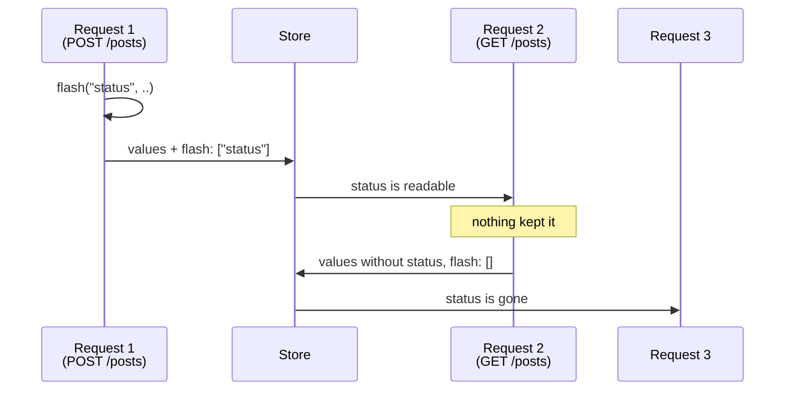
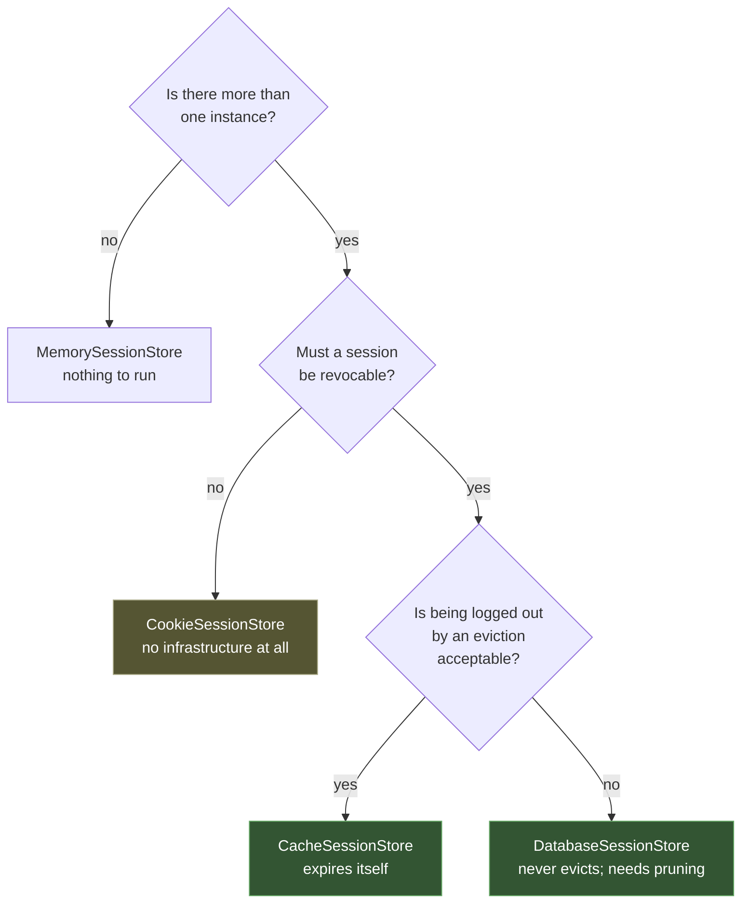

# Sessions

A session is a bag of values that follows a browser between requests, keyed by
an unguessable id in a cookie.

```rust
router.get("/dashboard", dashboard).middleware(groups::session());
```

```rust
pub async fn dashboard(request: Req) -> Result<Response> {
    let session = request.session().expect("behind the `session` middleware");

    let visits: u64 = session.get("visits").unwrap_or(0);
    session.put("visits", visits + 1)?;

    Ok(Response::text(format!("{visits}")))
}
```

## The session is on the request, not on the facade

This is the structural decision worth reading before anything else.

A globally callable `Session::get('user_id')` only works when a container
rebinds a request-scoped session for each request. Rainier's [facades](facades.md) resolve
from a **process-global** application — so with two requests in flight, there is
no honest answer for `Session::instance().get("user_id")` to give. Whose session?

So the split is explicit:

| | Gives you |
|---|---|
| `request.session()` | **this request's bag** |
| `Session::instance()` | the store and its settings |

```rust
use rainier_framework::prelude::*;    // brings SessionRequestExt

request.session()                     // Option<&Session>
```

`Option`, not a panic: a route without the middleware genuinely has no session,
and that is the honest answer rather than handing out a bag that silently fails
to persist.

The facade is for what genuinely *is* application-wide:

```rust
Session::instance().read(&id).await?;      // inspect a session by id
Session::instance().destroy(&id).await?;   // log a device out
Session::instance().gc().await?;           // collect expired ones
Session::instance().driver();              // "memory" | "database" | "redis" | "cookie"
```

Destroying by id is what you call for every one of a user's sessions when their
password changes.

## Reading and writing

```rust
session.get::<u64>("user_id");         // Option<T>, deserialised
session.string("name");                // Option<String>
session.value("meta");                 // Option<Value>, raw
session.has("user_id");                // present and not null
session.all();                         // Map<String, Value>
session.len();
session.is_empty();

session.put("user_id", 42u64)?;        // anything Serialize
session.pull::<String>("once");        // read and remove
session.forget("user_id");
session.flush();                       // empty it, keep the id
```

Note `&self` throughout — a `Session` is a cheap clone of one shared bag, so the
middleware can hold one while your handler writes through another. Reads do
**not** mark it dirty, which is what keeps a read-only page from writing a row.

## Flash data

A value that survives exactly **one** further request. The
redirect-then-show-a-message pattern, with nothing to remember to clean up:

```rust
session.flash("status", "Your post was published.")?;
Ok(Redirect::see_other("/posts").into_response())
```

```html
@if(status)
    <div class="notice">{{ status }}</div>
@endif
```



For a redirect that itself redirects, the value would be gone before anything
rendered it — so keep it:

```rust
session.keep(&["status"]);      // this one, for one more request
session.reflash();              // everything flashed, for one more request
```

## The CSRF token

```rust
let token = session.token();
```

Minted on first use, then stable for the life of the session — rotating it per
request would break every form a user has open in another tab.

Rainier ships **no CSRF middleware**: a session app's strategy depends on how it
renders forms, and the token-guard path does not need one. Put the token in a
hidden field and compare it, or rely on
[`SameSite`](responses.md#cookies), which is `Lax` by default.

## Logging in

Two calls that matter, and one of them is a security requirement rather than a
convenience:

```rust
session.regenerate();     // new id, same data
session.invalidate();     // new id, no data
```

**`regenerate()` on login.** Without it, an attacker who can set a victim's
session cookie *before* they authenticate ends up holding a cookie for the
authenticated session — session fixation. It is invisible in testing because
everything works.

The [session guard](authentication.md#sessionguard) does this for you:

```rust
guard.attempt(&request, &credentials).await?;   // regenerates, then stores the identity
guard.login(&request, &user).await?;
guard.logout(&request).await?;                  // invalidates the whole bag
```

`logout` invalidates **everything**, not just the auth key — a cart or a
half-filled form left behind is the next person at that browser reading it.

## The middleware

```rust
router.get("/dashboard", dashboard).middleware(groups::session());
router.group(GroupAttributes::new().middleware(groups::web()), |router| { … });
```

`groups::session()` builds `StartSession` from whichever store the application
bound, and **`groups::web()` includes it**. The
`api` group deliberately does not: an API authenticating per request with a
token would otherwise allocate a row and a cookie it never uses.

> **Registering a group replaces it.** Writing
> a `web()` in your kernel that lists only `AddHeaders` silently drops the
> session from every route in the group — nothing fails, the routes just have no
> session. List everything the group should contain.

### An anonymous request allocates nothing

A session that started empty and stayed empty gets **no cookie and no row**.
Otherwise every hit on a public page by a crawler allocates both, and the table
fills with nothing.

The consequence: a response only carries `Set-Cookie` once something has
actually been written.

### A failing store does not fail the request

If the store is unreachable, a visitor gets a fresh session and the page
renders; the error is logged. Turning a cache blip into a total outage is worse
than losing a session.

## Drivers

Selected by `SESSION_DRIVER`, a
[`SessionDriver`](configuration.md#settings-closed-sets-of-values) — so the
three columns below are methods you can call rather than facts to remember.

| `SessionDriver` | `is_durable()` | `is_shared()` | `is_revocable()` | Note |
|---|---|---|---|---|
| `Memory` | no | no | yes | development |
| `Database` | yes | yes | yes | never evicts |
| `Cache` | no | yes | yes | expires itself; **can evict** |
| `Cookie` | yes | yes | **no** | no server state at all |

Note there is no `redis`. Sessions in Redis are the `cache` driver pointed at
Redis — one store to configure, one pool to open. `SESSION_DRIVER=redis` is a
reasonable thing to try and it fails with the list of what is actually
available, rather than silently doing nothing.

`is_revocable()` is the one worth asserting on in a deployment check: a logout,
a password change and a stolen cookie all need it.

```env
SESSION_DRIVER=memory
SESSION_DRIVER=database
SESSION_DRIVER=cache      # Redis / Redis Cluster / Memcached, per CACHE_DRIVER
SESSION_DRIVER=cookie     # the whole session, encrypted, in the cookie
```

**A memory store behind a load balancer** makes a user's session appear to
vanish and reappear as they are routed around. That looks like a bug in your
login code and is not — it is two processes with two maps.



### `CacheSessionStore`

```rust
use rainier_framework::session::CacheSessionStore;

CacheSessionStore::new(cache).with_lifetime(Duration::days(14))
```

The usual production choice, because it gets both of the things a session needs
from infrastructure you already have: **shared between instances**, and
**expiring by itself** so nothing has to sweep. Works over any
[`Cache`](cache.md) — including a sharded Redis Cluster, where each session
lands on the node that owns its slot.

The TTL is reset on every write, so an active session slides forward and an
abandoned one expires on its own.

**A cache can evict.** That is the trade against the database store: under memory
pressure a cache discards whatever it likes, and an evicted session logs somebody
out mid-checkout. For Redis, `maxmemory-policy volatile-lru` at least confines
eviction to keys with a TTL; `allkeys-lru` will take sessions ahead of things you
would rather lose. If being logged out is genuinely unacceptable, use the
database store.

Session keys are prefixed `session:`, so they do not collide with cached values.

### `CookieSessionStore`

```rust
use rainier_framework::session::CookieSessionStore;

CookieSessionStore::new(Crypt::instance().as_ref().clone())
```

The whole session, [encrypted](encryption.md), in the cookie. **No server-side
state at all** — nothing to store, nothing to expire, nothing to share between
instances. That is the entire appeal, and every limitation follows from it:

- **No revocation.** A session you cannot see is a session you cannot end. There
  is no "log out all my devices", no invalidating everything when a password
  changes, and a stolen cookie works until it expires.
- **~3.5 KB, hard.** Browsers guarantee 4096 bytes per cookie *including* its
  name and attributes. Exceeding it is refused **at write time**, with both
  numbers in the message — because an over-long cookie is dropped by the browser
  silently, and a session that mysteriously does not persist for some users is a
  bad afternoon.
- **The cookie travels on every request**, in both directions.
- **Rotating a key out ends every session it wrote.** The [key
  ring](encryption.md#key-rotation) matters twice over here.

The client cannot read it or change it: tampering fails the AEAD tag and the
session is discarded. A session sealed with another application's key is
discarded too.

Reach for it when you have no Redis and no appetite for session rows, and
revocation genuinely does not matter.

### Writing your own store

```rust
pub trait SessionStore: Send + Sync + 'static {
    fn name(&self) -> &str;
    fn read(&self, id: &str) -> …<Result<Option<SessionData>>>;
    fn write(&self, id: &str, data: &SessionData) -> …<Result<()>>;
    fn destroy(&self, id: &str) -> …<Result<()>>;
    fn gc(&self) -> …<Result<u64>> { … }

    // For a store that owns the cookie value rather than just an id.
    fn is_client_side(&self) -> bool { false }
    fn encode(&self, id: &str, data: &SessionData) -> Result<String> { … }
    fn decode(&self, value: &str) -> Result<(String, Option<SessionData>)> { … }
}
```

The four required methods are the server-side shape. `encode`/`decode` exist so a
store can instead put the **whole session in the cookie** without the middleware
needing to know which kind it has — which is how the cookie driver works, and how
yours could.

The default `decode` rejects anything that is not the 64-hex-character shape
Rainier mints, which is what stops a client choosing its own id.

### `DatabaseSessionStore`

```rust
DatabaseSessionStore::new(db).with_lifetime(Duration::days(14))
```

Its table comes as a migrator to merge in:

```rust
Migrator::new()
    .create_table::<User>("0001_create_users")
    .merge(DatabaseSessionStore::migrations())
```

Writes are an **upsert**, not an insert-or-update: a session is written on
almost every request, and two concurrent requests for one session would race
between the check and the insert.

A row whose payload will not parse — left by an older shape of the application —
is discarded and a fresh session started. Failing the request instead would lock
that user out permanently with no way to recover but clearing their cookies.

```rust
store.prune().await?;      // delete expired rows
```

Run it periodically. Nothing does it per request, because a `DELETE` on every
page load is a poor trade.

### Writing your own store (superseded)

```rust
pub trait SessionStore: Send + Sync + 'static {
    fn name(&self) -> &str;
    fn read<'a>(&'a self, id: &'a str) -> BoxFuture<'a, Result<Option<SessionData>>>;
    fn write<'a>(&'a self, id: &'a str, data: &'a SessionData) -> BoxFuture<'a, Result<()>>;
    fn destroy<'a>(&'a self, id: &'a str) -> BoxFuture<'a, Result<()>>;
    fn gc(&self) -> BoxFuture<'_, Result<u64>> { … }
}
```

Four methods for Redis, Memcached, or a cache in front of the database.

## Configuring it

```rust
// src/bootstrap.rs
fn sessions(env: &Env, database: &Database) -> SessionManager {
    let lifetime = chrono::Duration::seconds(env.int("SESSION_LIFETIME", 7200));

    let store: Arc<dyn SessionStore> = match env.string("SESSION_DRIVER", "memory").as_str() {
        "database" => Arc::new(DatabaseSessionStore::new(database.clone()).with_lifetime(lifetime)),
        _ => Arc::new(MemorySessionStore::new(lifetime)),
    };

    SessionManager::with_config(
        store,
        SessionConfig::default()
            .cookie(env.string("SESSION_COOKIE", "rainier_session"))
            .secure(env.bool("SESSION_SECURE", false))
            .same_site(SameSite::Lax)
            .lifetime(lifetime),
    )
}
```

```rust
Rainier::new(".").with_sessions(sessions(&env, &database))
```

Without `with_sessions`, sessions default to an in-process store — right for
development, wrong the moment there are two instances.

| Setting | Default | Note |
|---|---|---|
| `cookie` | `rainier_session` | |
| `path` | `/` | |
| `domain` | none | the host that set it |
| `secure` | `false` | **turn this on in production** |
| `same_site` | `Lax` | |
| `lifetime` | 2 hours | idle timeout, refreshed on write |

The cookie is always `HttpOnly` and that is not configurable: a session id
readable by JavaScript is one an XSS bug can steal, and there is no legitimate
reason for a script to read it.

`secure(false)` is the default only so `http://localhost` works. A session
cookie over plain HTTP is a session anyone on the path can take.

## A client cannot choose its own id

An id that is not the shape Rainier mints — 64 hex characters — is not even
worth a store round-trip, so a forged cookie gets a fresh session:

```rust
// cookie: rainier_session=../../etc/passwd
request.session().unwrap().id()    // a freshly generated id
```

Ids are 256 bits from the OS CSPRNG. A session id is a bearer credential, so
anything guessable here is an account takeover.

## Testing

```rust
// A request carrying a session, as StartSession would have left it.
let request = Request::builder().build().with_extension(Session::new());
```

That is enough to unit-test anything that reads or writes one — no middleware,
no store, no cookie.

For the whole path, drive the kernel and follow the cookie:

```rust
fn session_cookie(response: &Response) -> Option<String> {
    response
        .header("set-cookie")?
        .split(';')
        .next()?
        .strip_prefix("rainier_session=")
        .map(str::to_string)
}

#[tokio::test]
async fn a_session_counts_visits_across_requests() {
    let app = App::boot().await;

    let first = app.send(app.get("/visits")).await;
    let cookie = session_cookie(&first).expect("the session should be persisted");

    let with_cookie = || {
        Request::builder()
            .method(Method::GET)
            .uri("/visits")
            .header("cookie", &format!("rainier_session={cookie}"))
            .build()
    };

    assert_eq!(app.json(with_cookie()).await["visits"], 1);
    assert_eq!(app.json(with_cookie()).await["visits"], 2);
}
```

And to test ageing without any HTTP at all:

```rust
let session = Session::new();
session.flash("status", "Saved.")?;

let next = Session::restore("id", session.age_and_take());
assert_eq!(next.string("status").as_deref(), Some("Saved."));

let later = Session::restore("id", next.age_and_take());
assert!(!later.has("status"));
```

`age_and_take` is what the middleware calls once, after the handler: it drops
flash values from the previous request unless they were kept, and promotes this
request's.

## Production checklist

- [ ] a shared driver — `database`, `cache`, or `cookie` — if there is more than one instance
- [ ] the session table migrated, if using `database`
- [ ] `SESSION_SECURE=true`
- [ ] `prune()`/`gc()` running periodically
- [ ] `regenerate()` on login — or use the [session guard](authentication.md#sessionguard), which does it
- [ ] the `web` group still lists `session` after you edited it
