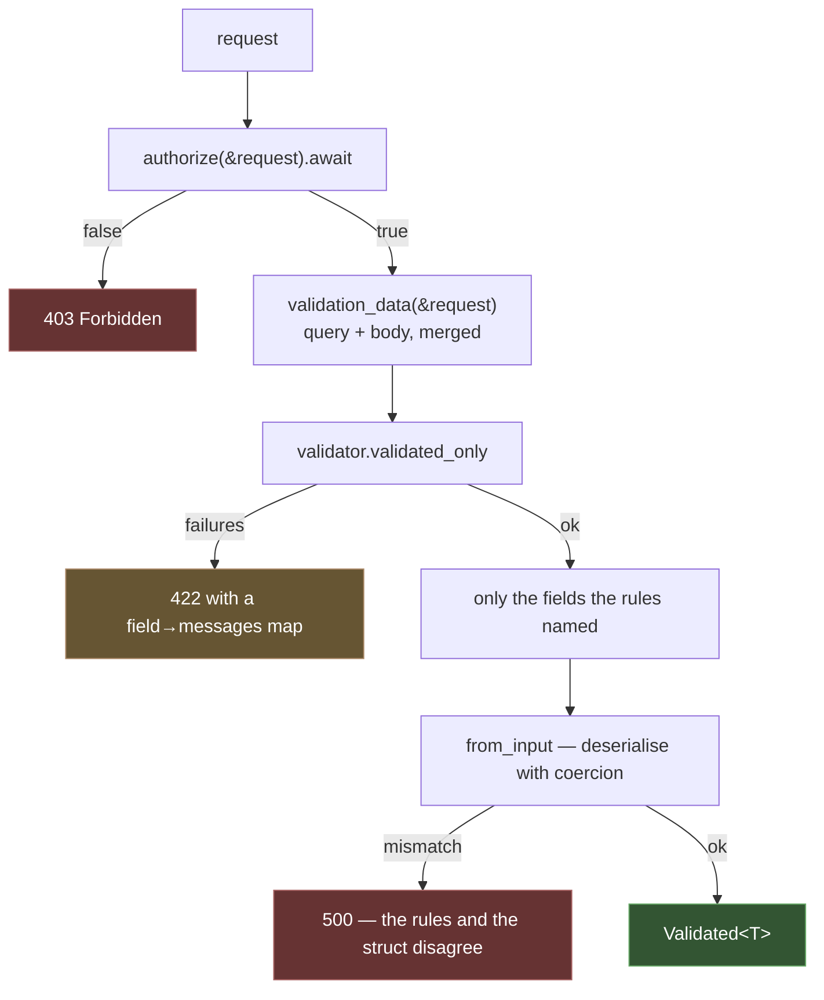

# Validation

Validation has two shapes: a **validator** you drive yourself, and a **request
contract** — a form request — that authorises, validates, and hands the action
a typed payload.

The contract is the one you want almost always.

## Request contracts

```rust
use rainier_framework::prelude::*;
use serde::Deserialize;

#[derive(Deserialize)]
pub struct StorePostRequest {
    pub title: String,
    pub body: String,
}

#[async_trait]
impl FormRequest for StorePostRequest {
    fn rules() -> RuleSet {
        vec![
            field("title", [Rule::Required, Rule::String, Rule::Between(3.0, 120.0)]),
            field("body", [Rule::Required, Rule::String, Rule::Min(10.0)]),
        ]
    }

    async fn authorize(request: &Request) -> bool {
        request.extension::<AuthenticatedUser<User>>().is_some()
    }
}
```

```rust
pub async fn store(Validated(input): Validated<StorePostRequest>) -> Result<Response> {
    // authorised, validated, and containing only the fields the rules named
    Ok(Response::json(&create(input).await?))
}
```

### What happens, in order



**Authorisation runs before validation**, so an unauthorised caller cannot use
validation messages to probe what the endpoint expects.

**A deserialisation failure after validation passed is a `500`, not a `422`.**
If the rules said a field was fine and the struct could not be built from it,
the two disagree — that is a programming error, and the message says so:

```
`StorePostRequest` passed validation but could not be built from the input: …
```

### Mass assignment

The payload contains **only the fields the rules named**. `validated_only`
filters everything else out before `from_input` ever sees it.

That is mass-assignment protection without a separate allow-list: it falls out
of the rules you already wrote, so there is no second list to keep in sync and
no way for the two to drift apart. A client adding `"is_admin": true` to the
JSON gets it dropped, because no rule mentions `is_admin`.

### Customising

```rust
#[async_trait]
impl FormRequest for UpdatePostRequest {
    fn rules() -> RuleSet { … }

    /// Messages overriding the defaults, keyed "field.rule".
    fn messages() -> Vec<(&'static str, &'static str)> {
        vec![("title.required", "Give the post a title.")]
    }

    /// Fold in the route parameter, for uniqueness-except-self.
    fn validation_data(request: &Request) -> Value {
        let mut data = request.all();
        if let Some(slug) = request.route_param("post") {
            data["current_slug"] = json!(slug);
        }
        data
    }
}
```

| Method | Default |
|---|---|
| `rules()` | required |
| `authorize(&request)` | `true` |
| `messages()` | none |
| `validation_data(&request)` | `request.all()` |
| `from_input(value)` | deserialise with string coercion |

### Outside an extractor

The whole contract in one call, for a console command or a test:

```rust
let input = StorePostRequest::validate_request(&request).await?;
```

Or validate without building:

```rust
match StorePostRequest::check(&request) {
    Ok(()) => …,
    Err(errors) => println!("{}", errors.to_json()),
}
```

## The rules

| Rule | Passes when |
|---|---|
| `Required` | present, not null, not empty |
| `Present` | present (may be null or empty) |
| `NotNull` | not null when present |
| `String` | a string, or reads as one |
| `Integer` | an integer |
| `Numeric` | a number |
| `Boolean` | a bool, or a string a form sends for one |
| `Array` | an array |
| `Min(n)` / `Max(n)` / `Size(n)` | length for strings and arrays, value for numbers |
| `Between(lo, hi)` | inclusive |
| `Email` | a plausible email address |
| `Url` | an absolute `http`/`https` URL |
| `Slug` | letters, digits, `-`, `_` |
| `Uuid` | a canonical UUID |
| `Alpha` / `AlphaNumeric` / `AlphaDash` | ASCII letters / and digits / and `-` `_` |
| `In(values)` / `NotIn(values)` | membership |
| `StartsWith(s)` / `EndsWith(s)` | |
| `Date` | `YYYY-MM-DD` |
| `After(date)` / `Before(date)` | inclusive |
| `Confirmed` | equals `<field>_confirmation` |
| `Same(other)` / `Different(other)` | compared to another field |
| `Custom { message, check }` | your predicate returns `true` |

```rust
field("password", [
    Rule::Required,
    Rule::Min(12.0),
    Rule::Confirmed,
]),
field("role", [Rule::In(vec!["author".into(), "editor".into()])]),
field("handle", [
    Rule::Custom {
        message: "Handles must not start with a digit.".into(),
        check: Arc::new(|v| !v.as_str().unwrap_or("").starts_with(|c: char| c.is_ascii_digit())),
    },
]),
```

## Absent, null and empty

Rainier distinguishes three states that most validators partly conflate, and
this is the difference you will actually notice.

| Input | `Required` | `Present` | `NotNull` | `Email` |
|---|---|---|---|---|
| field missing | fails | fails | passes | **passes** |
| `null` | fails | passes | fails | **passes** |
| `""` | fails | passes | passes | fails |
| `"a@b.c"` | passes | passes | passes | passes |

Only the **presence** rules look at absence and null. Every other rule is
"*if supplied*, must be …". So:

```rust
field("website", [Rule::Url])
```

means "an optional website, which must be a URL if given". There is no
`sometimes`, no `nullable`, and no combinator to remember — the rule already
means the sensible thing.

To require it, say so:

```rust
field("website", [Rule::Required, Rule::Url])
```

This is also why the [`ConvertEmptyStringsToNull`
middleware](middleware.md#trimstrings-and-convertemptystringstonull) matters: a
browser sends an untouched optional field as `""`, and turning it into `null`
is what makes `[Rule::Url]` do the right thing.

## The validator directly

```rust
let validator = Validator::new()
    .rules("email", vec![Rule::Required, Rule::Email])
    .rules("age", vec![Rule::Integer, Rule::Min(18.0)])
    .custom_message("email.required", "We need an email address.");

match validator.validate(&input) {
    Ok(()) => …,
    Err(errors) => …,
}
```

| Method | Returns |
|---|---|
| `validate(&input)` | `Ok(())` or the failures |
| `validated(&input)` | the whole input, if it passed |
| `validated_only(&input)` | **only the fields with rules** — what contracts use |

## The errors

```rust
errors.is_empty();
errors.len();
errors.has("email");
errors.get("email");            // &[String] — every message for one field
errors.first("email");          // Option<&str>
errors.first_message();         // the first message of any field
errors.all_messages();
errors.fields();
errors.to_json();
```

`ValidationErrors` converts into an [`Error`](errors.md) with kind
`Validation`, which is a `422` carrying the field map as `details`:

```json
{
  "message": "The given data was invalid.",
  "errors": {
    "title": ["The title field is required."],
    "body": ["The body must be at least 10 characters."]
  }
}
```

A `422` is a `4xx`, so it is always disclosed to the client — it describes what
the *client* did. See [Error Handling](errors.md#what-the-client-is-told).

## Nested fields

Rule keys are dotted paths, matching [input lookup](requests.md#input):

```rust
vec![
    field("user.email", [Rule::Required, Rule::Email]),
    field("items.0.quantity", [Rule::Integer, Rule::Min(1.0)]),
]
```
