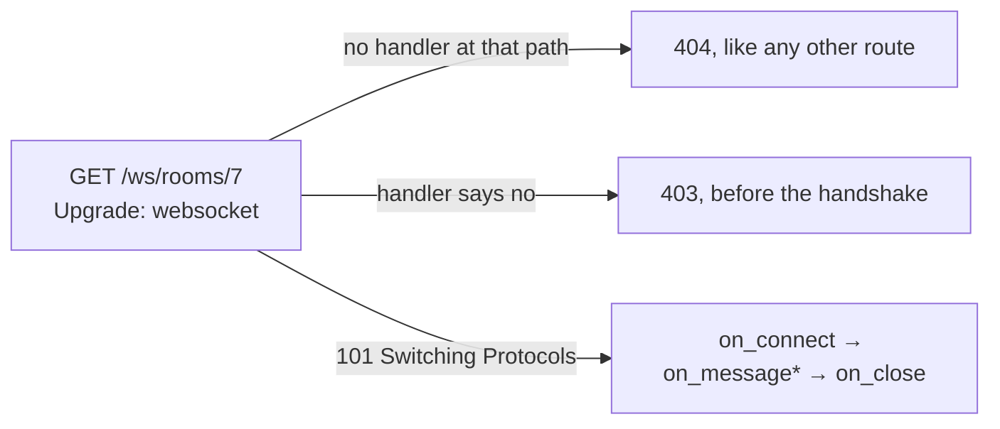

# WebSockets

A connection that stays open, served on the same port as everything else.

```rust
// routes/ws.rs
WebSocketRoutes::new().add("/ws/rooms/{room}", Chat { rooms })

// bootstrap.rs
Rainier::new(".").with_websockets(routes::ws::routes(rooms))
```

Most MVC frameworks hold no sockets — they publish to a relay and something
else holds the connections. Rainier can work that way too; see
[Broadcasting](broadcasting.md), and [below](#which-one) for which to reach for.

---

## It shares the HTTP server

A WebSocket connection *starts* as an HTTP request — a `GET` carrying
`Upgrade: websocket`. So there is no second listener, no second port, no second
runtime, and nothing to keep in step: the same accept loop takes both, and a
socket is a connection that answered `101` instead of `200` and then kept
going.



Concurrency falls out of that rather than being arranged. Every connection was
already its own task, so a thousand idle sockets are a thousand parked futures
and cost nothing while they wait.

## A handler

```rust
pub struct Chat {
    rooms: Arc<Rooms>,
}

#[async_trait]
impl WebSocketHandler for Chat {
    async fn on_connect(&self, socket: &Socket) -> Result<()> {
        self.rooms.join("lobby", socket.clone());
        socket.send("welcome")
    }

    async fn on_message(&self, socket: &Socket, message: Message) -> Result<()> {
        self.rooms.send_except("lobby", socket.id(), message);
        Ok(())
    }

    async fn on_close(&self, socket: &Socket) {
        self.rooms.leave_all(socket.id());
    }
}
```

`on_connect` runs once after the handshake. `on_message` runs per frame.
`on_close` runs once, **whatever ended the connection** — a clean close, a
dropped TCP connection, a closed laptop, or an error from one of the other two.

That last guarantee is the one to rely on: a registry that only cleaned up on a
polite goodbye would leak an entry for every client that walked out of wifi
range.

An error from `on_connect` or `on_message` closes the connection and is logged.
It is **not** sent to the client, for the same reason a
[5xx body is not](errors.md#what-the-client-is-told): an error message is
written for you, not for whoever is connected.

## The socket handle

```rust
socket.id();                          // unique for the life of the process
socket.path();                        // "/ws/rooms/lobby"
socket.param("room");                 // "lobby"
socket.parse_param::<u64>("id")?;     // a 400 if it will not parse

socket.send("text")?;
socket.send_json(&update)?;
socket.close_with("that is enough")?;
```

`Socket` is cheap to clone and safe to keep in a registry, because **sending
queues rather than writes**. A handler that awaited the socket would block on
one slow client, and one slow client must not hold up the task reading everyone
else's messages.

Sending to a socket that has gone away is an `Err`, not a panic and not a
silent success — a registry holding stale handles finds out that way.

Because the handle is a channel, **a handler is tested by calling it**. No
network:

```rust
let (tx, mut rx) = mpsc::unbounded_channel();
let socket = Socket::new(SocketId::next(), "/ws/rooms/lobby", vec![], tx);

chat.on_message(&socket, Message::text("hello")).await?;
assert!(matches!(rx.try_recv(), Ok(Outbound::Send(_))));
```

## Routes and parameters

```rust
WebSocketRoutes::new()
    .add("/ws/notifications", Notifications)
    .add("/ws/rooms/{room}", Chat { rooms })
```

`{name}` captures a segment, read back with `socket.param("name")`. The first
matching pattern wins, so declare the specific before the general.

Matching is **segment for segment**: `/ws/rooms/{room}` does not match
`/ws/rooms/7/messages`. A route that swallowed extra segments would serve paths
its author never considered.

An unrouted path is a `404`, exactly as it would be over HTTP.

## Authorising

```rust
fn authorize(&self, request: &Request) -> bool {
    request.header("authorization").is_some_and(|value| value.starts_with("Bearer "))
}
```

Runs **before the handshake**, with the HTTP request that asked to upgrade — so
it has the headers, the cookies, and whatever middleware put in the extensions.
Returning `false` answers `403` and no socket is created.

The default allows everyone, which is right for a public feed and wrong for
anything else. **A socket is a route.** It needs the same thought about who may
reach it, and it does not get your route middleware for free.

## Rooms

```rust
rooms.join("lobby", socket.clone());
rooms.send("lobby", Message::text("someone arrived"));
rooms.send_except("lobby", socket.id(), message);   // not the sender
rooms.count("lobby");
rooms.leave_all(socket.id());                       // what on_close wants
```

The thing every non-trivial socket application needs and none of them want to
write twice. Handles to sockets that have gone away are dropped on the next
send rather than reaped on a timer, so a client that vanished without a close
frame costs one failed send and then nothing.

`leave_all` exists so a handler does not keep its own record of which rooms a
socket is in — that would be a second copy of this map, and it would drift.

**One process.** A `Rooms` registry is in memory, so two instances behind a
load balancer have two sets of rooms and a message sent on one reaches half
your users.

That is the ceiling on this approach *by itself*. A [Kafka
relay](kafka.md#sockets-across-replicas) lifts it without a second deployment:
every replica publishes to a topic and every replica reads it back into its own
rooms, so a message sent on one reaches the sockets held by all of them. The
alternative is [broadcasting](broadcasting.md) through Redis to a server that
holds every socket instead.

## Which one

|  | WebSockets (this) | [Broadcasting](broadcasting.md) |
|---|---|---|
| Who holds the socket | your process | a separate one — soketi, Pusher |
| Direction | both ways | out only |
| Across instances | one process's memory, unless [relayed](kafka.md#sockets-across-replicas) | yes, through Redis |
| Client | anything that speaks WebSocket | a Pusher-protocol client |
| Extra infrastructure | none | a relay, and Redis |

Use a socket when the browser needs to **talk back**, or when you would rather
not run a second process. Broadcast when it only needs to hear, or when you
have more than one instance.

They are not exclusive. A sensible arrangement is broadcasting for
notifications that fan out to everyone and sockets for the one interactive
feature that needs a conversation. For sockets, a relay and a worker fleet
composed into one design, see
[the feed scenario](scenarios.md#a-twitter-shaped-feed).

## What is not here

**No automatic reconnection or heartbeat policy.** Ping and pong are answered
by the transport, so a connection stays alive; deciding that a client which has
said nothing for five minutes should be disconnected is application policy, and
`socket.close()` is how you express it.

**No message size limit of its own.** The HTTP body limit does not apply to
frames — the body was never read. Add the check in `on_message`, where you know
what a reasonable message is for that endpoint.

**No per-socket middleware.** `authorize` sees the request, which covers
authentication; anything more is a function you call at the top of
`on_connect`.

**No clustering.** See [rooms](#rooms).
